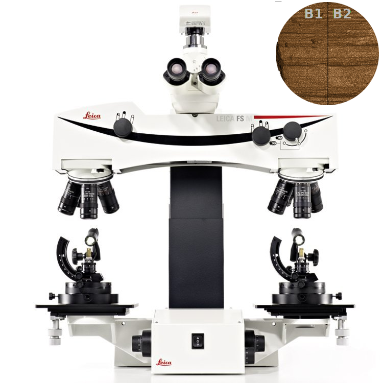
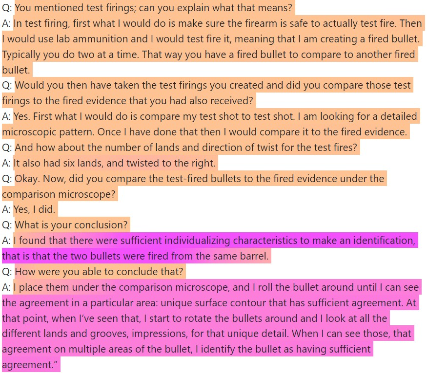
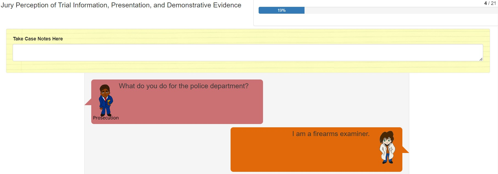

class: primary-blue
## Outline

```{r setup, echo=FALSE, warning=FALSE, message=FALSE}
library(knitr)
library(ggplot2)
library(fontawesome)
library(DiagrammeR)
library(gridExtra)
library(grid)
library(jpeg)
library(ggridges)
library(patchwork)
library(ggmosaic)
library(tidyverse)
library(readr)
library(ggpcp)
```

- Initial Study

    - How are potential jurors' perceptions of evidence affected by the use of algorithms and images?

- Response Type Investigation

    - Notepad Analysis
    
    - Response Type Study
    
- Study Formatting

---

class: primary-blue

## Jury Studies in Forensic Science

- General Trust in Forensic Methods
  - Higher than expected conviction rates (Garrett et. al. 2020)
      - 21% in the inconclusive case, 55% for various match language
  - Overall belief in reliability in fingerprint and bullet matching (Garrett et. al 2020; Garrett and Mitchell 2013)
  
- Numbers are Hard
  - Difficulty in interpreting evidence
      - 60.7% and 42.1% of individuals provided a DNA frequency and probability, respectively, correctly calculated the number of matching individuals in a population (Koehler 2001)
  - Same values in different formats result in different interpretations
      - More likely to believe subject was the source of the DNA when presented with a probability rather than a frequency (Koehler 2001)
  - Inconsistency in Response Types
      - Higher values of guilt on categorical chance scale compared to likelihood scale (Thompson and Newman 2015)
      
---

class: secondary-blue
## Initial Study Structure

- Based on Garrett et. al.'s "Mock jurors' evaluation of firearm examiner testimony" (2020)
    - Richard Cole is on trial for attempted robbery of a convenience store
    - Gun found in Cole's car is tested against bullet recovered from crime scene
    
- Three Variables: 
    - Demonstrative Evidence 
    - Algorithm 
        - Algorithm testimony includes both a Firearm Examiner and an Algorithm Expert
    - Conclusion

- Gathering Data
    - 569 participants from Prolific (using representative sample feature)
    
- Questions on the reliability/credibility of the evidence or the expert

---

class: center, secondary-blue
### The Demonstrative Evidence

<figure>

<figcaption>Gremi-ch, 2009</figcaption>
</figure>

.pull-left[
<figure>

<figcaption>baku13, 2005</figcaption>
</figure>
]

.pull-right[

]

---

class: secondary-blue
### The Algorithm

.pull-left[
- Described in Hare et. al.
- A 3D scan is taken of each bullet land, a stable cross section is extracted, and shoulders are removed
- A smoothing function is applied twice in order to extract the signature, which can be compared to land signatures from other bullets
- Traits (cross correlation, matching extrema, number of nonmatches, etc.) are used in a random forest to produce a match score for lands. Lands are aligned across bullets in order to compute an overall match score for the bullets
]

.pull-right[
<figure>

<figcaption><font size="1">  Hare et al.</font></figcaption>
</figure>

<figure>

<figcaption><font size="1">Hare et al.</font></figcaption>
</figure>


]


---

class: secondary-blue
### The Results

```{r, echo=FALSE, message=FALSE, warning=FALSE, fig.width=12, fig.height=8}

merged_results_allresponses<-read_csv("~/PhD Research/UNL_Thesis/data/study1_merged_results_clean.csv")

merged_results_allresponses <-merged_results_allresponses %>% subset(clean_prints!=231)

merged_results <- merged_results_allresponses %>% filter(check1 =="9mm" & check2 == "Moderately reliable")

merged_results$conclusion <-
  factor(merged_results$conclusion,
         levels = c("NoMatch", "Inconclusive", "Match"))

conclusion_labs <- c("Identification", "Inconclusive", "Elimination")
names(conclusion_labs) <- c("Match", "Inconclusive", "NoMatch")

merged_results$overrel = factor(
  merged_results$overrel,
  levels = c(
    "Extremely unreliable",
    "Moderately unreliable",
    "Weakly unreliable",
    "Neither reliable nor unreliable",
    "Weakly reliable",
    "Moderately reliable",
    "Extremely reliable"
  )
)

levels(merged_results$overrel) <-
  gsub(" ", "\n", levels(merged_results$overrel))

rel_graph <- merged_results %>% 
  filter(!is.na(overrel)) %>%
  group_by(conclusion, algorithm, picture, overrel) %>%
  count() %>%
  group_by(conclusion, algorithm, picture) %>%
  mutate(prop = n/sum(n)) %>%
ggplot(aes(x = picture, fill = overrel)) +
  geom_col(
    mapping = aes(y =prop),
    position = position_stack(), color="black"
  ) +
  coord_flip() +
  facet_grid(algorithm~conclusion, labeller = labeller(algorithm = label_both, conclusion = conclusion_labs)) +
  ggtitle("How reliable do you think the firearm evidence in this case is?") +
  scale_fill_manual("", values = c("#d77227", "#fc8d59", "#fee090", "#ffffbf", "#e0f3f8","#91bfdb", "#4575b4")) +
  theme_bw()+
  theme(legend.position = "bottom", legend.direction = "horizontal") + 
  ylab("Proportion of responses") + 
    guides(fill = guide_legend(nrow = 1, reverse = TRUE))

merged_results$firetestcred = factor(
  merged_results$firetestcred,
  levels = c(
    "Extremely noncredible",
    "Moderately noncredible",
    "Weakly noncredible",
    "Neither credible nor noncredible",
    "Weakly credible",
    "Moderately credible",
    "Extremely credible"
  )
)

levels(merged_results$firetestcred) <-
  gsub(" ", "\n", levels(merged_results$firetestcred))

cred_graph <- merged_results %>% 
  filter(!is.na(firetestcred)) %>%
  group_by(conclusion, algorithm, picture, firetestcred) %>%
  count() %>%
  group_by(conclusion, algorithm, picture) %>%
  mutate(prop = n/sum(n)) %>%
ggplot(aes(x = picture, fill = firetestcred)) +
  geom_col(
    mapping = aes(y =prop),
    position = position_stack(), color="black"
  ) +
  coord_flip() +
  facet_grid(algorithm~conclusion, labeller = labeller(algorithm = label_both, conclusion = conclusion_labs)) +
  ggtitle("How credible did you find the testimony of Terry Smith (the firearm examiner)?") +
  scale_fill_manual("", values = c("#8c510a", "#d8b365", "#f6e8c3", "#f5f5f5", "#c7eae5","#5ab4ac", "#01665e")) +
  theme_bw()+
  theme(legend.position = "bottom", legend.direction = "horizontal") + 
  ylab("Proportion of responses") + 
    guides(fill = guide_legend(nrow = 1, reverse = TRUE))

rel_graph / cred_graph

```

---

class: secondary-blue

### Moving Forward - An Investigation of Response Types

- Scale Compression
  - Ceiling effect: examiners are overall seen as reliable
  - Individuals may already believe that firearms evidence is reliable (Garrett & Mitchell, 2013)
  - Proposed Solution: Investigate other response methods
  
- Written Testimony
  - Not representative of a courtroom setting
  - Can be confusing
  - Proposed Partial Solution: Include characters to clarify actors
  
- Notepad analysis

---

class: primary-blue
## Digital Notepad

.img[]

- Participants are provided with a digital notepad, and input is saved for each page of testimony
  - Data cleaning: removing the previous page's notes before analysis
  
  .img[]

---


class: primary-blue
### Longest Common Substring (LCS)

- Search for the longest common substring between the current set of notes and the previous set of notes (PTXQC)
   - If the string is long enough, remove from current page of notes
   - Repeat

```{r, echo=FALSE, message=FALSE, warning=FALSE, fig.align="center"}
grViz("digraph {
  graph [layout = dot, rankdir = TB]
  
  node [shape = rectangle]        
  rec1 [label = 'Page 1\n the cat enjoys napping in the afternoon']
  rec2 [label = 'Page 2\nWhen it is quiet, the cat enjoys napping']
  rec3 [label =  'LCS\n the cat enjoys napping']
  rec4 [label = 'Page 2 Clean\nWhen it is quiet']
  
  # edge definitions with the node IDs
  rec1 -> rec3
  rec2 -> rec3
  rec3 -> rec4
  }",
  height = 500, width=800)

```

---

class: primary-blue
### Hybrid Method

- Difficult Cases
   - Edit distance larger than the initial cutoff value
   - Note length more than 4 standard deviations above the mean length for that page
- Based on validation from 35 participants' notes (495 non-blank pages, cleaned by hand)

```{r echo=FALSE, warning=FALSE, message=FALSE}
validation_table <- read_csv("~/PhD Research/UNL_Thesis/data/validation_summary_table.csv")

val_table <- validation_table[,-1]
val_table$Time<- round(val_table$Time, 2)
val_table$Error<- round(val_table$Error, 2)
val_table$SD<- round(val_table$SD, 2)
colnames(val_table) <- c("Method", "Time (Minutes)", "Error", "SD")

kable(val_table, align=c('l','c','c','c'), caption="Note Cleaning Method Comparison")

```

---

class: primary-blue

- Highlight testimony based on frequency of occurrence in participants' notes
  - Frequency of Individual words
  - Collocations of length 5 (quanteda)
     - Willfully: average frequency of 91.2
  - Divide by number of occurrences in the testimony
- Weighted Fuzzy Matches


  
.pull-left[.img[]]
.pull-right[.img[]
            ]

---

class: primary-blue
### Collocation Analysis



---

class: center, middle, inverse-blue

## Microstudy

---

class: primary-blue

- Designed to test response formats for jury perception study
  - Measuring both consistency and interpretability of results

- Inclusion of jury instructions and more cross examination on subjectivity

- Simplified to Identification and Exclusion condition, without algorithm and images

- 298 participants completed the survey and passed the attention check
  - 147 participants with the Identification condition
  - 151 participants with the Elimination condition

---

class: primary-blue

### Study Questions

.pull-left[.img[]]
.pull-right[.img[]]

---

class: primary-blue
### Testimony Format

- Development of figures (by Richy Meleus) with text bubbles, and colors indicating which side they are testifying for

.pull-left[
.pull-left[
]
.pull-right[
]
]
.pull-right[
.pull-left[
]
.pull-right[
]
]

---

class: primary-blue

.img[]
<center></center>

---

class: center, middle, inverse-blue

### Microstudy Results

```{r echo=FALSE, warning=FALSE, message=FALSE}

microstudy <- read_csv("~/PhD Research/UNL_Thesis/data/mircrostudy_response_redo_clean.csv")

microstudy_clean <- microstudy %>% dplyr::filter(check=="9mm", round(randomnumber,5) != 12.59938)

```

---

class: primary-blue

### Response Scales - Strength

```{r echo=FALSE, warning=FALSE, message=FALSE, fig.width=12, fig.height=8}

library(ggplot2)
library(scales)

microstudy_clean$evidence_strength = factor(
  microstudy_clean$evidence_strength,
  levels = c(
    "1 Not at all strong",
    "2",
    "3",
    "4",
    "5 Moderately strong",
    "6",
    "7",
    "8",
    "9 Extremely strong"
  )
)

ggplot(microstudy_clean) +
  geom_bar(aes(x=evidence_strength, fill=conclusion), position="dodge") +
  ggtitle("What is the Strength of Evidence against the Defendant?") +
  scale_fill_manual(values = c("grey80","seagreen"), name="Condition",
                    labels=c("Identification", "Elimination"))+
  ylab("Count")+
  xlab("Strength")+
  theme_bw()+
  scale_x_discrete(labels = wrap_format(10))


```

---

class: primary-blue

### Response Scales - Probability

```{r echo=FALSE, warning=FALSE, message=FALSE, fig.width=12, fig.height=8}

colors <-  c("Hidden"="red", "Visible"="grey")

conclusion_labs <- c("Identification", "Elimination")
names(conclusion_labs) <- c("Match", "NoMatch")

ggplot(microstudy_clean) +
  geom_density(alpha=0.75, aes(x=as.numeric(hidden_probability), fill="Hidden")) +
  geom_density(alpha=0.75, aes(x=as.numeric(visible_probability), fill="Visible")) +
  ggtitle("Probability Cole Commited the Crime") +
  scale_fill_manual(values = colors, name="Probability")+
  ylab("Density")+
  xlab("Probability")+
  facet_grid(.~conclusion, labeller = labeller(conclusion = conclusion_labs))+
  theme_bw()


```

---

class: primary-blue
### Response Scales - Betting

```{r echo=FALSE, warning=FALSE, message=FALSE, fig.width=12, fig.height=8}

ggplot(microstudy_clean) +
  geom_histogram(aes(x=betting, fill=guilt_opinion), 
                 binwidth=5, color="black",
           position = position_dodge(preserve = "single")) +
  ggtitle("How much would you bet that the Defendant is...") +
  scale_fill_manual(values = c("#D81B60","#004D40"), name="", labels=c("Innocent","Guilty"))+
  ylab("Count")+
  xlab("Bet Amount ($)")+
  xlim(c(0,50))+
  facet_grid(conclusion~., labeller = labeller(conclusion = conclusion_labs))+
  theme_bw()


```

---

class: primary-blue

### Response Scales - Fixed

```{r echo=FALSE, warning=FALSE, message=FALSE, fig.width=12, fig.height=8}

microstudy_clean$chances_fixed = factor(
  microstudy_clean$chances_fixed,
  levels = c(
    "Impossible that he is guilty",
    "About 1 chance in 10,000",
    "About 1 chance in 1,000",
    "About 1 chance in 100",
    "About 1 chance in 10",
    "1 chance in 2 (fifty-fifty chance)",
    "About 9 chances in 10",
    "About 99 chances in 100",
    "About 999 chances in 1,000",
    "About 9,999 chances in 10,000",
    "Certain to be guilty"
  )
)

ggplot(microstudy_clean) +
  geom_bar(aes(x=chances_fixed, fill=conclusion),  
           position = position_dodge(preserve = "single")) +
  ggtitle("What is the Chance that the Defendant is Guilty?") +
  scale_fill_manual(values = c("grey80","seagreen"), name="Condition",
                    labels = conclusion_labs)+
  ylab("Count")+
  xlab("Chance")+
  theme_bw()+
  scale_x_discrete(labels = wrap_format(10))


```


---

class: primary-blue

### Response Scales - Numeric Chance

Individuals were allowed to express numeric chance in terms of innocence or guilt.

```{r echo=FALSE, warning=FALSE, message=FALSE, fig.width=12, fig.height=7}

microstudy_clean <- microstudy_clean %>% 
  separate(numeric_chance, c("chance_of", "numerator", "denominator"), sep=",")

microstudy_clean$num_chance <- as.numeric(microstudy_clean$numerator)/as.numeric(microstudy_clean$denominator)

ggplot(microstudy_clean) +
  geom_density(alpha=0.5, aes(x=num_chance, fill=chance_of), position="dodge") +
  ggtitle("What is the chance that the defendant is...") +
  scale_fill_manual(values = c("#CC79A7" ,"#D55E00"), name="", labels=c("Guilty","Innocent"))+
 # ylab("Count")+
  xlab("Chance")+
  facet_grid(.~conclusion, labeller = labeller(conclusion = conclusion_labs))+
  #scale_x_continuous(trans='log10')+
  theme_bw()+
  xlim(c(0,1))

# ggplot(microstudy_clean) +
#   geom_density(alpha=0.5, aes(x=log(num_chance+0.0000000001), fill=chance_of), position="dodge") +
#   ggtitle("What is the chance that the defendant is...") +
#   scale_fill_manual(values = c("#CC79A7" ,"#D55E00"), name="", labels=c("Guilty","Innocent"))+
#  # ylab("Count")+
#   xlab("Chance")+
#   facet_grid(.~conclusion, labeller = labeller(conclusion = conclusion_labs))+
#   #scale_x_continuous(trans='log10')+
#   theme_bw()


```

---

class: secondary-blue

### Interpretability

- Scale Compression
  - Strength of Evidence
  - Betting

- Probability a Useful Metric
  - Sliding Scales instead of Likert Scales

- More Distributed Scales
  - Categorical Chance

- Next Step: Scale Comparison
  - Are response variables consistent?

---

class: primary-blue

### Scale Comparison Opinion of Guilt vs Conviction

```{r echo=FALSE, warning=FALSE, message=FALSE, fig.width=12, fig.height=8}


conviction_labs <- c("Convict", "Not Convict")
names(conviction_labs) <- c("Yes", "No")


ggplot(microstudy_clean) +
  geom_bar(aes(x=convict, fill=guilt_opinion), 
           position=position_dodge(preserve="single")) +
  ggtitle("") +
  scale_fill_manual(values = c("#D81B60","#004D40"), name="Opinion", labels=c("Innocent","Guilty"))+
  ylab("Count")+
  xlab("")+
  facet_grid(.~conclusion, labeller = labeller(conclusion = conclusion_labs))+
  theme_bw()+
  scale_x_discrete(labels = conviction_labs)

```

---

class: primary-blue, center, middle

### Scale Comparison

```{r echo=FALSE, warning=FALSE, message=FALSE, fig.width=15, fig.height=8}

set_values <- 
  data.frame(chances_fixed=c("Impossible that he is guilty",
                             "About 1 chance in 10,000",
                             "About 1 chance in 1,000",
                             "About 1 chance in 100",
                             "About 1 chance in 10",
                             "1 chance in 2 (fifty-fifty chance)",
                             "About 9 chances in 10",
                             "About 99 chances in 100",
                             "About 999 chances in 1,000",
                             "About 9,999 chances in 10,000",
                             "Certain to be guilty"),
             value=c(0,1/10000,1/1000,1/100,1/10,0.5,9/10,
                     99/100,999/1000,9999/10000,1),
             lower = c(0, 1/20000, (1/10000+1/1000)/2, (1/1000+1/100)/2,
                       (1/100+1/10)/2, (1/10+0.5)/2, (0.5+9/10)/2,
                       (9/10+99/100)/2, (99/100+999/1000)/2,
                       (999/1000+9999/10000)/2, (9999/10000+1)/2),
             upper = c(1/20000, (1/10000+1/1000)/2, (1/1000+1/100)/2,
                       (1/100+1/10)/2, (1/10+0.5)/2, (0.5+9/10)/2,
                       (9/10+99/100)/2, (99/100+999/1000)/2,
                       (999/1000+9999/10000)/2, (9999/10000+1)/2, 1))
clean_results_merged<- dplyr::left_join(microstudy_clean, set_values)

clean_results_merged <- clean_results_merged %>%
    mutate(adjusted_lower = 
             ifelse(chance_of == "innocent", 1 - upper, lower))%>%
    mutate(adjusted_upper = ifelse(chance_of == "innocent", 1 - lower, upper))


clean_results_merged$chances_fixed = factor(
  clean_results_merged$chances_fixed,
  levels = c(
    "Impossible that he is guilty",
    "About 1 chance in 10,000",
    "About 1 chance in 1,000",
    "About 1 chance in 100",
    "About 1 chance in 10",
    "1 chance in 2 (fifty-fifty chance)",
    "About 9 chances in 10",
    "About 99 chances in 100",
    "About 999 chances in 1,000",
    "About 9,999 chances in 10,000",
    "Certain to be guilty"
  )
)
guilt_overall <- ggplot(subset(clean_results_merged, chance_of=="guilty"), aes(x=chances_fixed))+ #,fill=conclusion
  geom_point(aes(y=value),color="red",size=5,alpha=0.5)+
  ggtitle("Chances of Guilt") +
  geom_jitter(aes(y=num_chance),
    size = 1
  ) +
  geom_boxplot(aes(y=num_chance),
               position = position_dodge(1),
               alpha = 0.5,
               outlier.shape = NA)+ 
  ylab("Open Response Chance")+
  xlab("Closed Response Chance")+
  scale_x_discrete(labels = wrap_format(10))+
  theme_bw()+
  ylim(c(0,1))


clean_results_merged$chance_wo_0 <- clean_results_merged$num_chance

clean_results_merged <- clean_results_merged %>%
    mutate(chance_wo_0 = ifelse(chance_wo_0 == 0, .Machine$double.eps, chance_wo_0))

guilt_low <- ggplot(subset(clean_results_merged, chance_of=="guilty" & 
              chances_fixed %in% c("Impossible that he is guilty", 
                                   "About 1 chance in 10,000", 
                                   "About 1 chance in 1,000",
                                   "About 1 chance in 100",
                                   "About 1 chance in 10")), aes(x=chance_wo_0, fill=chances_fixed, y=chances_fixed))+
  ggtitle("Chances of Guilt") +
  ylab("Count")+
  xlab("Open Response Chance")+
  geom_density_ridges(alpha=0.5)+
  scale_fill_manual(values=c("#D81B60","#1E88E5","#FFC107","#004D40", "#CCA785"))+
  theme_bw()+
  theme(panel.grid.major = element_blank(), panel.grid.minor = element_blank(), legend.position="none")+
  scale_x_log10(breaks=c(1/10000, 1/1000, 1/100, 1/10, 0.5),
                labels=label_number(drop0trailing=TRUE), 
                 limits = c(.Machine$double.eps, NA))+
  geom_vline(aes(xintercept=1/10000), color="#1E88E5")+
  geom_vline(aes(xintercept=1/1000), color="#FFC107")+
  geom_vline(aes(xintercept=1/100), color="#004D40")+
  geom_vline(aes(xintercept=.Machine$double.eps), color="#D81B60")+
  geom_vline(aes(xintercept=1/10), color="#CCA785")+
  geom_vline(aes(xintercept=0.5), color="black")+
  scale_y_discrete(labels = wrap_format(15))+
  theme(axis.text.x = element_text(angle = 90, vjust = 0.5, hjust=1))

clean_results_merged$chance_subtracted <- 1 - clean_results_merged$num_chance

clean_results_merged <- clean_results_merged %>%
    mutate(chance_subtracted = ifelse(chance_subtracted == 0, .Machine$double.eps, chance_subtracted))

guilt_high <- ggplot(subset(clean_results_merged, chance_of=="guilty" & 
              chances_fixed %in% c("Certain to be guilty", 
                                   "About 9,999 chances in 10,000", 
                                   "About 999 chances in 1,000",
                                   "About 99 chances in 100",
                                   "About 9 chances in 10")), aes(x=chance_subtracted, fill=chances_fixed, y=chances_fixed))+
  ggtitle("Chances of Innocence") +
  ylab("Count")+
  xlab("1 - Open Response Chance of Guilt")+
  geom_density_ridges(alpha=0.5)+
  scale_fill_manual(values=c("#CC79A7","#D55E00","#009E73","#F0E442", "#A4A3B3"))+
  theme_bw()+
  theme(panel.grid.major = element_blank(), panel.grid.minor = element_blank(), legend.position="none")+
   scale_x_log10(breaks=c(1/10000, 1/1000, 1/100, 1/10, 0.5),
                 labels=label_number(drop0trailing=TRUE), 
                 limits = c(.Machine$double.eps, NA))+
  geom_vline(aes(xintercept=1/10000), color="#F0E442")+
  geom_vline(aes(xintercept=1/1000), color="#009E73")+
  geom_vline(aes(xintercept=1/100), color="#D55E00")+
  geom_vline(aes(xintercept=.Machine$double.eps), color="#A4A3B3")+
  geom_vline(aes(xintercept=1/10), color="#CC79A7")+
  geom_vline(aes(xintercept=0.5), color="black")+
  scale_y_discrete(labels = wrap_format(15))+
  theme(axis.text.x = element_text(angle = 90, vjust = 0.5, hjust=1))

guilt_overall+(guilt_low/guilt_high)

```


---

class: primary-blue, center, middle

### Scale Comparison

```{r echo=FALSE, warning=FALSE, message=FALSE, fig.width=15, fig.height=8}

innocent_overall <- ggplot(subset(clean_results_merged, chance_of=="innocent"), aes(x=chances_fixed))+ #,fill=conclusion
  geom_point(aes(y=1-value),color="red",size=5,alpha=0.5)+
  ggtitle("Chances of Innocence") +
  geom_jitter(aes(y=num_chance, color=guilt_opinion),
    size = 2
  ) +
  geom_boxplot(aes(y=num_chance),
               position = position_dodge(1),
               alpha = 0.5,
               outlier.shape = NA)+ 
  ylab("Numeric Chance of Innocence")+
  xlab("Chance of Guilt")+
  scale_x_discrete(labels = wrap_format(10))+
  scale_color_manual(values = c("#D81B60","#004D40"), name="Opinion", labels=c("Innocent","Guilty"))+
  theme_bw()+
  ylim(c(0,1))+theme(legend.position = "bottom")

innocent_high <- ggplot(subset(clean_results_merged, chance_of=="innocent" & 
              chances_fixed %in% c("Impossible that he is guilty", 
                                   "About 1 chance in 10,000", 
                                   "About 1 chance in 1,000",
                                   "About 1 chance in 100",
                                   "About 1 chance in 10")),
       aes(x=chance_subtracted, 
           fill=chances_fixed, y = chances_fixed))+
  geom_density_ridges(alpha=0.5)+
  ggtitle("Chances of Guilt") +
  ylab("Count")+
  xlab("1 - Open Response Chance of Innocence")+
  scale_fill_manual(values=c("#D81B60","#1E88E5","#FFC107","#004D40", "#CCA785"))+
  theme_bw()+
    theme(panel.grid.major = element_blank(), panel.grid.minor = element_blank(), legend.position="none")+
   scale_x_log10(breaks=c(1/10000, 1/1000, 1/100, 1/10, 0.5),
                 labels=label_number(drop0trailing=TRUE), 
                 limits = c(.Machine$double.eps, NA))+
  geom_vline(aes(xintercept=1/10000), color="#1E88E5")+
  geom_vline(aes(xintercept=1/1000), color="#FFC107")+
  geom_vline(aes(xintercept=1/100), color="#004D40")+
    geom_vline(aes(xintercept=.Machine$double.eps), color="#D81B60")+
  geom_vline(aes(xintercept=1/10), color="#CCA785")+
  geom_vline(aes(xintercept=0.5), color="black")+
  scale_y_discrete(labels = wrap_format(15))+
  theme(axis.text.x = element_text(angle = 90, vjust = 0.5, hjust=1))

innocent_low <- ggplot(subset(clean_results_merged, chance_of=="innocent" &
              chances_fixed %in% c("Certain to be guilty",
                                   "About 9,999 chances in 10,000",
                                   "About 999 chances in 1,000",
                                   "About 99 chances in 100",
                                   "About 9 chances in 10")), aes(x=chance_wo_0, fill=chances_fixed, y=chances_fixed))+
   geom_density_ridges(alpha=0.5)+
  ggtitle("Chances of Innocence") +
  ylab("Count")+
  xlab("Open Response Chance of Innocence")+
  scale_fill_manual(values=c("#CC79A7","#D55E00","#009E73","#F0E442", "#A4A3B3"))+
  theme_bw()+
      theme(panel.grid.major = element_blank(), panel.grid.minor = element_blank(), legend.position="none")+
   scale_x_log10(breaks=c(1/10000, 1/1000, 1/100, 1/10, 0.5),
                 labels=label_number(drop0trailing=TRUE),
                 limits = c(.Machine$double.eps, NA))+
  geom_vline(aes(xintercept=1/10000), color="#F0E442")+
  geom_vline(aes(xintercept=1/1000), color="#009E73")+
  geom_vline(aes(xintercept=1/100), color="#D55E00")+
    geom_vline(aes(xintercept=.Machine$double.eps), color="#A4A3B3")+
  geom_vline(aes(xintercept=1/10), color="#CC79A7")+
  # geom_vline(aes(xintercept=0.255), color="black")+
  # geom_vline(aes(xintercept=0.0055), color="black")+
  # geom_vline(aes(xintercept=0.00055), color="black")+
  # geom_vline(aes(xintercept=0.000055), color="black")+
  geom_vline(aes(xintercept=0.5), color="black")+
  scale_y_discrete(labels = wrap_format(15))+
  theme(axis.text.x = element_text(angle = 90, vjust = 0.5, hjust=1))

innocent_overall+(innocent_low/innocent_high)

```

---

class: primary-blue, center, middle

### Scale Comparison

```{r echo=FALSE, warning=FALSE, message=FALSE, fig.width=12, fig.height=6}

mult_labs <- data.frame(short_mult = c(
    "Impossible",
    "1/10,000",
    "1/1,000",
    "1/100",
    "1/10",
    "1/2",
    "9/10",
    "99/100",
    "999/1,000",
    "9,999/10,000",
    "Certain"
  ), chances_fixed = c(
    "Impossible that he is guilty",
    "About 1 chance in 10,000",
    "About 1 chance in 1,000",
    "About 1 chance in 100",
    "About 1 chance in 10",
    "1 chance in 2 (fifty-fifty chance)",
    "About 9 chances in 10",
    "About 99 chances in 100",
    "About 999 chances in 1,000",
    "About 9,999 chances in 10,000",
    "Certain to be guilty"
  ))

clean_results_merged<-left_join(clean_results_merged, mult_labs)

clean_results_merged$short_mult = factor(
  clean_results_merged$short_mult,
  levels = c(
    "Impossible",
    "1/10,000",
    "1/1,000",
    "1/100",
    "1/10",
    "1/2",
    "9/10",
    "99/100",
    "999/1,000",
    "9,999/10,000",
    "Certain"
  )
)

clean_results_merged$correct_range <- 
  clean_results_merged$num_chance >= clean_results_merged$adjusted_lower &
  clean_results_merged$num_chance <= clean_results_merged$adjusted_upper

clean_results_merged$correct_range_word <- NA
clean_results_merged[clean_results_merged$correct_range==TRUE,]$correct_range_word <- "consistent"
clean_results_merged[clean_results_merged$correct_range==FALSE,]$correct_range_word <- "inconsistent"

correct_summary_df <- data.frame(table(clean_results_merged$correct_range, clean_results_merged$chance_of))
names(correct_summary_df)<- c("Consistent", "chance_of", "Count")

correct_prop_test <-
  prop.test(x=c(correct_summary_df$Count[2], correct_summary_df$Count[4]),
              n=c(correct_summary_df$Count[1]+correct_summary_df$Count[2],
                  correct_summary_df$Count[3]+correct_summary_df$Count[4]))

ggplot(clean_results_merged)+
  geom_mosaic(aes(x=product(correct_range_word, short_mult),
                  fill=correct_range_word), color="black")+
  theme_bw()+
  scale_fill_manual(values = c("seagreen1", "white"), name="Consistent Range:")+
  ggtitle("Selecting the Consistent Range vs. Choice to Express Chance")+
  xlab("Multiple Choice Chance of Guilt")+
  facet_grid(.~chance_of, labeller = "label_both", scales = "free_x")+
  theme(axis.text.y = element_blank(), axis.ticks.y=element_blank(),
        axis.title.y = element_blank(), 
        axis.text.x = element_text(angle = 90))

```


---

class: primary-blue

### Scale Comparison - What is "Beyond a Reasonable Doubt"?

```{r echo=FALSE, warning=FALSE, message=FALSE, fig.width=12, fig.height=6}

ggplot(microstudy_clean) +
  geom_bar(aes(x=chances_fixed, fill=convict), position=position_dodge(preserve = "single")) +
  ggtitle("What is the Chance that the Defendant is Guilty?") +
  scale_fill_manual(values = c("grey20", "plum1"), name="Convict?")+
  ylab("Count")+
  xlab("Chance")+
  theme_bw()+
  facet_grid(conclusion~., labeller = labeller(conclusion = conclusion_labs))+
  scale_x_discrete(labels = wrap_format(10))


```

---

class: primary-blue, center, middle

### Scale Comparison

```{r echo=FALSE, warning=FALSE, message=FALSE, fig.width=12, fig.height=6}

ggplot(microstudy_clean, aes(x=chances_fixed, fill=guilt_opinion))+ #,fill=conclusion
  ggtitle("Bet Amount by Perceived Chance of Guilt") +
  geom_jitter(aes(y=betting),
    size = 1
  ) +
  scale_fill_manual(values = c("#D81B60","#004D40"), name="Opinion", labels=c("Innocent","Guilty"))+
  geom_boxplot(aes(y=betting),
               position = position_dodge(preserve = "single"),
               alpha = 0.5,
               outlier.shape = NA)+ 
  ylab("Bet Amount")+
  xlab("Closed Response Chance")+
  scale_x_discrete(labels = wrap_format(10))+
  facet_grid(conclusion~., labeller = labeller(conclusion = conclusion_labs))+
  theme_bw()

```


---


class: primary-blue, center, middle

### Scale Comparison

```{r echo=FALSE, warning=FALSE, message=FALSE, fig.width=12, fig.height=8}

clean_results_merged$chances_fixed = factor(
  clean_results_merged$chances_fixed,
  levels = c(
    "Impossible that he is guilty",
    "About 1 chance in 10,000",
    "About 1 chance in 1,000",
    "About 1 chance in 100",
    "About 1 chance in 10",
    "1 chance in 2 (fifty-fifty chance)",
    "About 9 chances in 10",
    "About 99 chances in 100",
    "About 999 chances in 1,000",
    "About 9,999 chances in 10,000",
    "Certain to be guilty"
  )
)

clean_results_merged$prob_mult_consistency <- NA

clean_results_merged[clean_results_merged$chances_fixed=="Impossible that he is guilty" & clean_results_merged$visible_probability==0,]$prob_mult_consistency <- "consistent"

clean_results_merged[clean_results_merged$chances_fixed=="Impossible that he is guilty" & clean_results_merged$visible_probability!=0,]$prob_mult_consistency <- "inconsistent"

clean_results_merged[clean_results_merged$chances_fixed=="About 1 chance in 10,000" & clean_results_merged$visible_probability %in% c(0,1),]$prob_mult_consistency <- "consistent"

clean_results_merged[clean_results_merged$chances_fixed=="About 1 chance in 10,000" & !(clean_results_merged$visible_probability %in% c(0,1)),]$prob_mult_consistency <- "inconsistent"

clean_results_merged[clean_results_merged$chances_fixed=="About 1 chance in 1,000" & clean_results_merged$visible_probability %in% c(0,1),]$prob_mult_consistency <- "consistent"

clean_results_merged[clean_results_merged$chances_fixed=="About 1 chance in 1,000" & !(clean_results_merged$visible_probability %in% c(0,1)),]$prob_mult_consistency <- "inconsistent"

clean_results_merged[clean_results_merged$chances_fixed=="About 1 chance in 100" & clean_results_merged$visible_probability %in% seq(1,5),]$prob_mult_consistency <- "consistent"

clean_results_merged[clean_results_merged$chances_fixed=="About 1 chance in 100" & !(clean_results_merged$visible_probability %in% seq(1,5)),]$prob_mult_consistency <- "inconsistent"

clean_results_merged[clean_results_merged$chances_fixed=="About 1 chance in 10" & clean_results_merged$visible_probability %in% seq(6,30),]$prob_mult_consistency <- "consistent"

clean_results_merged[clean_results_merged$chances_fixed=="About 1 chance in 10" & !(clean_results_merged$visible_probability %in% seq(6,30)),]$prob_mult_consistency <- "inconsistent"

clean_results_merged[clean_results_merged$chances_fixed=="1 chance in 2 (fifty-fifty chance)" & clean_results_merged$visible_probability %in% seq(30,70),]$prob_mult_consistency <- "consistent"

clean_results_merged[clean_results_merged$chances_fixed=="1 chance in 2 (fifty-fifty chance)" & !(clean_results_merged$visible_probability %in% seq(30,70)),]$prob_mult_consistency <- "inconsistent"

clean_results_merged[clean_results_merged$chances_fixed=="About 9 chances in 10" & clean_results_merged$visible_probability %in% seq(70,94),]$prob_mult_consistency <- "consistent"

clean_results_merged[clean_results_merged$chances_fixed=="About 9 chances in 10" & !(clean_results_merged$visible_probability %in% seq(70,94)),]$prob_mult_consistency <- "inconsistent"

clean_results_merged[clean_results_merged$chances_fixed=="About 99 chances in 100" & clean_results_merged$visible_probability %in% seq(95,99),]$prob_mult_consistency <- "consistent"

clean_results_merged[clean_results_merged$chances_fixed=="About 99 chances in 100" & !(clean_results_merged$visible_probability %in% seq(95,99)),]$prob_mult_consistency <- "inconsistent"

clean_results_merged[clean_results_merged$chances_fixed=="About 999 chances in 1,000" & clean_results_merged$visible_probability %in% c(99,100),]$prob_mult_consistency <- "consistent"

clean_results_merged[clean_results_merged$chances_fixed=="About 999 chances in 1,000" & !(clean_results_merged$visible_probability %in% c(99,100)),]$prob_mult_consistency <- "inconsistent"

clean_results_merged[clean_results_merged$chances_fixed=="About 9,999 chances in 10,000" & clean_results_merged$visible_probability %in% c(99,100),]$prob_mult_consistency <- "consistent"

clean_results_merged[clean_results_merged$chances_fixed=="About 9,999 chances in 10,000" & !(clean_results_merged$visible_probability %in% c(99,100)),]$prob_mult_consistency <- "inconsistent"

clean_results_merged[clean_results_merged$chances_fixed=="Certain to be guilty" & clean_results_merged$visible_probability==100,]$prob_mult_consistency <- "consistent"

clean_results_merged[clean_results_merged$chances_fixed=="Certain to be guilty" & clean_results_merged$visible_probability!=100,]$prob_mult_consistency <- "inconsistent"


prob_hist <- ggplot(subset(clean_results_merged, !is.na(visible_probability)), aes(x=visible_probability, y=chances_fixed,
                     fill=prob_mult_consistency))+
    geom_density_ridges(scale=1, stat="binline", bins=100)+
  theme_bw()+
  scale_x_continuous(breaks=c(1,5.5,30,70,94.5,99),
                     labels=label_number(drop0trailing=TRUE))+
  xlab("Probability Defendant is Guilty")+
  scale_y_discrete(labels = wrap_format(15))+
  scale_fill_manual(values = c("seagreen1", "grey"), name="Range")+
  theme(legend.position="bottom")


prob_con <- ggplot(clean_results_merged)+
  geom_mosaic(aes(x=product(prob_mult_consistency, short_mult),
                  fill=prob_mult_consistency), color="black")+
  theme_bw()+
  xlab("Multiple Choice Chance of Guilt")+
  scale_fill_manual(values = c("seagreen1" ,"white"), name="Consistent Range:")+
  ggtitle("Selecting the Consistent Range vs. \nMultiple Choice Value")+
  theme(axis.text.y = element_blank(), axis.ticks.y=element_blank(),
        axis.title.y = element_blank(),
        axis.text.x = element_text(angle = 90), legend.position="bottom")

prob_hist+prob_con+ 
  plot_layout(widths = c(2, 1))

```

---


class: primary-blue, center, middle

### Scale Comparison

```{r echo=FALSE, warning=FALSE, message=FALSE, fig.width=12, fig.height=8}

library(ggpcp)

microstudy_pcp <- microstudy_clean %>% 
  select(evidence_strength, chances_fixed, conclusion, visible_probability)

# microstudy_pcp <- as.data.frame(table(microstudy_clean$evidence_strength,
#                                       microstudy_clean$chances_fixed,
#                                       microstudy_clean$conclusion))
# 
# microstudy_pcp <- microstudy_pcp %>%
#   purrr::map(.f = function(x) rep(x, microstudy_pcp$Freq)) %>%
#   as.data.frame() %>% select(-Freq)

# names(microstudy_pcp) <- c("evidence strength", "chances_fixed","conclusion")

microstudy_pcp<-left_join(microstudy_pcp, mult_labs)

conclusion_labs_df <- data.frame(conclusion = c("Match", "NoMatch"),
                                 condition = c("Identification", "Elimination"))

microstudy_pcp <- left_join(microstudy_pcp, conclusion_labs_df)

names(microstudy_pcp) <- c("Evidence Strength", "original_chance",
                           "original_conclusion", "Probability", 
                           "Fixed Chances", "Conclusion")

microstudy_pcp$`Fixed Chances` = factor(
  microstudy_pcp$`Fixed Chances`,
  levels = c(
    "Impossible",
    "1/10,000",
    "1/1,000",
    "1/100",
    "1/10",
    "1/2",
    "9/10",
    "99/100",
    "999/1,000",
    "9,999/10,000",
    "Certain"
  )
)

microstudy_pcp$`Evidence Strength` <- 
  gsub(" ", "\n", microstudy_pcp$`Evidence Strength`)

microstudy_pcp %>%
  ggplot(aes(vars=vars(c(6,1,5,4)))) +
  geom_pcp(aes(colour = Conclusion), boxwidth=0.6, alpha=0.9) +
  geom_pcp_box(boxwidth=0.6, fill="white", alpha=0.6) +
  scale_color_manual(values = c("seagreen", "grey80"), name="Conclusion",
                    labels=conclusion_labs) +
  guides(colour=guide_legend(override.aes = list(alpha=1))) +
  geom_pcp_text(boxwidth=0.6) +
  theme_bw() +
  ggtitle("Comparing Strength of Evidence to Multiple Choice Guilt Answer")

```


---

class: primary-blue

### Consistency

- Confusion in numerical chance

- Some Inconsistency between probability and multiple choice chance

- Compression in strength of evidence

- Some relationship between betting and multiple choice chance

- Follow Up Study
   - Multiple choice format
     -   "[blank] out of [blank]"
   - Sliding scales

---

class: primary-blue

### Notepad Analysis

.pull-left[Identification
.img[]]

.pull-right[Elimination
.img[]]

.img[]

---

class: primary-blue

## Future Research

- Package development and validation for notepad analysis
  - [seqstrclean](https://rachelesrogers.github.io/seqstrclean/)
  - [highlightr](https://rachelesrogers.github.io/highlightr/)

- Package development and validation for study format tools

- Rerunning initial study to answer questions of jury perception

---

class: primary-blue,citation-slide
## Citations
- baku13. (2005, August). L7 105mm tank gun Cut model. Retrieved from https://commons.wikimedia.org/wiki/File:105mm_tank_gun_Rifling.jpg
- Defense Forensic Science Center (DFSC). Information paper: modification of latent print technical reports to include statistical calculations, 2017; https://osf.io/pmkwf/
- Garrett, Brandon, Gregory Mitchell, and Nicholas Scurich. “Comparing Categorical and Probabilistic Fingerprint Evidence.” Journal of Forensic Sciences 63, no. 6 (November 2018): 1712–17. https://doi.org/10.1111/1556-4029.13797.
- Garrett, B., & Mitchell, G. and. (2013). How Jurors Evaluate Fingerprint
Evidence: The Relative Importance of Match Language, Method Information, and Error Acknowledgment: How Jurors Evaluate Fingerprint Evidence. Journal of Empirical Legal Studies, 10(3), 484–511. http://doi.org/10.1111/jels.12017 
- Garrett, B. L., Scurich, N., & Crozier, W. E. "Mock jurors’ evaluation of firearm examiner testimony." (2020). Law and Human Behavior, 44(5), 412–423. https://doi.org/10.1037/lhb0000423
- Gremi-ch. (2009). English: A 5.66x45mm (.223 rem.) Boat tailed FMJ spitzer bullet laying on a ruler with a scale in centimeter. Retrieved from https://commons.wikimedia.org/wiki/File:GP90-bullet.JPG?uselang=fr
- Hare, Eric, et al. “Automatic Matching of Bullet Land Impressions.” The Annals of Applied Statistics, vol. 11, no. 4, Dec. 2017, pp. 2332–56. Project Euclid, https://doi.org/10.1214/17-AOAS1080  
- Hofmann, H., Vanderplas, S., & Carriquiry, A. (2021). Treatment of Inconclusives in the AFTE Range of Conclusions. Law, Probability & Risk, 19(3-4). http://doi.org/https://doi.org/10.1093/lpr/mgab002
- Koehler, J. J. (2001). "When are people persuaded by DNA match statistics?" Law and Human Behavior, 25(5), 493–513. http://doi.org/d82kvn
- PCAST. (2016). Forensic Science in Criminal Courts: Ensuring Scientific Validity of Feature Comparison Methods. President’s Council of Advisors on Science and Technology. Retrieved from https://obamawhitehouse.archives.gov/sites/default/files/microsites/ostp/PCAST/pcast_forensic_science_report_final.pdf
- Thompson, W. C., & Newman, E. J. (2015). Lay understanding of forensic
statistics: Evaluation of random match probabilities, likelihood ratios,
and verbal equivalents. Law and Human Behavior, 39(4), 332–349.
http://doi.org/10.1037/lhb0000134

This work was funded (or partially funded) by the Center for Statistics and Applications in Forensic Evidence (CSAFE) through Cooperative Agreements 70NANB15H176 and 70NANB20H019 between NIST and Iowa State University, which includes activities carried out at Carnegie Mellon University, Duke University, University of California Irvine, University of Virginia, West Virginia University, University of Pennsylvania, Swarthmore College and University of Nebraska, Lincoln.

---

class: center, middle, inverse-blue

# Literature Review

---

class: primary-blue
### Algorithms in Forensic Science

- Foundational Validity (PCAST definition)

  - Reproducible and consistent procedure for identifying and comparing features to determine identification between two samples
  
  - empirical measurements from multiple independent studies of false positive rate and sensitivity
 
---

class: primary-blue
### Algorithms in the Courtroom
#### Concern about Interpretability
- FRStat testimony using probabilistic language:
  - "The probability of observing this amount of correspondence is approximately [XXX] times greater when the impressions are made by the same source rather than by different sources" (Defense Forensic Science Center)
  - Jurors struggle with distinguishing between a wide range of values (between 10 and 100,000)
    when estimating the likelihood that the defendant was involved in the crime (Garrett et. al. 2018) 
- A study in DNA (Koehler)
  - More likely to believe subject was the source of the DNA when presented with a probability rather than a frequency
  - Asked participants how many individuals would match DNA for a given match proportion in a population of 500,000. Correct answers:
     - 60.7% for frequency
     - 42.1% for probability

---

class: primary-blue
### Demonstrative Evidence

- Non-probative images may affect the perceived "truthiness" or "falsiness" of a statement in the courtroom (Kellermann)

- Images can also affect memories (Cardwell et al.)
  - Individuals were more likely to remember "giving" food to an animal if accompanied by an image
  
- Cognitive neuroscience articles presented with an activated brain image rated higher in scientific reasoning than those with bar charts, a topographical brain graphic, or no graphic (McCabe & Castel)

- Schweitzer et al. found no effect of the inclusion of neuroimages on participant decisions with respect to the defendant's mental state.

---

class: center, middle, inverse-blue

# Study 1

---

class: secondary-blue
## The Results

<center></center>

---

class: secondary-blue
## The Results

- Conviction choice
  - 10/196 (5%) for Non-match
  - 13/191 (7%) for Inconclusive
  - 112/182 (62%) for Match


---

class: secondary-blue
## Individual Comparisons in the Algorithm Condition

```{r echo=FALSE, warning=FALSE, message=FALSE, fig.width=12, fig.height=7}
algorithm_results <- merged_results %>% filter(algorithm == "Yes")
algtestcred_reorder<- algorithm_results %>%
  mutate(algtestcred=fct_relevel(algtestcred, "Extremely noncredible",
                                 "Moderately noncredible",
                                 "Weakly noncredible",
                                 "Neither credible nor noncredible", 
                                 "Weakly credible", "Moderately credible",
                                 "Extremely credible"))

algtestcred_reorder<- algtestcred_reorder %>%
  mutate(firetestcred=fct_relevel(firetestcred, 
                                  "Extremely\nnoncredible","Moderately\nnoncredible",
                                  "Weakly\nnoncredible", 
                                  "Neither\ncredible\nnor\nnoncredible", 
                                  "Weakly\ncredible", "Moderately\ncredible",
                                  "Extremely\ncredible"))

algtestcred_reorder<- algtestcred_reorder %>% mutate(
  expunder=fct_relevel(expunder,
    "1 <br/> I understood nothing",
    "2.0",
    "3 <br/> I understood about half of the method",
    "4.0",
    "5 <br/> I understood everything"
  )
)

algtestcred_reorder<- algtestcred_reorder %>% mutate(
  algunder=fct_relevel(algunder,
    "1 <br/> I understood nothing",
    "2.0",
    "3 <br/> I understood about half of the method",
    "4.0",
    "5 <br/> I understood everything"
  )
)


cred_data2 <- data.frame(
  conclusion = algtestcred_reorder$conclusion,
  Firearms = algtestcred_reorder$firetestcred,
  Algorithm = algtestcred_reorder$algtestcred
)

cred_tab2 <- table(cred_data2)
cred_df2 <- as.data.frame(cred_tab2)

cred_df2 <- cred_df2 %>%
  purrr::map(.f = function(x) rep(x, cred_df2$Freq)) %>%
  as.data.frame() %>%
  select(-Freq)

credplot <- cred_df2 %>%
  ggplot(aes(vars=vars(c(Algorithm, Firearms)))) +
  geom_pcp_box(boxwidth=0.1, fill=NA) +
  geom_pcp(aes(colour = conclusion), alpha = 0.5, 
            boxwidth=0.1) +
  scale_colour_manual(values = c("#FF8E00", "grey20", "#037AC7"), labels = conclusion_labs) +
  guides(colour=guide_legend(override.aes = list(alpha=1))) +
  theme_bw() +
  ggtitle("How credible did you find the\ntestimony of the ___ expert?")

under_data2 <- data.frame(
  conclusion = algtestcred_reorder$conclusion,
  algorithm = algtestcred_reorder$algunder,
  examiner = algtestcred_reorder$expunder
)

under_tab2 <- table(under_data2)
under_df2 <- as.data.frame(under_tab2)

under_df2 <- under_df2 %>%
  purrr::map(.f = function(x) rep(x, under_df2$Freq)) %>%
  as.data.frame() %>%
  select(-Freq)

underplot <- under_df2 %>%
  ggplot(aes(vars=vars(c(algorithm, examiner)))) +
  geom_pcp_box(boxwidth=0.1, fill=NA) +
  geom_pcp(aes(colour = conclusion), alpha = 0.5, 
            boxwidth=0.1) +
  scale_colour_manual(values = c("#FF8E00", "grey20", "#037AC7"), labels = conclusion_labs) +
  guides(colour=guide_legend(override.aes = list(alpha=1))) +
  theme_bw() +
  
  ggtitle("Based on this testimony, how would\nyou rate your understanding of the\nmethod described for the ______?")


grid.arrange(credplot, underplot, ncol = 2)


```

---


class: secondary-blue
## Individual Comparisons in the Algorithm Condition

```{r echo=FALSE, warning=FALSE, message=FALSE, fig.width=12, fig.height=7}

sci_reorder<- algorithm_results %>% mutate(algsci=fct_relevel(algsci, "Extremely unscientific","Moderately unscientific","Weakly unscientific",
                                           "Neither scientific nor unscientific", "Weakly scientific", "Moderately scientific",
                                           "Extremely scientific"))

sci_reorder<- sci_reorder %>% mutate(examsci=fct_relevel(examsci, "Extremely unscientific","Moderately unscientific","Weakly unscientific",
                                           "Neither scientific nor unscientific", "Weakly scientific", "Moderately scientific",
                                           "Extremely scientific"))

sci_data2 <- data.frame(
  conclusion = sci_reorder$conclusion,
  examiner = sci_reorder$examsci,
  algorithm = sci_reorder$algsci
)

sci_tab2 <- table(sci_data2)
sci_df2 <- as.data.frame(sci_tab2)

sci_df2 <- sci_df2 %>%
  purrr::map(.f = function(x) rep(x, sci_df2$Freq)) %>%
  as.data.frame() %>%
  select(-Freq)

sciplot <- sci_df2 %>%
  ggplot(aes(vars=vars(c(algorithm, examiner)))) +
  geom_pcp_box(boxwidth=0.1, fill=NA) +
  geom_pcp(aes(colour = conclusion), alpha = 0.5, 
            boxwidth=0.1) +
  scale_colour_manual(values = c("#FF8E00", "grey20", "#037AC7"), labels = conclusion_labs) +
  guides(colour=guide_legend(override.aes = list(alpha=1))) +
  theme_bw() +
  ggtitle("How scientific do you think the ____\nevidence is, in this case?")


# algorithm_results<- rbind.fill(algorithm_results, data.frame("examrel"="Extremely unreliable"))

rel_reorder<- algorithm_results %>% mutate(algrel=fct_relevel(algrel, "Extremely unreliable","Moderately unreliable","Weakly unreliable", "Neither reliable nor unreliable", "Weakly reliable", "Moderately reliable",
                                            "Extremely reliable"))

rel_reorder<- rel_reorder %>% mutate(examrel=fct_relevel(examrel, "Extremely unreliable", "Moderately unreliable","Weakly unreliable","Neither reliable nor unreliable", "Weakly reliable", "Moderately reliable",
                                            "Extremely reliable"))

rel_data2 <- data.frame(
  conclusion = rel_reorder$conclusion,
  examiner = rel_reorder$examrel,
  algorithm = rel_reorder$algrel
)

rel_tab2 <- table(rel_data2)
rel_df2 <- as.data.frame(rel_tab2)

rel_df2 <- rel_df2 %>%
  purrr::map(.f = function(x) rep(x, rel_df2$Freq)) %>%
  as.data.frame() %>%
  select(-Freq)

relplot <- rel_df2 %>%
  ggplot(aes(vars=vars(c(algorithm, examiner)))) +
  geom_pcp_box(boxwidth=0.1, fill=NA) +
  geom_pcp(aes(colour = conclusion), alpha = 0.5, 
            boxwidth=0.1) +
  scale_colour_manual(values = c("#FF8E00", "grey20", "#037AC7"), labels = conclusion_labs) +
  guides(colour=guide_legend(override.aes = list(alpha=1))) +
  theme_bw() +
  ggtitle("How scientific do you think the ____\nevidence is, in this case?")


grid.arrange(sciplot, relplot, ncol = 2)


```

---

class: center, middle, inverse-blue

# Notepad Analysis

---


class: primary-blue
### First n Characters

- Test edit distance on first n characters to previous notes
   - Edit distance: Number of changes necessary to go from one string to the other string
   - Hat -> Hot requires 1 substitution (edit distance of 1)
   - Over there -> there requires 5 deletions (edit distance of 5)

.img[]

- What if:
   - Participants delete portions of their previous notes?
   - Participants add new notes in the middle of/before their old notes?
   - Participants duplicate their old notes?
---

class: primary-blue
### Longest Common Substring (LCS)

What if...
- Participants delete portions of their previous notes?
   
Page 1 | Page 2 | LCS | Edit Distance
--------|---------|---------|---------
The cat ran up the tree | The cat ran | The cat ran | 12

- Participants add new notes in the middle of old notes?
   
Page 1 | Page 2 | LCS | Edit Distance
--------|---------|---------|---------
The cat ran up the tree | <mark>The cat ran, chased by a</mark> dog, up the tree | (The cat ran)(up the tree) | 11

- Participants duplicate their old notes?
   
Page 1 | Page 2 | LCS | Edit Distance
--------|---------|---------|---------
The cat ran up the tree | <mark>The cat ran up the tree</mark> The cat ran up the tree | (The cat ran up the tree)(The cat ran up the tree) | 0

---

class: primary-blue
### Hybrid Method

- LCS Drawbacks
   - What if testimony itself is repeated?
   - Time intensive
- Use the first n character method for easy cases, then clean up difficult cases with LCS (Tested on subset of 35 participants' notes)


---

class: primary-blue
### Hybrid Method

- Difficult Cases
   - Edit distance larger than the initial cutoff value
   - Note length more than 4 standard deviations above the mean length for that page

.img[]

---

class: primary-blue

```{r, echo=FALSE, message=FALSE, warning=FALSE, fig.align="center"}
#attr(adist("The cat ran up the tree.", "After the dog barked, Th", counts=TRUE,),"trafos")
grViz("digraph {
  graph [layout = dot, rankdir = TB]
  
  node [shape = rectangle]        
  rec1 [label = 'Calculate edit distance between first n characters in current notes and previous notes']
  rec2 [label = 'Edit Distance < 16']
  rec3 [label =  'Edit Distance > 15']
  rec4 [label = 'Remove first n characters']
  rec5 [label = 'Compute Longest Common Substring']
  rec6 [label = 'LCS > 1/3 Previous Note Length']
  rec7 [label = 'LCS <= 1/3 Previous Note Length']
  rec8 [label = 'Remove LCS']
  rec9 [label = 'End']
  rec10 [label = 'Calculate clean note length']
  rec11 [label = 'Clean note length > Mean(clean note length) + 4*SD(clean note length)']
  rec12 [label = 'Clean note length <= Mean(clean note length) + 4*SD(clean note length)']
  
  # edge definitions with the node IDs
  rec1 -> rec2 
  rec1 -> rec3
  rec2 -> rec4
  rec3 -> rec5
  rec5 -> rec6
  rec5 -> rec7
  rec6 -> rec8
  rec8 -> rec5
  rec4 -> rec10
  rec10 -> rec11
  rec10 -> rec12
  rec11 -> rec5
  rec12 -> rec9
  rec7 -> rec9
  }",
  height = 600, width=800)

```


---


class: primary-blue


```{r, echo=FALSE, message=FALSE, warning=FALSE, fig.align="center"}
#attr(adist("The cat ran up the tree.", "After the dog barked, Th", counts=TRUE,),"trafos")
grViz("digraph {
  graph [layout = dot, rankdir = TB]
  
  node [shape = rectangle, style = filled]    
  
  node [ fillcolor= white]
  rec3 [label =  'Edit Distance > 15']
  rec5 [label = 'Compute Longest Common Substring']
  rec6 [label = 'LCS > 1/3 Previous Note Length']
  rec7 [label = 'LCS <= 1/3 Previous Note Length']
  rec8 [label = 'Remove LCS']
  rec11 [label = 'Clean note length > Mean(clean note length) + 4*SD(clean note length)']
  
  node [fillcolor = pink]
  rec1 [label = 'Calculate edit distance between first n characters in current notes and previous notes\n 0']
  rec2 [label = 'Edit Distance < 16']
  rec4 [label = 'Remove first n characters']
  rec10 [label = 'Calculate clean note length']
  rec12 [label = 'Clean note length <= Mean(clean note length) + 4*SD(clean note length)']
  rec9 [label = 'End']
  
  # edge definitions with the node IDs
  rec1 -> rec2 
  rec1 -> rec3
  rec2 -> rec4
  rec3 -> rec5
  rec5 -> rec6
  rec5 -> rec7
  rec6 -> rec8
  rec8 -> rec5
  rec4 -> rec10
  rec10 -> rec11
  rec10 -> rec12
  rec11 -> rec5
  rec12 -> rec9
  rec7 -> rec9
  }",
  height = 400, width=600)

```


---

class: primary-blue

Page 1 | Page 2 | LCS | Edit Distance | Result 
--------|---------|---------|---------
The cat ran up the tree | The cat ran | The cat ran | 12 |  

```{r, echo=FALSE, message=FALSE, warning=FALSE, fig.align="center"}
#attr(adist("The cat ran up the tree.", "After the dog barked, Th", counts=TRUE,),"trafos")
grViz("digraph {
  graph [layout = dot, rankdir = TB]
  
  node [shape = rectangle, style = filled]    
  
  node [ fillcolor= white]        
  rec2 [label = 'Edit Distance < 6']
  rec4 [label = 'Remove first n characters']
  rec10 [label = 'Calculate clean note length']
  rec11 [label = 'Clean note length > Mean(clean note length) + 4*SD(clean note length)']
  rec12 [label = 'Clean note length <= Mean(clean note length) + 4*SD(clean note length)']
  
  node [ fillcolor= pink]
  rec1 [label = 'Calculate edit distance between first n characters in current notes and previous notes\n 12']
  rec3 [label =  'Edit Distance > 5']
  rec5 [label = 'Compute Longest Common Substring\nThe cat ran']
  rec6 [label = 'LCS > 1/3 Previous Note Length\n11 > 8']
  rec8 [label = 'Remove LCS\n']
  rec7 [label = 'LCS <= 1/3 Previous Note Length\n 0 < 8']
  rec9 [label = 'End']
  
  # edge definitions with the node IDs
  rec1 -> rec2 
  rec1 -> rec3
  rec2 -> rec4
  rec3 -> rec5
  rec5 -> rec6
  rec5 -> rec7
  rec6 -> rec8
  rec8 -> rec5
  rec4 -> rec10
  rec10 -> rec11
  rec10 -> rec12
  rec11 -> rec5
  rec12 -> rec9
  rec7 -> rec9
  }",
  height = 500, width=600)

```

---

class: primary-blue

Page 1 | Page 2 | LCS | Edit Distance | Result
--------|---------|---------|---------
The cat ran up the tree | <mark>The cat ran, chased by a</mark> dog, up the tree | (The cat ran)(up the tree) | 11 | ,chased by a dog,

```{r, echo=FALSE, message=FALSE, warning=FALSE, fig.align="center"}
#attr(adist("The cat ran up the tree.", "After the dog barked, Th", counts=TRUE,),"trafos")
grViz("digraph {
  graph [layout = dot, rankdir = TB]
  
  node [shape = rectangle, style = filled]    
  
  node [ fillcolor= white]        
  rec2 [label = 'Edit Distance < 6']
  rec4 [label = 'Remove first n characters']
  rec10 [label = 'Calculate clean note length']
  rec11 [label = 'Clean note length > Mean(clean note length) + 4*SD(clean note length)']
  rec12 [label = 'Clean note length <= Mean(clean note length) + 4*SD(clean note length)']
  
  node [ fillcolor= pink]
  rec1 [label = 'Calculate edit distance between first n characters in current notes and previous notes\n11']
  rec3 [label =  'Edit Distance > 5']
  rec5 [label = 'Compute Longest Common Substring\nThe cat ran\nUp the tree\nc']
  rec6 [label = 'LCS > 1/3 Previous Note Length\n11 > 8\n11 > 8']
  rec8 [label = 'Remove LCS\nchased by a dog, up the tree\nchased by a dog']
  rec7 [label = 'LCS <= 1/3 Previous Note Length\n1<8']
  rec9 [label = 'End\nchased by a dog']
  
  # edge definitions with the node IDs
  rec1 -> rec2 
  rec1 -> rec3
  rec2 -> rec4
  rec3 -> rec5
  rec5 -> rec6
  rec5 -> rec7
  rec6 -> rec8
  rec8 -> rec5
  rec4 -> rec10
  rec10 -> rec11
  rec10 -> rec12
  rec11 -> rec5
  rec12 -> rec9
  rec7 -> rec9
  }",
  height = 500, width=600)

```

---


class: primary-blue

Page 1 | Page 2 | LCS | Edit Distance | Mean | SD | Result
--------|---------|---------|---------
The cat ran up the tree | <mark>The cat ran up the tree</mark> The cat ran up the tree chased by a dog | (The cat ran up the tree) | 0 | 10 | 5 | chased by a dog

```{r, echo=FALSE, message=FALSE, warning=FALSE, fig.align="center"}
#attr(adist("The cat ran up the tree.", "After the dog barked, Th", counts=TRUE,),"trafos")
grViz("digraph {
  graph [layout = dot, rankdir = TB]
  
  node [shape = rectangle, style = filled]    
  
  node [ fillcolor= white]    
  rec3 [label =  'Edit Distance > 5']
  rec12 [label = 'Clean note length <= Mean(clean note length) + 4*SD(clean note length)']
  
  node [ fillcolor= pink]
  rec1 [label = 'Calculate edit distance between first n characters in current notes and previous notes\n 0']
  rec2 [label = 'Edit Distance < 6\n 0 < 6']
  rec4 [label = 'Remove first n characters\n The cat ran up the tree chased by a dog']
  rec10 [label = 'Calculate clean note length\n39']
  rec11 [label = 'Clean note length > Mean(clean note length) + 4*SD(clean note length)\n39>30']
  rec5 [label = 'Compute Longest Common Substring\nThe cat ran up the tree\nc']
  rec6 [label = 'LCS > 1/3 Previous Note Length\n 23 > 8']
  rec8 [label = 'Remove LCS\nchased by a dog']
  rec7 [label = 'LCS <= 1/3 Previous Note Length\n1 < 8']
  rec9 [label = 'End\nchased by a dog']
  
  # edge definitions with the node IDs
  rec1 -> rec2 
  rec1 -> rec3
  rec2 -> rec4
  rec3 -> rec5
  rec5 -> rec6
  rec5 -> rec7
  rec6 -> rec8
  rec8 -> rec5
  rec4 -> rec10
  rec10 -> rec11
  rec10 -> rec12
  rec11 -> rec5
  rec12 -> rec9
  rec7 -> rec9
  }",
  height = 500, width=600)

```

---

class: primary-blue
### Weights

- Fuzzy Matching
  - $x_i$ is the frequency for a fuzzy collocation $i$
  - $d_i$ is the fuzzy match distance
  - $c_i$ is the number of closest matches for the fuzzy collocation
     - ex. "Jur"
- Non-Fuzzy Matching ( $z$ )
- What if the testimony contains the same collocation multiple times? ( $k$ )
  - ex. "the bullet matching algorithm is"
- What if the testimony occurs in multiple scenarios? ( $s$ )
  
$$
(z+\sum_{i=1}^n\frac{x_i}{(d_i+0.25)c_i})\frac{1}{ks}
$$

.pull-left[.img[]]
.pull-right[.img[]]

---

class: primary-blue
### Hybrid Method

- Use the first n character method for easy cases, then clean up difficult cases with LCS (Tested on subset of 35 participants' notes)


---

class: primary-blue
### Hybrid Note Cleaning

- Easy Cases of Sequential Notes
   - First N Character Method
     - Compare the beginning of the current notes with the entirety of the previous notes

.img[]

- Difficult Notes (deletion, insertion, and duplication)
   - Longest Common Substring 
   
---

class: center, middle, inverse-blue

# Microstudy

---

class: primary-blue
## Study Format

.pull-left[

]
.pull-right[

]

---

class: primary-blue

## Scale Comparison

```{r echo=FALSE, warning=FALSE, message=FALSE, fig.width=12, fig.height=6}

ggplot(microstudy_clean) +
  geom_histogram(aes(x=betting, fill=convict), 
                 binwidth=5, color="black",
           position = position_dodge(preserve = "single")) +
  ggtitle("Betting vs Conviction Decision") +
  scale_fill_manual(values = c("grey20", "plum1"), name="Convict?")+
  ylab("Count")+
  xlab("Bet Amount ($)")+
  xlim(c(0,50))+
  facet_grid(conclusion~., labeller = labeller(conclusion = conclusion_labs))+
  theme_bw()


```