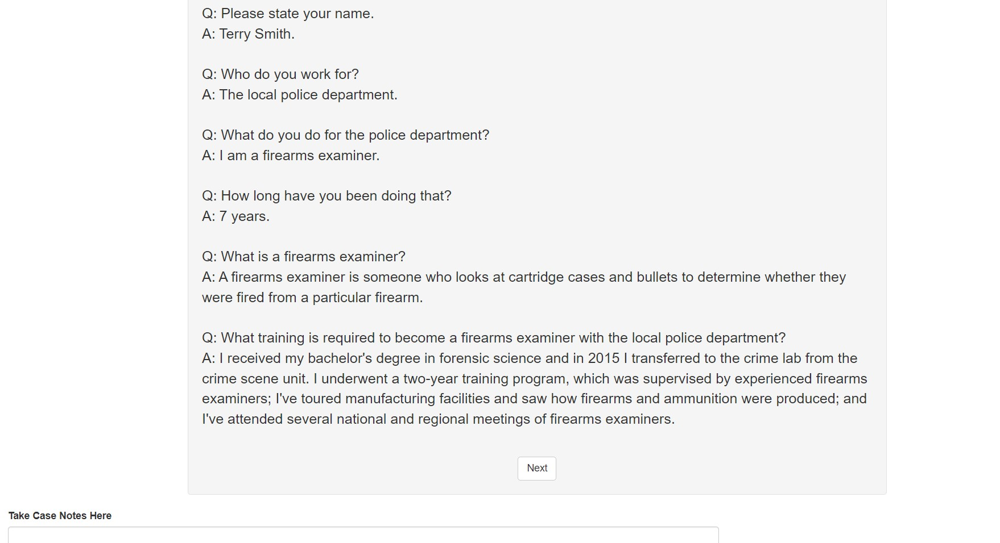
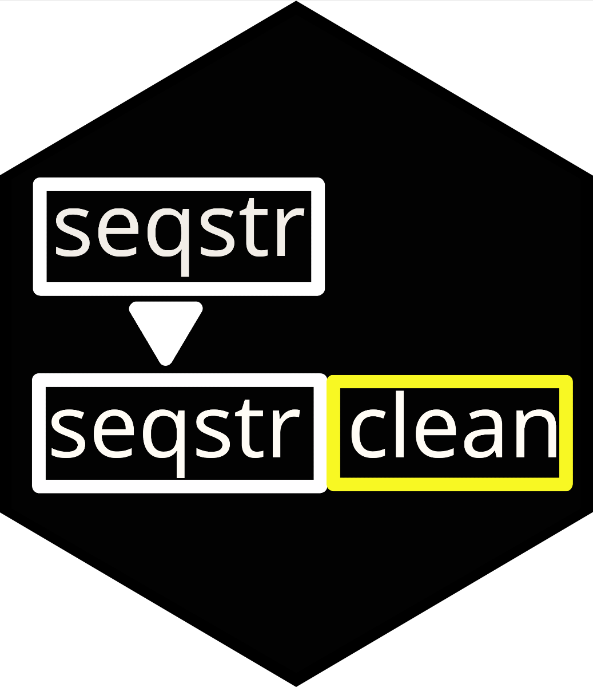
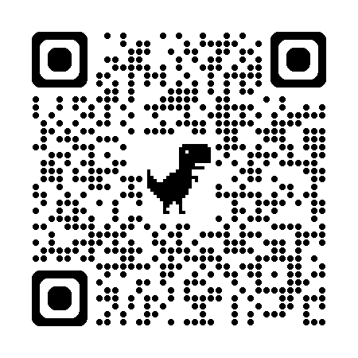
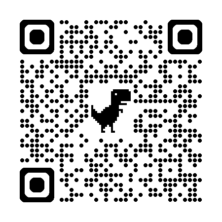
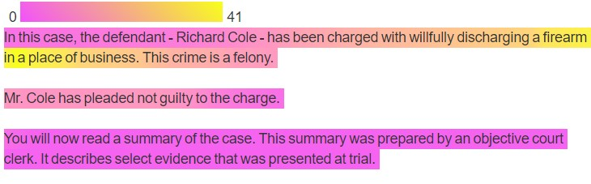
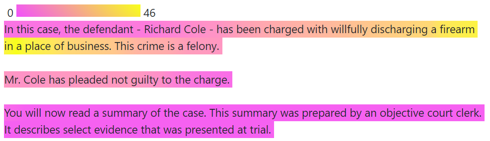
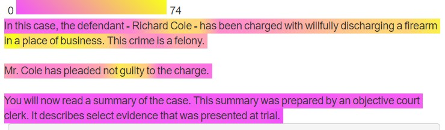
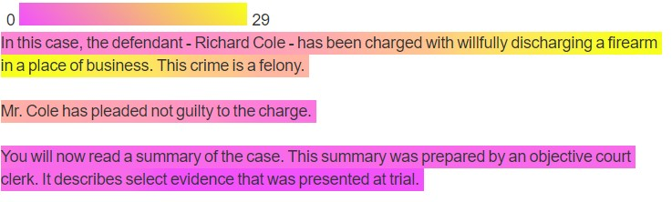
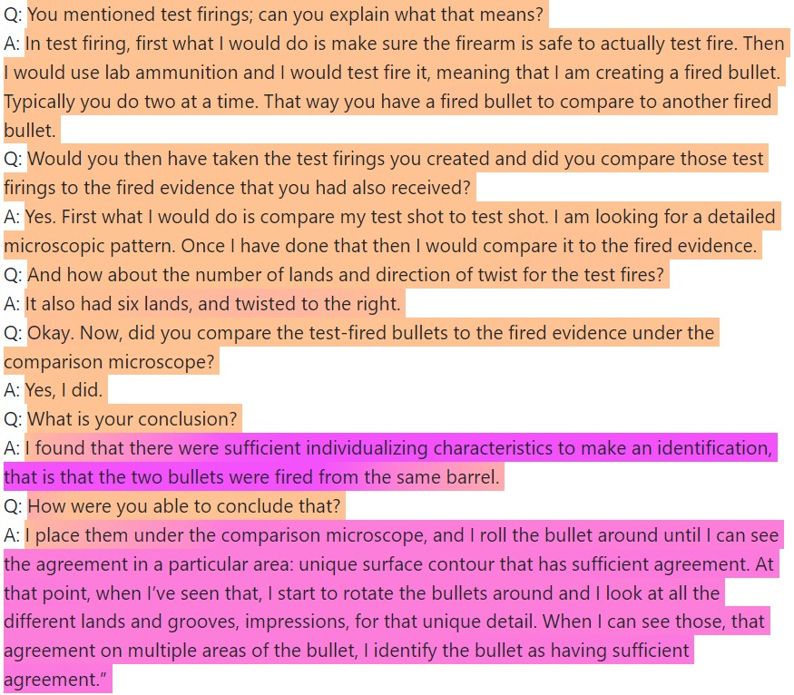
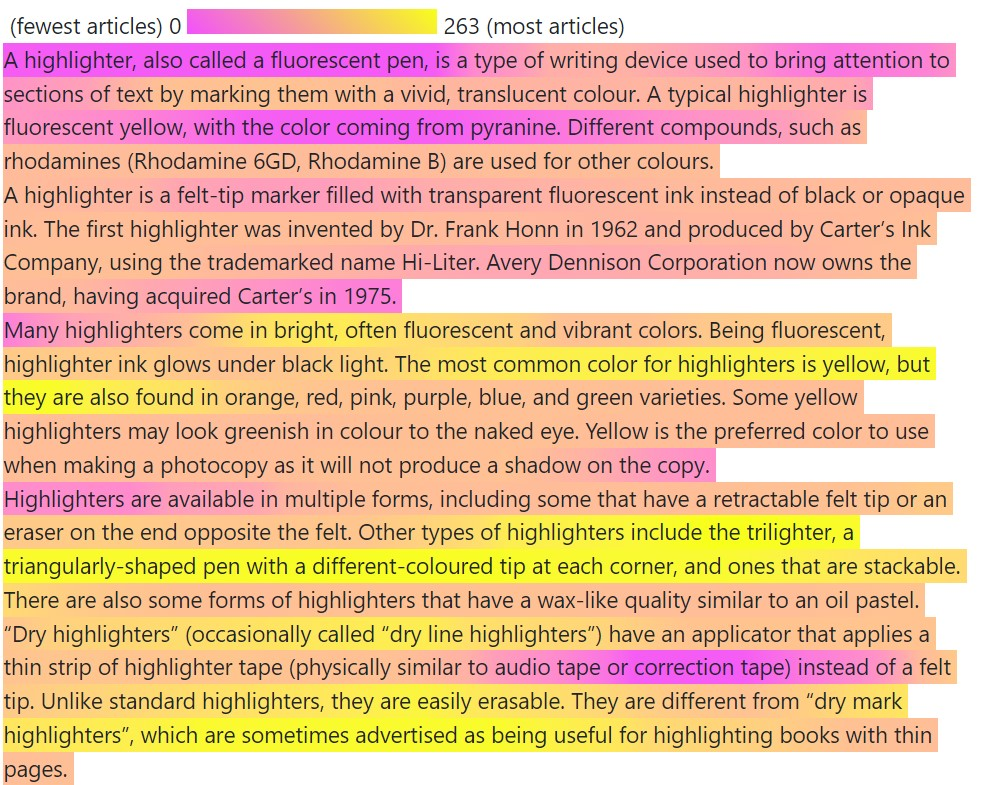

```{r setup, echo=FALSE, warning=FALSE, message=FALSE}
library(knitr)
library(ggplot2)
library(fontawesome)
library(DiagrammeR)
library(gridExtra)
library(grid)
library(jpeg)
```


class: primary-blue
## Transcript Scenario

- Mock Trial Scenario (Garrett et. al.(2020))
    - Attempted convenience store robbery
    - Participants read testimony from firearms examiner comparing defendant's gun to bullet recovered from the crime scene
    
- Three Variables: 
    - Demonstrative Evidence 
    - Algorithm 
        - Algorithm testimony includes both a firearms examiner and an algorithm developer
    - Conclusion

- Gathering Data
    - 569 participants from Prolific (using representative sample feature)

- Participants were presented with a trial transcript based on court cases

---

class: primary-blue

.img[]

- Participants are provided with a digital notepad, and input is saved for each page of testimony

---

class: primary-blue
### Digital Notepad

- Data cleaning: removing the previous page's notes before analysis
  
  .img[]

---

class: center, middle, inverse-blue

# Sequential Note Cleaning

<!--  -->

<!--  -->

---

class: primary-blue
### First n Characters

- Test edit distance on first n characters to previous notes
   - Edit distance: Number of changes necessary to go from one string to the other string

.img[]

- What if:
   - Participants delete portions of their previous notes?
   - Participants add new notes in the middle of/before their old notes?
   - Participants duplicate their old notes?
   
---

class: primary-blue
### Longest Common Substring (LCS)

PTXQC Package (Bielow et al.)

- Participants delete portions of their previous notes
   
Page 1 | Page 2 | LCS | Edit Distance
--------|---------|---------|---------
The cat ran up the tree | The cat ran | The cat ran | 12

- Participants add new notes in the middle of old notes
   
Page 1 | Page 2 | LCS | Edit Distance
--------|---------|---------|---------
The cat ran up the tree | <mark>The cat ran, chased by a</mark> dog, up the tree | (The cat ran)(up the tree) | 11

- Participants duplicate their old notes
   
Page 1 | Page 2 | LCS | Edit Distance
--------|---------|---------|---------
The cat ran up the tree | <mark>The cat ran up the tree</mark> The cat ran up the tree | (The cat ran up the tree)(The cat ran up the tree) | 0

---

class: primary-blue
### Hybrid Method

- Difficult Cases
   - Edit distance larger than the initial cutoff value
   - Note length more than 4 standard deviations above the mean length for that page
- Based on validation from 35 participants' notes (495 non-blank pages, cleaned by hand)

```{r echo=FALSE, warning=FALSE, message=FALSE}
library(readr)
validation_table <- read_csv("~/PhD Research/UNL_Thesis/data/validation_summary_table.csv")

val_table <- validation_table[,-1]
val_table$Time<- round(val_table$Time, 2)
val_table$Error<- round(val_table$Error, 2)
val_table$SD<- round(val_table$SD, 2)
colnames(val_table) <- c("Method", "Time (Minutes)", "Error", "SD")

kable(val_table, align=c('l','c','c','c'))

```

---

class: center, middle, inverse-blue

# Highlighting Common Text




---

class: primary-blue
### How can we tell which portions of the testimony participants focus on?

- Highlight testimony based on frequency of occurrence in participants' notes
  - Collocations of length 5
     - Willfully: average frequency of ~30

```{r echo=FALSE, warning=FALSE, message=FALSE}
library(highlightr)
library(dplyr)
comment_example_rename <- dplyr::rename(comment_example, page_notes=Notes)

toks_comment <- highlightr::token_comments(comment_example_rename)

transcript_example_rename <- dplyr::rename(transcript_example, text=Text)

toks_transcript <- highlightr::token_transcript(transcript_example_rename)

collocation_object <- highlightr::collocate_comments(toks_transcript, toks_comment)

merged_frequency <- highlightr::transcript_frequency(transcript_example_rename, collocation_object)

collocation_object %>% select(col_1, collocation) %>% filter(grepl("willfully", collocation)) %>% rename(Frequency=col_1) %>% kable()

freq_plot <- highlightr::collocation_plot(merged_frequency)

page_highlight <- highlightr::highlighted_text(freq_plot)

```




---

class: primary-blue
### Weights

- Fuzzy Matches:
  - How many times the indirect match occurs
  - How close the indirect match is to the transcript phrase
  - Number of closest transcript matches to the indirect match
    - For example, "Jur" has an edit distance of 2 from both "June" and "July"
- All Matches:
  - How many times the collocation occurs in the testimony
    - ex. "the bullet matching algorithm is"
  
.pull-left[.img[]]
.pull-right[.img[]]

---

class: primary-blue

Length 2



Length 5


Length 8



---

class: primary-blue
### Collocation Analysis



---

class: primary-blue

### Other Applications: Wikipedia Edit History




---

class: primary-blue
### Citations

- Center for Statistics and Applications in Forensic Evidence, Rogers R, VanderPlas S (2024). highlightr: Highlight Conserved Edits Across Versions of a Document. R package version 1.0.0,
https://doi.org/10.32614/CRAN.package.highlightr

-   Bielow C, Mastrobuoni G, Kempa S (2016). “Proteomics Quality Control: Quality Control Software for MaxQuant Results.” _Journal of Proteome Research_, *15 (3)*, 77-787.
  doi:10.1021/acs.jproteome.5b00780
  
- Garrett, B. L., Scurich, N., & Crozier, W. E. "Mock jurors’ evaluation of firearm examiner testimony." (2020). Law and Human Behavior, 44(5), 412–423. https://doi.org/10.1037/lhb0000423

- “Highlighter.” Wikipedia, 14 Mar. 2024. Wikipedia, https://en.wikipedia.org/w/index.php?title=Highlighter&oldid=1213690238.

This work was funded (or partially funded) by the Center for Statistics and Applications in Forensic Evidence (CSAFE) through Cooperative Agreements 70NANB15H176 and 70NANB20H019 between NIST and Iowa State University, which includes activities carried out at Carnegie Mellon University, Duke University, University of California Irvine, University of Virginia, West Virginia University, University of Pennsylvania, Swarthmore College and University of Nebraska, Lincoln.

---

class: primary-blue
### Weights

- Fuzzy Matching
  - $x_i$ is the frequency for a fuzzy collocation $i$
  - $d_i$ is the fuzzy match distance
  - $c_i$ is the number of closest matches for the fuzzy collocation
     - ex. "Jur"
- Non-Fuzzy Matching ( $z$ )
- What if the testimony contains the same collocation multiple times? ( $k$ )
  - ex. "the bullet matching algorithm is"
  
$$
(z+\sum_{i=1}^n\frac{x_i}{(d_i+0.25)c_i})\frac{1}{k}
$$

.pull-left[.img[]]
.pull-right[.img[]]

---

class: primary-blue
### Longest Common Substring (LCS)

- Search for the longest common substring between the current set of notes and the previous set of notes (PTXQC)
   - If the string is long enough, remove from current page of notes
   - Repeat

```{r, echo=FALSE, message=FALSE, warning=FALSE, fig.align="center"}
grViz("digraph {
  graph [layout = dot, rankdir = TB]
  
  node [shape = rectangle]        
  rec1 [label = 'Page 1\n the cat enjoys napping in the afternoon']
  rec2 [label = 'Page 2\nWhen it is quiet, the cat enjoys napping']
  rec3 [label =  'LCS\n the cat enjoys napping']
  rec4 [label = 'Page 2 Clean\nWhen it is quiet']
  
  # edge definitions with the node IDs
  rec1 -> rec3
  rec2 -> rec3
  rec3 -> rec4
  }",
  height = 500, width=800)

```

---

class: primary-blue
### Hybrid Method

- LCS Drawbacks
   - What if testimony itself is repeated?
   - Time intensive
- Use the first n character method for easy cases, then clean up difficult cases with LCS (Tested on subset of 35 participants' notes)


