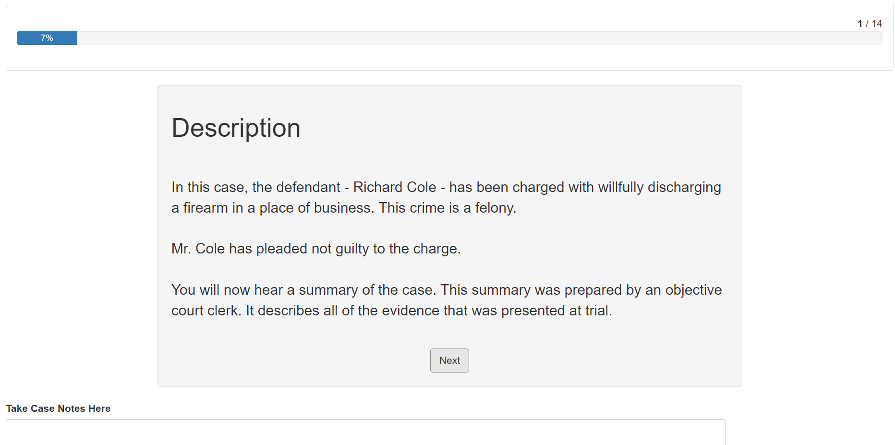
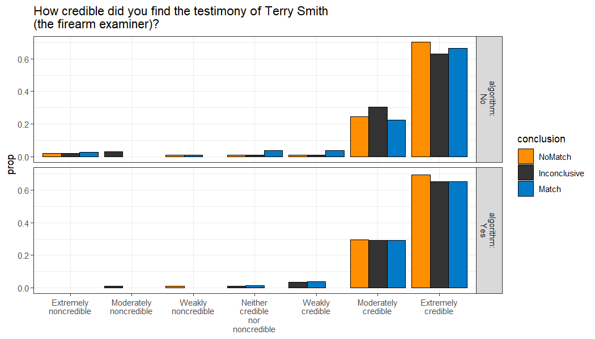
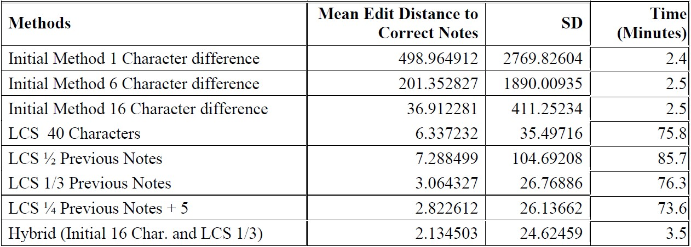
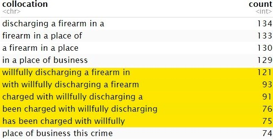
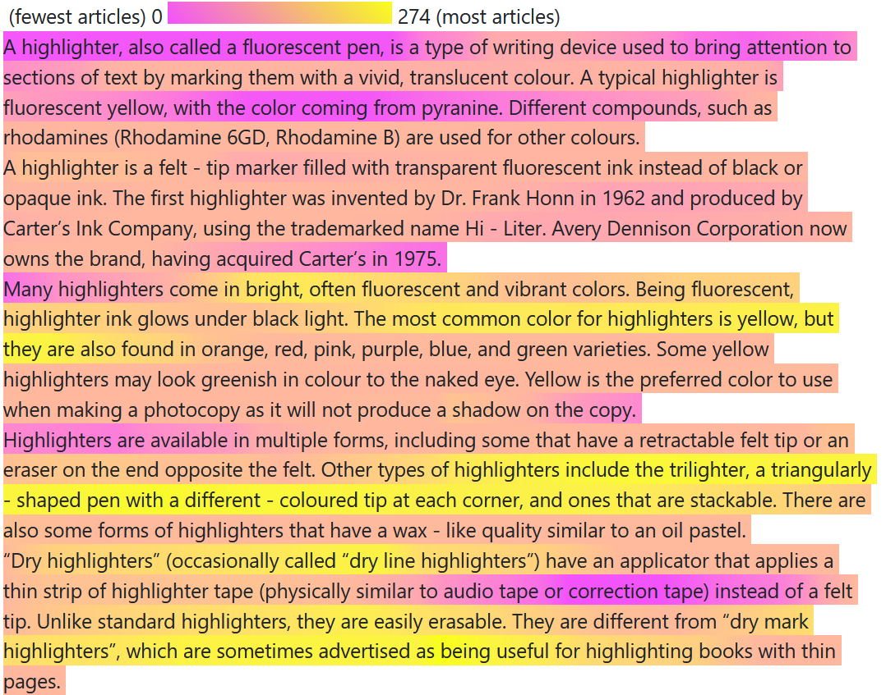

# Overview

- Humans are finicky, and do not always respond how we expect or prefer
- This presents a challenge and an opportunity when analyzing data

--

# Outline

- Failed Likert Scales and Alternative Approaches  
- Sequential Notepad Analysis  
- Flowmaps in an Interactive Lineup Scenario  
- Future Directions

---
# The Beginning

How do potential jurors react to the use of a bullet matching algorithm alongside an examiner's testimony in a trial scenario?

- 2 x 2 x 3 Factorial Design
  - Presence/Absence of Images
  - Presence/Absence of Algorithm
  - Identification/Inconclusive/Elimination Conclusion 
  
<figure>

</figure>

---

## The Structure

- Based on Garrett et. al.'s "Mock jurors' evaluation of firearm examiner testimony" (2020)
    - Richard Cole is on trial for attempted robbery of a convenience store
    - Gun found in Cole's car is tested against bullet recovered from crime scene
    - Partial Testimony

- Gathering Data
    - 569 participants from Prolific (using representative sample feature)
    
- Questions on the reliability/credibility of the evidence or the expert

---

## The Results


<center>
<!--  -->
</center>

---

## Moving Forward

- Notepad analysis
  - Participants had the option to use a digital notepad throughout the study
  - Results were saved after each page

- Scale analysis
  - Ceiling effect: examiners are overall seen as reliable
  - Individuals may already believe that firearms evidence is reliable (Garrett & Mitchell, 2013)
  - Proposed Solution: Investigate other response methods
  

---

## Notepad Analysis


- Participants are provided with a digital notepad, and input is saved for each page of testimony
  - Data cleaning: removing the previous page's notes before analysis
  - Visualization: map frequency of phrases onto original testimony to show which phrases were copied more frequently
  
  .img[]

---

### First n Characters

- Test edit distance on first n characters to previous notes
   - Edit distance: Number of changes necessary to go from one string to the other string
   - Hat -> Hot requires 1 substitution (edit distance of 1)
   - Over there -> there requires 5 deletions (edit distance of 5)
- Set a threshold for the maximum allowable difference between texts

.img[]

- What if:
   - Participants delete portions of their previous notes?
   - Participants add new notes in the middle of/before their old notes?
   - Participants duplicate their old notes?
   
---

### Longest Common Substring (LCS)

- Search for the longest common substring between the current set of notes and the previous set of notes
   - If the string is "long enough", remove from current page of notes
   - Repeat

```{r, echo=FALSE, message=FALSE, warning=FALSE, fig.align="center"}

library(DiagrammeR)
library(ggplot2)
library(patchwork)
library(readr)
library(dplyr)
library(tidyr)
library(scales)
library(corrplot)
library(kableExtra)
library(lme4)
library(car)
library(emmeans)
library(rcompanion)
library(knitr)

grViz("digraph {
  graph [layout = dot, rankdir = TB]
  
  node [shape = rectangle]        
  rec1 [label = 'Page 1\n the cat enjoys napping in the afternoon']
  rec2 [label = 'Page 2\nWhen it is quiet, the cat enjoys napping']
  rec3 [label =  'LCS\n the cat enjoys napping']
  rec4 [label = 'Page 2 Clean\nWhen it is quiet']
  
  # edge definitions with the node IDs
  rec1 -> rec3
  rec2 -> rec3
  rec3 -> rec4
  }",
  height = 500, width=800)

```

---

### Longest Common Substring (LCS)

What if...
- Participants delete portions of their previous notes?
   
Page 1 | Page 2 | LCS | Edit Distance
--------|---------|---------|---------
The cat ran up the tree | The cat ran | The cat ran | 12

- Participants add new notes in the middle of old notes?
   
Page 1 | Page 2 | LCS | Edit Distance
--------|---------|---------|---------
The cat ran up the tree | <mark>The cat ran, chased by a</mark> dog, up the tree | (The cat ran)(up the tree) | 11

- Participants duplicate their old notes?
   
Page 1 | Page 2 | LCS | Edit Distance
--------|---------|---------|---------
The cat ran up the tree | <mark>The cat ran up the tree</mark> The cat ran up the tree | (The cat ran up the tree)(The cat ran up the tree) | 0

---

### Hybrid Note Cleaning

- Easy Cases of Sequential Notes
   - First N Character Method
     - Compare the beginning of the current notes with the entirety of the previous notes

.img[]

- Difficult Notes (deletion, insertion, and duplication)
   - Longest Common Substring 

---

### Hybrid Method

- Difficult Cases
   - Edit distance larger than the initial cutoff value
   - Note length more than 4 standard deviations above the mean length for that page
- Based on validation from 35 participants' notes (cleaned by hand)
   - 561 pages of notes

.img[]


---

### How can we tell which portions of the testimony participants focus on?

- Highlight testimony based on frequency of occurrence in participants' notes
  - Collocations of length 5
     - Willfully: average frequency of 91.2
  - Frequency of Individual words
  - Divide by number of occurrences in the testimony

  
.pull-left[.img[]]
.pull-right[.img[]
            ]

---

background-image: url("images/logo.png")
background-size: 100px
background-position: 90% 8%

## Other Applications: highlightr package

.pull-left[
- Map collocation frequency in derivative documents to a source document

- Weighted Fuzzy Matches
  - Weight indirect matches by Jaccard distance to account for typos
  - Future directions: Account for paraphrased material
- Format output in .html
  - Works for .Rmd documents
  - Can save as separate file]
  
.pull-right[


.img[]]


---

## Scale Analysis

- Follow-up study comparing response formats
  - Strength of evidence (Likert - 9 point)
  - Guilt (Yes/No)
  - Convict (Yes/No)
  - Probability of guilt (Numeric)
  - What are the chances that defendant committed the crime? (Numeric or multiple choice)
  - How much would you be willing to bet that the defendant committed the crime? (Numeric)
  
- Inclusion of jury instructions and more cross examination on subjectivity

- Simplified to Identification and Elimination condition, without algorithm and images

- 300 Participants

---

## Results

```{r}
#| generalresponse,
#| fig.width= 8,
#| fig.height= 6,
#| fig.align= "center",
#| echo= FALSE,
#| eval= TRUE,
#| warning= FALSE,
#| message= FALSE,
#| dev = "svg"

microstudy <- read_csv("data/response_type_data_no_demographics.csv")

# removing participants who did not pass the attention check, and one participant with an unusually low completion time.
microstudy_clean <- microstudy %>% dplyr::filter(check=="9mm", round(randomnumber,5) != 12.59938) 

microstudy_clean$evidence_strength = factor(
  microstudy_clean$evidence_strength,
  levels = c(
    "1 Not at all strong",
    "2",
    "3",
    "4",
    "5 Moderately strong",
    "6",
    "7",
    "8",
    "9 Extremely strong"
  )
)

microstudy_clean$chances_fixed = factor(
  microstudy_clean$chances_fixed,
  levels = c(
    "Impossible that he is guilty",
    "About 1 chance in 10,000",
    "About 1 chance in 1,000",
    "About 1 chance in 100",
    "About 1 chance in 10",
    "1 chance in 2 (fifty-fifty chance)",
    "About 9 chances in 10",
    "About 99 chances in 100",
    "About 999 chances in 1,000",
    "About 9,999 chances in 10,000",
    "Certain to be guilty"
  )
)

conclusion_labs <- data.frame(conclusion = c("Match", "NoMatch"),
                                 condition = c("Identification", "Elimination"))

microstudy_clean <- microstudy_clean %>% 
  separate(numeric_chance, c("chance_of", "numerator", "denominator"), sep=",")

microstudy_clean$num_chance <- as.numeric(microstudy_clean$numerator)/as.numeric(microstudy_clean$denominator)

chance_plot <- ggplot(microstudy_clean) +
  geom_bar(aes(x=evidence_strength, fill=conclusion), position="dodge") +
  scale_fill_manual(values = c("grey80","seagreen"), name="Condition",
                    labels=c("Identification", "Elimination"))+
  ylab("Count")+
  xlab("Likert Evidence Strength")+
  theme_bw()+
  theme(legend.position="none")+
  scale_x_discrete(labels = wrap_format(8))


hide_probability_plot <- ggplot(microstudy_clean, fill=conclusion) +
  geom_density(alpha=0.75, aes(x=as.numeric(hidden_probability), fill=conclusion)) +
  ylab("Density")+
  xlab("Hidden Probability")+
  scale_fill_manual(values = c("grey80","seagreen"), name="Condition",
                    labels=c("Identification", "Elimination"))+
  theme_bw()

vis_probability_plot <- ggplot(microstudy_clean, fill=conclusion) +
  geom_density(alpha=0.75, aes(x=as.numeric(hidden_probability), fill=conclusion)) +
  ylab("Density")+
  xlab("Visible Probability")+
  scale_fill_manual(values = c("grey80","seagreen"), name="Condition",
                    labels=c("Identification", "Elimination"))+
  theme_bw()


log_plot <- ggplot(microstudy_clean) +
  geom_bar(aes(x=chances_fixed, fill=conclusion),  
           position = position_dodge(preserve = "single")) +
  scale_fill_manual(values = c("grey80","seagreen"), name="Condition",
                    labels = conclusion_labs)+
  ylab("Count")+
     xlab("Categorical Chance")+
  theme_bw()+
    theme(legend.position="none")+
    # theme(legend.position="bottom")+
  scale_x_discrete(labels = c("Impossible", "1 in 10,000", "1 in 1,000",
                              "1 in 100", "1 in 10", "1 in 2", "9 in 10",
                              "99 in 100", "999 in 1,000", 
                              "9,999 in 10,000", "Certain"),
                   guide=guide_axis(angle=-45))

(chance_plot + hide_probability_plot)/(log_plot+vis_probability_plot)+
  plot_layout(guides = "collect")

```

---

## Results

```{r}
#| changingresponse,
#| fig.width= 8,
#| fig.height= 6,
#| fig.align= "center",
#| echo= FALSE,
#| eval= TRUE,
#| warning= FALSE,
#| message= FALSE,
#| dev = "svg"


numeric_plot_guilty <- ggplot(microstudy_clean[microstudy_clean$chance_of=="guilty",]) +
    geom_density(alpha=0.75, aes(x=num_chance, fill=conclusion))+
    scale_fill_manual(values = c("grey80","seagreen"), name="Condition",
                    labels = conclusion_labs$condition)+
  ylab("Count")+
  xlab("Numeric Chance (Guilt)")+
  theme_bw()+
  xlim(c(0,1))+
  ylim(c(0,15))

numeric_plot_innocent <- ggplot(microstudy_clean[microstudy_clean$chance_of=="innocent",]) +
    geom_density(alpha=0.75, aes(x=num_chance, fill=conclusion))+
    scale_fill_manual(values = c("grey80","seagreen"), name="Condition",
                    labels = conclusion_labs$condition)+
  ylab("Count")+
  xlab("Numeric Chance (Innocence)")+
  theme_bw()+
  xlim(c(0,1))+
  ylim(c(0,15))


betting_guilt <- ggplot(microstudy_clean[microstudy_clean$guilt_opinion=="Yes",]) +
  geom_density(aes(x=betting, fill=conclusion), alpha=0.75) +
    scale_fill_manual(values = c("grey80","seagreen"), name="Condition",
                    labels = conclusion_labs$condition)+
  scale_x_continuous(labels = scales::dollar_format(), breaks=c(0,10,20,30,40,50)) +
  ylab("Count")+
  xlab("Bet of Guilty")+
  ylim(c(0,0.1))+
  theme_bw()

betting_innocent <- ggplot(microstudy_clean[microstudy_clean$guilt_opinion=="No",]) +
  geom_density(aes(x=betting, fill=conclusion), alpha=0.75) +
    scale_fill_manual(values = c("grey80","seagreen"), name="Condition",
                    labels = conclusion_labs$condition)+
  scale_x_continuous(labels = scales::dollar_format(), breaks=c(0,10,20,30,40,50)) +
  ylab("Count")+
  xlab("Bet of Innocent")+
  theme_bw()

(numeric_plot_guilty + numeric_plot_innocent)/(betting_guilt + betting_innocent) +
  plot_layout(guides = "collect")


```

---

## Rank correlation

```{r}
#| corrplot,
#| fig.width= 8,
#| fig.height= 8,
#| fig.align= "center",
#| echo= FALSE,
#| eval= TRUE,
#| warning= FALSE,
#| message= FALSE,
#| dev = "svg"


# hid_vis_pval <- wilcox.test(microstudy_clean[!is.na(microstudy_clean$hidden_probability),]$visible_probability-as.numeric(microstudy_clean[!is.na(microstudy_clean$hidden_probability),]$hidden_probability))

corr_values <- microstudy_clean %>% dplyr::select("convict", "guilt_opinion", "betting", "hidden_probability", "chances_fixed", "evidence_strength", "num_chance", "visible_probability", "chance_of") %>% mutate("num_convict"=as.numeric(as.factor(convict)), "num_guilt_opinion"=as.numeric(as.factor(guilt_opinion)), "cat_chances"=as.numeric(chances_fixed), "num_strength"=as.numeric(evidence_strength), "num_hidden"=as.numeric(hidden_probability))

corr_values$numeric_guilt <- NA
corr_values[corr_values$chance_of=="guilty",]$numeric_guilt <- corr_values[corr_values$chance_of=="guilty",]$num_chance

corr_values$numeric_innocence <- NA
corr_values[corr_values$chance_of=="innocent",]$numeric_innocence <- corr_values[corr_values$chance_of=="innocent",]$num_chance

corr_values$bet_guilt <- NA
corr_values[corr_values$guilt_opinion=="Yes",]$bet_guilt <- corr_values[corr_values$guilt_opinion=="Yes",]$betting

corr_values$bet_innocent <- NA
corr_values[corr_values$guilt_opinion=="No",]$bet_innocent <- corr_values[corr_values$guilt_opinion=="No",]$betting

cor_matrix <- cor(corr_values[,c("bet_guilt","bet_innocent","num_convict", "num_guilt_opinion", "cat_chances", "num_strength", "num_hidden", "visible_probability", "numeric_guilt", "numeric_innocence")], use="pairwise.complete.obs", method="kendall")

rownames(cor_matrix) <- c("Guilt Bet", "Innocent Bet", "Conviction Decision", "Opinion of Guilt", "Categorical Chances", "Strength", "Hidden Probability", "visible Probability", "Numeric Chance (Guilt)", "Numeric Chance (Innocence)")

colnames(cor_matrix) <- c("Guilt Bet", "Innocent Bet", "Conviction Decision", "Opinion of Guilt", "Categorical Chances", "Strength", "Hidden Probability", "visible Probability", "Numeric Chance (Guilt)", "Numeric Chance (Innocence)")

corrplot(cor_matrix, type="lower", method="color", tl.col = "black", tl.srt = 45, addCoef.col = "grey60", addCoefasPercent = TRUE, number.cex=0.75)

```

---

## Consistency

```{r}
#| opinioncomp,
#| echo= FALSE,
#| eval= TRUE,
#| warning= FALSE,
#| message= FALSE


opinion_comparison <- 
  data.frame(hidden_probability = rep(NA, dim(microstudy_clean)[1]),
             chances_fixed = rep(NA, dim(microstudy_clean)[1]),
             visible_probability = rep(NA, dim(microstudy_clean)[1]),
             numeric_chance = rep(NA, dim(microstudy_clean)[1]),
             opinion = rep(NA, dim(microstudy_clean)[1]),
             chance_of = rep(NA, dim(microstudy_clean)[1]))

opinion_comparison$opinion <- ifelse(microstudy_clean$guilt_opinion == "No", "Innocent", "Guilty")

opinion_comparison$chance_of <- microstudy_clean$chance_of

opinion_comparison[opinion_comparison$opinion == "Innocent",]$hidden_probability <- 
  ifelse(as.numeric(microstudy_clean[microstudy_clean$guilt_opinion == "No",]$hidden_probability) <= 50, "Consistent","Inconsistent")

opinion_comparison[opinion_comparison$opinion == "Guilty",]$hidden_probability <- 
  ifelse(as.numeric(microstudy_clean[microstudy_clean$guilt_opinion == "Yes",]$hidden_probability) >= 50, "Consistent","Inconsistent")

opinion_comparison[opinion_comparison$opinion == "Innocent",]$visible_probability <- 
  ifelse(as.numeric(microstudy_clean[microstudy_clean$guilt_opinion == "No",]$visible_probability) <= 50, "Consistent","Inconsistent")

opinion_comparison[opinion_comparison$opinion == "Guilty",]$visible_probability <- 
  ifelse(as.numeric(microstudy_clean[microstudy_clean$guilt_opinion == "Yes",]$visible_probability) >= 50, "Consistent","Inconsistent")

opinion_comparison[opinion_comparison$opinion == "Innocent" & 
                     opinion_comparison$chance_of=="guilty",
                   ]$numeric_chance <-
  ifelse(microstudy_clean[(microstudy_clean$guilt_opinion == "No" &
                             microstudy_clean$chance_of=="guilty"),
                          ]$num_chance <= 0.50, "Consistent","Inconsistent")

opinion_comparison[opinion_comparison$opinion == "Guilty" & 
                     opinion_comparison$chance_of=="guilty",
                   ]$numeric_chance <-
  ifelse(microstudy_clean[(microstudy_clean$guilt_opinion == "Yes" &
                             microstudy_clean$chance_of=="guilty"),
                          ]$num_chance >= 0.50, "Consistent","Inconsistent")

opinion_comparison[opinion_comparison$opinion == "Innocent" & 
                     opinion_comparison$chance_of=="innocent",
                   ]$numeric_chance <-
  ifelse(microstudy_clean[(microstudy_clean$guilt_opinion == "No" &
                             microstudy_clean$chance_of=="innocent"),
                          ]$num_chance >= 0.50, "Consistent","Inconsistent")

opinion_comparison[opinion_comparison$opinion == "Guilty" & 
                     opinion_comparison$chance_of=="innocent",
                   ]$numeric_chance <-
  ifelse(microstudy_clean[(microstudy_clean$guilt_opinion == "Yes" &
                             microstudy_clean$chance_of=="innocent"),
                          ]$num_chance <= 0.50, "Consistent","Inconsistent")

opinion_comparison[opinion_comparison$opinion == "Innocent",
                   ]$chances_fixed <-
  ifelse(microstudy_clean[microstudy_clean$guilt_opinion ==
                            "No",]$chances_fixed %in% 
           c("Impossible that he is guilty", "About 1 chance in 10,000",
             "About 1 chance in 1,000", "About 1 chance in 100",
             "About 1 chance in 10", "1 chance in 2 (fifty-fifty chance)"),
         "Consistent","Inconsistent")

opinion_comparison[opinion_comparison$opinion == "Guilty",
                   ]$chances_fixed <-
  ifelse(microstudy_clean[microstudy_clean$guilt_opinion ==
                            "Yes",]$chances_fixed %in% 
           c("1 chance in 2 (fifty-fifty chance)", "About 9 chances in 10",
             "About 99 chances in 100", "About 999 chances in 1,000",
             "About 9,999 chances in 10,000","Certain to be guilty"),
         "Consistent","Inconsistent")

opinion_comparison <- opinion_comparison %>% mutate(id = as.character(1:n()))

opinion_comparison$numeric_chance_guilt <- NA
opinion_comparison[opinion_comparison$chance_of=="guilty",]$numeric_chance_guilt <- opinion_comparison[opinion_comparison$chance_of=="guilty",]$numeric_chance

opinion_comparison$numeric_chance_innocence <- NA
opinion_comparison[opinion_comparison$chance_of=="innocent",]$numeric_chance_innocence <- opinion_comparison[opinion_comparison$chance_of=="innocent",]$numeric_chance

opinion_comparison2 <- opinion_comparison %>% dplyr::select(hidden_probability, chances_fixed, visible_probability, opinion, numeric_chance_guilt, numeric_chance_innocence, id)

long_opinion_comparison <- opinion_comparison2 %>% 
  pivot_longer(c("hidden_probability", "chances_fixed", "visible_probability", "numeric_chance_guilt", "numeric_chance_innocence"), names_to = "Question", values_to = "Consistent")

long_opinion_comparison$Consistent <- factor(long_opinion_comparison$Consistent, levels = c("Inconsistent", "Consistent"))

opinion_consistency<-long_opinion_comparison %>% group_by(Question) %>% summarize(number_consistent_opinion = sum(Consistent=="Consistent", na.rm=TRUE), number_inconsistent_opinion = sum(Consistent=="Inconsistent", na.rm=TRUE),  opinion=paste0(round(number_consistent_opinion/(number_consistent_opinion+number_inconsistent_opinion)*100, 2), "%")) 

# kable(caption="Percentage of Participants providing values consistent to their opinion of guilt for each response category. \\label{tab:opinioncomp}")

```

```{r}
#| correctrange,
#| echo= FALSE,
#| eval= TRUE,
#| warning= FALSE,
#| message= FALSE


set_values <- 
  data.frame(chances_fixed=c("Impossible that he is guilty",
                             "About 1 chance in 10,000",
                             "About 1 chance in 1,000",
                             "About 1 chance in 100",
                             "About 1 chance in 10",
                             "1 chance in 2 (fifty-fifty chance)",
                             "About 9 chances in 10",
                             "About 99 chances in 100",
                             "About 999 chances in 1,000",
                             "About 9,999 chances in 10,000",
                             "Certain to be guilty"),
             value=c(0,1/10000,1/1000,1/100,1/10,0.5,9/10,
                     99/100,999/1000,9999/10000,1),
             lower = c(0, 1/20000, (1/10000+1/1000)/2, (1/1000+1/100)/2,
                       (1/100+1/10)/2, (1/10+0.5)/2, (0.5+9/10)/2,
                       (9/10+99/100)/2, (99/100+999/1000)/2,
                       (999/1000+9999/10000)/2, (9999/10000+1)/2),
             upper = c(1/20000, (1/10000+1/1000)/2, (1/1000+1/100)/2,
                       (1/100+1/10)/2, (1/10+0.5)/2, (0.5+9/10)/2,
                       (9/10+99/100)/2, (99/100+999/1000)/2,
                       (999/1000+9999/10000)/2, (9999/10000+1)/2, 1))
clean_results_merged<- dplyr::left_join(microstudy_clean, set_values)

clean_results_merged <- clean_results_merged %>%
    mutate(adjusted_lower = 
             ifelse(chance_of == "innocent", 1 - upper, lower))%>%
    mutate(adjusted_upper = ifelse(chance_of == "innocent", 1 - lower, upper))


clean_results_merged$chances_fixed = factor(
  clean_results_merged$chances_fixed,
  levels = c(
    "Impossible that he is guilty",
    "About 1 chance in 10,000",
    "About 1 chance in 1,000",
    "About 1 chance in 100",
    "About 1 chance in 10",
    "1 chance in 2 (fifty-fifty chance)",
    "About 9 chances in 10",
    "About 99 chances in 100",
    "About 999 chances in 1,000",
    "About 9,999 chances in 10,000",
    "Certain to be guilty"
  )
)

mult_labs <- data.frame(short_mult = c(
    "Impossible",
    "1/10,000",
    "1/1,000",
    "1/100",
    "1/10",
    "1/2",
    "9/10",
    "99/100",
    "999/1,000",
    "9,999/10,000",
    "Certain"
  ), chances_fixed = c(
    "Impossible that he is guilty",
    "About 1 chance in 10,000",
    "About 1 chance in 1,000",
    "About 1 chance in 100",
    "About 1 chance in 10",
    "1 chance in 2 (fifty-fifty chance)",
    "About 9 chances in 10",
    "About 99 chances in 100",
    "About 999 chances in 1,000",
    "About 9,999 chances in 10,000",
    "Certain to be guilty"
  ))

clean_results_merged<-left_join(clean_results_merged, mult_labs)

clean_results_merged$short_mult = factor(
  clean_results_merged$short_mult,
  levels = c(
    "Impossible",
    "1/10,000",
    "1/1,000",
    "1/100",
    "1/10",
    "1/2",
    "9/10",
    "99/100",
    "999/1,000",
    "9,999/10,000",
    "Certain"
  )
)

clean_results_merged$correct_range <- 
  clean_results_merged$num_chance >= clean_results_merged$adjusted_lower &
  clean_results_merged$num_chance <= clean_results_merged$adjusted_upper

clean_results_merged$correct_range_word <- NA
clean_results_merged[clean_results_merged$correct_range==TRUE,]$correct_range_word <- "Consistent"
clean_results_merged[clean_results_merged$correct_range==FALSE,]$correct_range_word <- "Inconsistent"

correct_summary_df <- data.frame(table(clean_results_merged$correct_range, clean_results_merged$chance_of))
names(correct_summary_df)<- c("Consistent", "chance_of", "Count")

guilt_consist <- correct_summary_df[2,3]/(correct_summary_df[1,3]+correct_summary_df[2,3])

innocent_consist <- correct_summary_df[4,3]/(correct_summary_df[3,3]+correct_summary_df[4,3])

correct_prop_test <-
  prop.test(x=c(correct_summary_df$Count[2], correct_summary_df$Count[4]),
              n=c(correct_summary_df$Count[1]+correct_summary_df$Count[2],
                  correct_summary_df$Count[3]+correct_summary_df$Count[4]))

choice.labs <- c("Guilt\nChance", "Innocence\nChance")
names(choice.labs) <- c("guilty", "innocent")

# chance_chisq<-chisq.test(clean_results_merged$correct_range_word,clean_results_merged$chance_of)
# chance_cramer <- cramerV(clean_results_merged$correct_range_word,clean_results_merged$chance_of)

inconsistent_values <- clean_results_merged %>% 
  filter(correct_range_word=="Inconsistent" & chance_of=="guilty")

inconsistent_values$flipped_value <- inconsistent_values$num_chance
# inconsistent_values[inconsistent_values$chance_of=="innocent",]$flipped_value <- 
#   1 - inconsistent_values[inconsistent_values$chance_of=="innocent",]$num_chance

inconsistent_values$multiple_extreme <- NA

inconsistent_values[inconsistent_values$value > 0.5 & 
                      inconsistent_values$flipped_value > inconsistent_values$value, ]$multiple_extreme<-FALSE

inconsistent_values[inconsistent_values$value > 0.5 & 
                      inconsistent_values$flipped_value < inconsistent_values$value, ]$multiple_extreme<-TRUE

inconsistent_values[inconsistent_values$value < 0.5 & 
                      inconsistent_values$flipped_value < inconsistent_values$value, ]$multiple_extreme<-FALSE

inconsistent_values[inconsistent_values$value < 0.5 & 
                      inconsistent_values$flipped_value > inconsistent_values$value, ]$multiple_extreme<-TRUE

inconsistent_values[inconsistent_values$value == 0.5, ]$multiple_extreme<-FALSE

proportion_test <- prop.test(sum(inconsistent_values$multiple_extreme),length(inconsistent_values$multiple_extreme))

```

```{r}
#| correctprobmosaic,
#| echo= FALSE,
#| eval= TRUE,
#| warning= FALSE,
#| message= FALSE

clean_results_merged$prob_mult_consistency <- NA

clean_results_merged[clean_results_merged$chances_fixed=="Impossible that he is guilty" & clean_results_merged$visible_probability==0,]$prob_mult_consistency <- "Consistent"

clean_results_merged[clean_results_merged$chances_fixed=="Impossible that he is guilty" & clean_results_merged$visible_probability!=0,]$prob_mult_consistency <- "Inconsistent"

clean_results_merged[clean_results_merged$chances_fixed=="About 1 chance in 10,000" & clean_results_merged$visible_probability %in% c(0,1),]$prob_mult_consistency <- "Consistent"

clean_results_merged[clean_results_merged$chances_fixed=="About 1 chance in 10,000" & !(clean_results_merged$visible_probability %in% c(0,1)),]$prob_mult_consistency <- "Inconsistent"

clean_results_merged[clean_results_merged$chances_fixed=="About 1 chance in 1,000" & clean_results_merged$visible_probability %in% c(0,1),]$prob_mult_consistency <- "Consistent"

clean_results_merged[clean_results_merged$chances_fixed=="About 1 chance in 1,000" & !(clean_results_merged$visible_probability %in% c(0,1)),]$prob_mult_consistency <- "Inconsistent"

clean_results_merged[clean_results_merged$chances_fixed=="About 1 chance in 100" & clean_results_merged$visible_probability %in% seq(1,5),]$prob_mult_consistency <- "Consistent"

clean_results_merged[clean_results_merged$chances_fixed=="About 1 chance in 100" & !(clean_results_merged$visible_probability %in% seq(1,5)),]$prob_mult_consistency <- "Inconsistent"

clean_results_merged[clean_results_merged$chances_fixed=="About 1 chance in 10" & clean_results_merged$visible_probability %in% seq(6,30),]$prob_mult_consistency <- "Consistent"

clean_results_merged[clean_results_merged$chances_fixed=="About 1 chance in 10" & !(clean_results_merged$visible_probability %in% seq(6,30)),]$prob_mult_consistency <- "Inconsistent"

clean_results_merged[clean_results_merged$chances_fixed=="1 chance in 2 (fifty-fifty chance)" & clean_results_merged$visible_probability %in% seq(30,70),]$prob_mult_consistency <- "Consistent"

clean_results_merged[clean_results_merged$chances_fixed=="1 chance in 2 (fifty-fifty chance)" & !(clean_results_merged$visible_probability %in% seq(30,70)),]$prob_mult_consistency <- "Inconsistent"

clean_results_merged[clean_results_merged$chances_fixed=="About 9 chances in 10" & clean_results_merged$visible_probability %in% seq(70,94),]$prob_mult_consistency <- "Consistent"

clean_results_merged[clean_results_merged$chances_fixed=="About 9 chances in 10" & !(clean_results_merged$visible_probability %in% seq(70,94)),]$prob_mult_consistency <- "Inconsistent"

clean_results_merged[clean_results_merged$chances_fixed=="About 99 chances in 100" & clean_results_merged$visible_probability %in% seq(95,99),]$prob_mult_consistency <- "Consistent"

clean_results_merged[clean_results_merged$chances_fixed=="About 99 chances in 100" & !(clean_results_merged$visible_probability %in% seq(95,99)),]$prob_mult_consistency <- "Inconsistent"

clean_results_merged[clean_results_merged$chances_fixed=="About 999 chances in 1,000" & clean_results_merged$visible_probability %in% c(99,100),]$prob_mult_consistency <- "Consistent"

clean_results_merged[clean_results_merged$chances_fixed=="About 999 chances in 1,000" & !(clean_results_merged$visible_probability %in% c(99,100)),]$prob_mult_consistency <- "Inconsistent"

clean_results_merged[clean_results_merged$chances_fixed=="About 9,999 chances in 10,000" & clean_results_merged$visible_probability %in% c(99,100),]$prob_mult_consistency <- "Consistent"

clean_results_merged[clean_results_merged$chances_fixed=="About 9,999 chances in 10,000" & !(clean_results_merged$visible_probability %in% c(99,100)),]$prob_mult_consistency <- "Inconsistent"

clean_results_merged[clean_results_merged$chances_fixed=="Certain to be guilty" & clean_results_merged$visible_probability==100,]$prob_mult_consistency <- "Consistent"

clean_results_merged[clean_results_merged$chances_fixed=="Certain to be guilty" & clean_results_merged$visible_probability!=100,]$prob_mult_consistency <- "Inconsistent"


############ Hidden Probability Calculations ########################

clean_results_merged$hid_prob_mult_consistency <- NA

clean_results_merged[clean_results_merged$chances_fixed=="Impossible that he is guilty" & clean_results_merged$hidden_probability==0,]$hid_prob_mult_consistency <- "Consistent"

clean_results_merged[clean_results_merged$chances_fixed=="Impossible that he is guilty" & clean_results_merged$hidden_probability!=0,]$hid_prob_mult_consistency <- "Inconsistent"

clean_results_merged[clean_results_merged$chances_fixed=="About 1 chance in 10,000" & clean_results_merged$hidden_probability %in% c(0,1),]$hid_prob_mult_consistency <- "Consistent"

clean_results_merged[clean_results_merged$chances_fixed=="About 1 chance in 10,000" & !(clean_results_merged$hidden_probability %in% c(0,1)),]$hid_prob_mult_consistency <- "Inconsistent"

clean_results_merged[clean_results_merged$chances_fixed=="About 1 chance in 1,000" & clean_results_merged$hidden_probability %in% c(0,1),]$hid_prob_mult_consistency <- "Consistent"

clean_results_merged[clean_results_merged$chances_fixed=="About 1 chance in 1,000" & !(clean_results_merged$hidden_probability %in% c(0,1)),]$hid_prob_mult_consistency <- "Inconsistent"

clean_results_merged[clean_results_merged$chances_fixed=="About 1 chance in 100" & clean_results_merged$hidden_probability %in% seq(1,5),]$hid_prob_mult_consistency <- "Consistent"

clean_results_merged[clean_results_merged$chances_fixed=="About 1 chance in 100" & !(clean_results_merged$hidden_probability %in% seq(1,5)),]$hid_prob_mult_consistency <- "Inconsistent"

clean_results_merged[clean_results_merged$chances_fixed=="About 1 chance in 10" & clean_results_merged$hidden_probability %in% seq(6,30),]$hid_prob_mult_consistency <- "Consistent"

clean_results_merged[clean_results_merged$chances_fixed=="About 1 chance in 10" & !(clean_results_merged$hidden_probability %in% seq(6,30)),]$hid_prob_mult_consistency <- "Inconsistent"

clean_results_merged[clean_results_merged$chances_fixed=="1 chance in 2 (fifty-fifty chance)" & clean_results_merged$hidden_probability %in% seq(30,70),]$hid_prob_mult_consistency <- "Consistent"

clean_results_merged[clean_results_merged$chances_fixed=="1 chance in 2 (fifty-fifty chance)" & !(clean_results_merged$hidden_probability %in% seq(30,70)),]$hid_prob_mult_consistency <- "Inconsistent"

clean_results_merged[clean_results_merged$chances_fixed=="About 9 chances in 10" & clean_results_merged$hidden_probability %in% seq(70,94),]$hid_prob_mult_consistency <- "Consistent"

clean_results_merged[clean_results_merged$chances_fixed=="About 9 chances in 10" & !(clean_results_merged$hidden_probability %in% seq(70,94)),]$hid_prob_mult_consistency <- "Inconsistent"

clean_results_merged[clean_results_merged$chances_fixed=="About 99 chances in 100" & clean_results_merged$hidden_probability %in% seq(95,99),]$hid_prob_mult_consistency <- "Consistent"

clean_results_merged[clean_results_merged$chances_fixed=="About 99 chances in 100" & !(clean_results_merged$hidden_probability %in% seq(95,99)),]$hid_prob_mult_consistency <- "Inconsistent"

# No observations
clean_results_merged[clean_results_merged$chances_fixed=="About 999 chances in 1,000" & clean_results_merged$hidden_probability %in% c(99,100),]$hid_prob_mult_consistency <- "Consistent"

clean_results_merged[clean_results_merged$chances_fixed=="About 999 chances in 1,000" & !(clean_results_merged$hidden_probability %in% c(99,100)),]$hid_prob_mult_consistency <- "Inconsistent"

clean_results_merged[clean_results_merged$chances_fixed=="About 9,999 chances in 10,000" & clean_results_merged$hidden_probability %in% c(99,100),]$hid_prob_mult_consistency <- "Consistent"

clean_results_merged[clean_results_merged$chances_fixed=="About 9,999 chances in 10,000" & !(clean_results_merged$hidden_probability %in% c(99,100)),]$hid_prob_mult_consistency <- "Inconsistent"

clean_results_merged[clean_results_merged$chances_fixed=="Certain to be guilty" & clean_results_merged$hidden_probability==100,]$hid_prob_mult_consistency <- "Consistent"

clean_results_merged[clean_results_merged$chances_fixed=="Certain to be guilty" & clean_results_merged$hidden_probability!=100,]$hid_prob_mult_consistency <- "Inconsistent"

vis <- table(clean_results_merged$prob_mult_consistency)[1]/(table(clean_results_merged$prob_mult_consistency)[1]+table(clean_results_merged$prob_mult_consistency)[2])

hid <- table(clean_results_merged$hid_prob_mult_consistency)[1]/(table(clean_results_merged$hid_prob_mult_consistency)[1]+table(clean_results_merged$hid_prob_mult_consistency)[2])


multiple_choice_consistency <- data.frame(Question=c("numeric_chance_guilt", "numeric_chance_innocence", "visible_probability", "hidden_probability", "chances_fixed"), chances_fixed = c(paste0(round(guilt_consist*100,2), "%"), paste0(round(innocent_consist*100,2), "%"), paste0(round(vis*100,2),"%"), paste0(round(hid*100,2),"%"), NA))

consistency <- right_join(opinion_consistency, multiple_choice_consistency)

# chance_prob_chisq<-chisq.test(clean_results_merged$prob_mult_consistency,clean_results_merged$short_mult)
# 
# chance_prob_cramer <- cramerV(table(clean_results_merged$prob_mult_consistency,clean_results_merged$short_mult))

```

```{r}
#| correctwin5,
#| echo= FALSE,
#| eval= TRUE,
#| warning= FALSE,
#| message= FALSE

clean_results_merged$prob_mult_consistency5 <- NA

clean_results_merged[clean_results_merged$chances_fixed=="Impossible that he is guilty" & clean_results_merged$visible_probability<=5,]$prob_mult_consistency5 <- "Consistent"

clean_results_merged[clean_results_merged$chances_fixed=="Impossible that he is guilty" & clean_results_merged$visible_probability>5,]$prob_mult_consistency5 <- "Inconsistent"

clean_results_merged[clean_results_merged$chances_fixed=="About 1 chance in 10,000" & clean_results_merged$visible_probability %in% seq(0,5),]$prob_mult_consistency5 <- "Consistent"

clean_results_merged[clean_results_merged$chances_fixed=="About 1 chance in 10,000" & !(clean_results_merged$visible_probability %in% seq(0,5)),]$prob_mult_consistency5 <- "Inconsistent"

clean_results_merged[clean_results_merged$chances_fixed=="About 1 chance in 1,000" & clean_results_merged$visible_probability %in% seq(0,5),]$prob_mult_consistency5 <- "Consistent"

clean_results_merged[clean_results_merged$chances_fixed=="About 1 chance in 1,000" & !(clean_results_merged$visible_probability %in% c(0,5)),]$prob_mult_consistency5 <- "Inconsistent"

clean_results_merged[clean_results_merged$chances_fixed=="About 1 chance in 100" & clean_results_merged$visible_probability %in% seq(1,10),]$prob_mult_consistency5 <- "Consistent"

clean_results_merged[clean_results_merged$chances_fixed=="About 1 chance in 100" & !(clean_results_merged$visible_probability %in% seq(1,10)),]$prob_mult_consistency5 <- "Inconsistent"

clean_results_merged[clean_results_merged$chances_fixed=="About 1 chance in 10" & clean_results_merged$visible_probability %in% seq(1,35),]$prob_mult_consistency5 <- "Consistent"

clean_results_merged[clean_results_merged$chances_fixed=="About 1 chance in 10" & !(clean_results_merged$visible_probability %in% seq(1,35)),]$prob_mult_consistency5 <- "Inconsistent"

clean_results_merged[clean_results_merged$chances_fixed=="1 chance in 2 (fifty-fifty chance)" & clean_results_merged$visible_probability %in% seq(25,75),]$prob_mult_consistency5 <- "Consistent"

clean_results_merged[clean_results_merged$chances_fixed=="1 chance in 2 (fifty-fifty chance)" & !(clean_results_merged$visible_probability %in% seq(25,75)),]$prob_mult_consistency5 <- "Inconsistent"

clean_results_merged[clean_results_merged$chances_fixed=="About 9 chances in 10" & clean_results_merged$visible_probability %in% seq(65,99),]$prob_mult_consistency5 <- "Consistent"

clean_results_merged[clean_results_merged$chances_fixed=="About 9 chances in 10" & !(clean_results_merged$visible_probability %in% seq(65,99)),]$prob_mult_consistency5 <- "Inconsistent"

clean_results_merged[clean_results_merged$chances_fixed=="About 99 chances in 100" & clean_results_merged$visible_probability %in% seq(90,100),]$prob_mult_consistency5 <- "Consistent"

clean_results_merged[clean_results_merged$chances_fixed=="About 99 chances in 100" & !(clean_results_merged$visible_probability %in% seq(90,100)),]$prob_mult_consistency5 <- "Inconsistent"

clean_results_merged[clean_results_merged$chances_fixed=="About 999 chances in 1,000" & clean_results_merged$visible_probability %in% seq(95,100),]$prob_mult_consistency5 <- "Consistent"

clean_results_merged[clean_results_merged$chances_fixed=="About 999 chances in 1,000" & !(clean_results_merged$visible_probability %in% seq(95,100)),]$prob_mult_consistency5 <- "Inconsistent"

clean_results_merged[clean_results_merged$chances_fixed=="About 9,999 chances in 10,000" & clean_results_merged$visible_probability %in% seq(95,100),]$prob_mult_consistency5 <- "Consistent"

clean_results_merged[clean_results_merged$chances_fixed=="About 9,999 chances in 10,000" & !(clean_results_merged$visible_probability %in% seq(95,100)),]$prob_mult_consistency5 <- "Inconsistent"

clean_results_merged[clean_results_merged$chances_fixed=="Certain to be guilty" & clean_results_merged$visible_probability>=95,]$prob_mult_consistency5 <- "Consistent"

clean_results_merged[clean_results_merged$chances_fixed=="Certain to be guilty" & clean_results_merged$visible_probability<95,]$prob_mult_consistency5 <- "Inconsistent"


############ Hidden Probability Calculations ########################

clean_results_merged$hid_prob_mult_consistency5 <- NA

clean_results_merged[clean_results_merged$chances_fixed=="Impossible that he is guilty" & clean_results_merged$hidden_probability<=5,]$hid_prob_mult_consistency5 <- "Consistent"

clean_results_merged[clean_results_merged$chances_fixed=="Impossible that he is guilty" & clean_results_merged$hidden_probability>5,]$hid_prob_mult_consistency5 <- "Inconsistent"

clean_results_merged[clean_results_merged$chances_fixed=="About 1 chance in 10,000" & clean_results_merged$hidden_probability %in% seq(0,5),]$hid_prob_mult_consistency5 <- "Consistent"

clean_results_merged[clean_results_merged$chances_fixed=="About 1 chance in 10,000" & !(clean_results_merged$hidden_probability %in% seq(0,5)),]$hid_prob_mult_consistency5 <- "Inconsistent"

clean_results_merged[clean_results_merged$chances_fixed=="About 1 chance in 1,000" & clean_results_merged$hidden_probability %in% seq(0,5),]$hid_prob_mult_consistency5 <- "Consistent"

clean_results_merged[clean_results_merged$chances_fixed=="About 1 chance in 1,000" & !(clean_results_merged$hidden_probability %in% seq(0,5)),]$hid_prob_mult_consistency5 <- "Inconsistent"

clean_results_merged[clean_results_merged$chances_fixed=="About 1 chance in 100" & clean_results_merged$hidden_probability %in% seq(0,10),]$hid_prob_mult_consistency5 <- "Consistent"

clean_results_merged[clean_results_merged$chances_fixed=="About 1 chance in 100" & !(clean_results_merged$hidden_probability %in% seq(0,10)),]$hid_prob_mult_consistency5 <- "Inconsistent"

clean_results_merged[clean_results_merged$chances_fixed=="About 1 chance in 10" & clean_results_merged$hidden_probability %in% seq(1,35),]$hid_prob_mult_consistency5 <- "Consistent"

clean_results_merged[clean_results_merged$chances_fixed=="About 1 chance in 10" & !(clean_results_merged$hidden_probability %in% seq(1,35)),]$hid_prob_mult_consistency5 <- "Inconsistent"

clean_results_merged[clean_results_merged$chances_fixed=="1 chance in 2 (fifty-fifty chance)" & clean_results_merged$hidden_probability %in% seq(25,75),]$hid_prob_mult_consistency5 <- "Consistent"

clean_results_merged[clean_results_merged$chances_fixed=="1 chance in 2 (fifty-fifty chance)" & !(clean_results_merged$hidden_probability %in% seq(25,75)),]$hid_prob_mult_consistency5 <- "Inconsistent"

clean_results_merged[clean_results_merged$chances_fixed=="About 9 chances in 10" & clean_results_merged$hidden_probability %in% seq(65,99),]$hid_prob_mult_consistency5 <- "Consistent"

clean_results_merged[clean_results_merged$chances_fixed=="About 9 chances in 10" & !(clean_results_merged$hidden_probability %in% seq(65,99)),]$hid_prob_mult_consistency5 <- "Inconsistent"

clean_results_merged[clean_results_merged$chances_fixed=="About 99 chances in 100" & clean_results_merged$hidden_probability %in% seq(90,100),]$hid_prob_mult_consistency5 <- "Consistent"

clean_results_merged[clean_results_merged$chances_fixed=="About 99 chances in 100" & !(clean_results_merged$hidden_probability %in% seq(90,100)),]$hid_prob_mult_consistency5 <- "Inconsistent"

clean_results_merged[clean_results_merged$chances_fixed=="About 999 chances in 1,000" & clean_results_merged$hidden_probability %in% seq(95,100),]$hid_prob_mult_consistency5 <- "Consistent"

clean_results_merged[clean_results_merged$chances_fixed=="About 999 chances in 1,000" & !(clean_results_merged$hidden_probability %in% seq(95,100)),]$hid_prob_mult_consistency5 <- "Inconsistent"

clean_results_merged[clean_results_merged$chances_fixed=="About 9,999 chances in 10,000" & clean_results_merged$hidden_probability %in% seq(95,100),]$hid_prob_mult_consistency5 <- "Consistent"

clean_results_merged[clean_results_merged$chances_fixed=="About 9,999 chances in 10,000" & !(clean_results_merged$hidden_probability %in% seq(95,100)),]$hid_prob_mult_consistency5 <- "Inconsistent"

clean_results_merged[clean_results_merged$chances_fixed=="Certain to be guilty" & clean_results_merged$hidden_probability>=95,]$hid_prob_mult_consistency5 <- "Consistent"

clean_results_merged[clean_results_merged$chances_fixed=="Certain to be guilty" & clean_results_merged$hidden_probability<95,]$hid_prob_mult_consistency5 <- "Inconsistent"

vis5 <- table(clean_results_merged$prob_mult_consistency5)[1]/(table(clean_results_merged$prob_mult_consistency5)[1]+table(clean_results_merged$prob_mult_consistency5)[2])

hid5 <- table(clean_results_merged$hid_prob_mult_consistency5)[1]/(table(clean_results_merged$hid_prob_mult_consistency5)[1]+table(clean_results_merged$hid_prob_mult_consistency5)[2])

clean_results_merged$correct_range5 <- 
  clean_results_merged$num_chance >= clean_results_merged$adjusted_lower - 0.05 &
  clean_results_merged$num_chance <= clean_results_merged$adjusted_upper + 0.05

clean_results_merged$correct_range_word5 <- NA
clean_results_merged[clean_results_merged$correct_range5==TRUE,]$correct_range_word5 <- "Consistent"
clean_results_merged[clean_results_merged$correct_range5==FALSE,]$correct_range_word5 <- "Inconsistent"

correct_summary_df5 <- data.frame(table(clean_results_merged$correct_range5, clean_results_merged$chance_of))
names(correct_summary_df5)<- c("Consistent", "chance_of", "Count")

guilt_consist5 <- correct_summary_df5[2,3]/(correct_summary_df5[1,3]+correct_summary_df5[2,3])

innocent_consist5 <- correct_summary_df5[4,3]/(correct_summary_df5[3,3]+correct_summary_df5[4,3])


multiple_choice_consistency5 <- data.frame(Question=c("numeric_chance_guilt", "numeric_chance_innocence", "visible_probability", "hidden_probability", "chances_fixed"), chances_win5 = c(paste0(round(guilt_consist5*100,2), "%"), paste0(round(innocent_consist5*100,2), "%"), paste0(round(vis5*100,2),"%"), paste0(round(hid5*100,2),"%"), NA))

consistency5 <- right_join(consistency, multiple_choice_consistency5)

# chance_prob_chisq<-chisq.test(clean_results_merged$prob_mult_consistency,clean_results_merged$short_mult)
# 
# chance_prob_cramer <- cramerV(table(clean_results_merged$prob_mult_consistency,clean_results_merged$short_mult))

```

```{r}
#| numcompare,
#| echo= FALSE,
#| eval= TRUE,
#| warning= FALSE,
#| message= FALSE

prob_diff <- as.numeric(microstudy_clean$hidden_probability)-microstudy_clean$visible_probability

innocent_prob_diff <- microstudy_clean[microstudy_clean$chance_of=="innocent",]$visible_probability - (100- microstudy_clean[microstudy_clean$chance_of=="innocent",]$num_chance*100)

guilt_prob_diff <- microstudy_clean[microstudy_clean$chance_of=="guilty",]$visible_probability - microstudy_clean[microstudy_clean$chance_of=="guilty",]$num_chance*100

num_consistency <- data.frame(Question=c("numeric_chance_guilt", "numeric_chance_innocence", "visible_probability", "hidden_probability", "chances_fixed"), visible_probability = c(paste0(round(sum(abs(guilt_prob_diff)<=5, na.rm=TRUE)/sum(!is.na(guilt_prob_diff))*100,2), "%"), paste0(round(sum(abs(innocent_prob_diff)<=5, na.rm=TRUE)/sum(!is.na(innocent_prob_diff))*100,2), "%"), NA, paste0(round(sum(abs(prob_diff)<=5, na.rm=TRUE)/sum(!is.na(prob_diff))*100,2),"%"), NA))

complete_consistency <- right_join(consistency5, num_consistency) %>%
  dplyr::select(Question, opinion, chances_fixed, chances_win5, visible_probability) %>%
  arrange(match(Question, c('chances_fixed', 'visible_probability', 'hidden_probability', 'numeric_chance_guilt',
                            'numeric_chance_innocence')))

```

```{r}
#| testing,
#| echo= FALSE,
#| eval= TRUE,
#| warning= FALSE,
#| message= FALSE,
#| out.width="100%"

### Opinion Consistency ###

specific_guilt_consistency <- glmer(Consistent ~ Question + (1|id), data = long_opinion_comparison, family = binomial)

specific_guilt_consist_anova <- Anova(specific_guilt_consistency)

specific_guilt_consist_emmeans <- emmeans(specific_guilt_consistency, specs = ~ Question,type = "response")

specific_guilt_consist_contrast<-contrast(specific_guilt_consist_emmeans, "pairwise", adjust = "none")

### Fixed Chance Consistency ###

chances_df <- clean_results_merged %>% select(randomnumber, chance_of, prob_mult_consistency, hid_prob_mult_consistency, correct_range_word) 

names(chances_df) <- c("randomnumber", "chance_of", "visible_probability", "hidden_probability", "numeric_chance")

chances_df$numeric_chance_guilt <- NA
chances_df[chances_df$chance_of=="guilty",]$numeric_chance_guilt <- chances_df[chances_df$chance_of=="guilty",]$numeric_chance

chances_df$numeric_chance_innocence <- NA
chances_df[chances_df$chance_of=="innocent",]$numeric_chance_innocence <- chances_df[chances_df$chance_of=="innocent",]$numeric_chance

chances_df <- chances_df %>% mutate(id = as.character(1:n()))


chances_long <- chances_df %>% select(-c(chance_of, numeric_chance, randomnumber)) %>% pivot_longer(cols=1:4, names_to="Question", values_to="Consistent")

chances_long$Consistent <- factor(chances_long$Consistent, levels = c("Inconsistent", "Consistent"))

chances_consistency <- glmer(Consistent ~ Question + (1|id), data = chances_long, family = binomial)

chances_consist_anova <- Anova(chances_consistency)

chances_consist_emmeans <- emmeans(chances_consistency, specs = ~ Question,type = "response")

chances_consist_contrast<-contrast(chances_consist_emmeans, "pairwise", adjust = "none")

### Fixed Chance Within 5 Consistency ###

chances_df5 <- clean_results_merged %>% select(randomnumber, chance_of, prob_mult_consistency5, hid_prob_mult_consistency5, correct_range_word5) 

names(chances_df5) <- c("randomnumber", "chance_of", "visible_probability", "hidden_probability", "numeric_chance")

chances_df5$numeric_chance_guilt <- NA
chances_df5[chances_df5$chance_of=="guilty",]$numeric_chance_guilt <- chances_df5[chances_df5$chance_of=="guilty",]$numeric_chance

chances_df5$numeric_chance_innocence <- NA
chances_df5[chances_df5$chance_of=="innocent",]$numeric_chance_innocence <- chances_df5[chances_df5$chance_of=="innocent",]$numeric_chance

chances_df5 <- chances_df5 %>% mutate(id = as.character(1:n()))


chances_long5 <- chances_df5 %>% select(-c(chance_of, numeric_chance, randomnumber)) %>% pivot_longer(cols=1:4, names_to="Question", values_to="Consistent")

chances_long5$Consistent <- factor(chances_long5$Consistent, levels = c("Inconsistent", "Consistent"))

chances_consistency5 <- glmer(Consistent ~ Question + (1|id), data = chances_long5, family = binomial)

chances_consist5_anova <- Anova(chances_consistency5)

chances_consist5_emmeans <- emmeans(chances_consistency5, specs = ~ Question,type = "response")

chances_consist5_contrast<-contrast(chances_consist5_emmeans, "pairwise", adjust = "none")

### Visible Probability Consistency ###

microstudy_clean$prob_diff <- as.numeric(microstudy_clean$hidden_probability)-microstudy_clean$visible_probability

microstudy_clean$innocent_prob_diff <- NA
microstudy_clean[microstudy_clean$chance_of=="innocent",]$innocent_prob_diff <- microstudy_clean[microstudy_clean$chance_of=="innocent",]$visible_probability - (100- microstudy_clean[microstudy_clean$chance_of=="innocent",]$num_chance*100)

microstudy_clean$guilt_prob_diff <- NA
microstudy_clean[microstudy_clean$chance_of=="guilty",]$guilt_prob_diff <- microstudy_clean[microstudy_clean$chance_of=="guilty",]$visible_probability - microstudy_clean[microstudy_clean$chance_of=="guilty",]$num_chance*100

prob_df <- microstudy_clean %>% select(randomnumber, prob_diff, innocent_prob_diff, guilt_prob_diff)

prob_df$hidden_probability <- NA
prob_df[!is.na(prob_df$prob_diff) & prob_df$prob_diff <= 5,]$hidden_probability <- "Consistent"
prob_df[!is.na(prob_df$prob_diff) & prob_df$prob_diff > 5,]$hidden_probability <- "Inconsistent"

prob_df$numeric_chance_innocence <- NA
prob_df[!is.na(prob_df$innocent_prob_diff) & prob_df$innocent_prob_diff <= 5,]$numeric_chance_innocence <- "Consistent"
prob_df[!is.na(prob_df$innocent_prob_diff) & prob_df$innocent_prob_diff > 5,]$numeric_chance_innocence <- "Inconsistent"

prob_df$numeric_chance_guilt <- NA
prob_df[!is.na(prob_df$guilt_prob_diff) & prob_df$guilt_prob_diff <= 5,]$numeric_chance_guilt <- "Consistent"
prob_df[!is.na(prob_df$guilt_prob_diff) & prob_df$guilt_prob_diff > 5,]$numeric_chance_guilt <- "Inconsistent"

prob_df <- prob_df %>% mutate(id = as.character(1:n()))


prob_long <- prob_df %>% select(c(hidden_probability, numeric_chance_innocence, numeric_chance_guilt, id)) %>% pivot_longer(cols=1:3, names_to="Question", values_to="Consistent")

prob_long$Consistent <- factor(prob_long$Consistent, levels = c("Inconsistent", "Consistent"))

prob_consistency <- glmer(Consistent ~ Question + (1|id), data = prob_long, family = binomial)

prob_consist_anova <- Anova(prob_consistency)

prob_consist_emmeans <- emmeans(prob_consistency, specs = ~ Question,type = "response")

prob_consist_contrast<-contrast(prob_consist_emmeans, "pairwise", adjust = "none")

#### Putting together ####

opinion_contrast_df <- as.data.frame(specific_guilt_consist_contrast)
opinion_contrast_df$model <- "Opinion"
chances_contrast_df <- as.data.frame(chances_consist_contrast)
chances_contrast_df$model <- "Exact Chance"
chances5_contrast_df <- as.data.frame(chances_consist5_contrast)
chances5_contrast_df$model <- "Within 5 Chance"
prob_contrast_df <- as.data.frame(prob_consist_contrast)
prob_contrast_df$model <- "Within 5 Visible Probability"

combined_contrasts <- rbind(opinion_contrast_df, chances_contrast_df, chances5_contrast_df, prob_contrast_df)

combined_contrasts$significant <- combined_contrasts$p.value <= 0.05/nrow(combined_contrasts)

complete_consistency$opinion <- paste0(complete_consistency$opinion, c(rep("<sup>a</sup>",3), "<sup>ab</sup>", "<sup>b</sup>")) 

complete_consistency$chances_fixed <- paste0(complete_consistency$chances_fixed, c("","<sup>ab</sup>", "<sup>ac</sup>", "<sup>b</sup>", "<sup>c</sup>"))

complete_consistency$chances_win5 <- paste0(complete_consistency$chances_win5, c("","<sup>a</sup>", "<sup>a</sup>", "<sup>b</sup>", "<sup>a</sup>"))

complete_consistency$visible_probability <- paste0(complete_consistency$visible_probability, c("","", "<sup>a</sup>", "<sup>a</sup>", "<sup>a</sup>"))

complete_consistency$'Response Type' <- c("Categorical Chances", "Visible Probability", "Hidden Probability",
                                          "Numeric Chance (Guilt)", "Numeric Chance (Innocence)")

colnames(complete_consistency) <- c("Question", "Opinion of Guilt", "Categorical Chances", "Categorical Chances Within 5",
                                    "Visible Probability Within 5", "Response Type")

complete_consistency %>% select("Response Type", "Opinion of Guilt", "Categorical Chances", "Categorical Chances Within 5",
                                    "Visible Probability Within 5") %>% kable()

```

---

# The End

---


```{r, echo=FALSE, message=FALSE, warning=FALSE, fig.align="center"}
#attr(adist("The cat ran up the tree.", "After the dog barked, Th", counts=TRUE,),"trafos")
grViz("digraph {
  graph [layout = dot, rankdir = TB]
  
  node [shape = rectangle]        
  rec1 [label = 'Calculate edit distance between first n characters in current notes and previous notes']
  rec2 [label = 'Edit Distance < 16']
  rec3 [label =  'Edit Distance > 15']
  rec4 [label = 'Remove first n characters']
  rec5 [label = 'Compute Longest Common Substring']
  rec6 [label = 'LCS > 1/3 Previous Note Length']
  rec7 [label = 'LCS <= 1/3 Previous Note Length']
  rec8 [label = 'Remove LCS']
  rec9 [label = 'End']
  rec10 [label = 'Calculate clean note length']
  rec11 [label = 'Clean note length > Mean(clean note length) + 4*SD(clean note length)']
  rec12 [label = 'Clean note length <= Mean(clean note length) + 4*SD(clean note length)']
  
  # edge definitions with the node IDs
  rec1 -> rec2 
  rec1 -> rec3
  rec2 -> rec4
  rec3 -> rec5
  rec5 -> rec6
  rec5 -> rec7
  rec6 -> rec8
  rec8 -> rec5
  rec4 -> rec10
  rec10 -> rec11
  rec10 -> rec12
  rec11 -> rec5
  rec12 -> rec9
  rec7 -> rec9
  }",
  height = 600, width=800)

```


---


```{r, echo=FALSE, message=FALSE, warning=FALSE, fig.align="center"}
#attr(adist("The cat ran up the tree.", "After the dog barked, Th", counts=TRUE,),"trafos")
grViz("digraph {
  graph [layout = dot, rankdir = TB]
  
  node [shape = rectangle, style = filled]    
  
  node [ fillcolor= white]
  rec3 [label =  'Edit Distance > 15']
  rec5 [label = 'Compute Longest Common Substring']
  rec6 [label = 'LCS > 1/3 Previous Note Length']
  rec7 [label = 'LCS <= 1/3 Previous Note Length']
  rec8 [label = 'Remove LCS']
  rec11 [label = 'Clean note length > Mean(clean note length) + 4*SD(clean note length)']
  
  node [fillcolor = pink]
  rec1 [label = 'Calculate edit distance between first n characters in current notes and previous notes\n 0']
  rec2 [label = 'Edit Distance < 16']
  rec4 [label = 'Remove first n characters']
  rec10 [label = 'Calculate clean note length']
  rec12 [label = 'Clean note length <= Mean(clean note length) + 4*SD(clean note length)']
  rec9 [label = 'End']
  
  # edge definitions with the node IDs
  rec1 -> rec2 
  rec1 -> rec3
  rec2 -> rec4
  rec3 -> rec5
  rec5 -> rec6
  rec5 -> rec7
  rec6 -> rec8
  rec8 -> rec5
  rec4 -> rec10
  rec10 -> rec11
  rec10 -> rec12
  rec11 -> rec5
  rec12 -> rec9
  rec7 -> rec9
  }",
  height = 450, width=800)

```


---

Page 1 | Page 2 | LCS | Edit Distance | Result 
--------|---------|---------|---------
The cat ran up the tree | The cat ran | The cat ran | 12 |  

```{r, echo=FALSE, message=FALSE, warning=FALSE, fig.align="center"}
#attr(adist("The cat ran up the tree.", "After the dog barked, Th", counts=TRUE,),"trafos")
grViz("digraph {
  graph [layout = dot, rankdir = TB]
  
  node [shape = rectangle, style = filled]    
  
  node [ fillcolor= white]        
  rec2 [label = 'Edit Distance < 6']
  rec4 [label = 'Remove first n characters']
  rec10 [label = 'Calculate clean note length']
  rec11 [label = 'Clean note length > Mean(clean note length) + 4*SD(clean note length)']
  rec12 [label = 'Clean note length <= Mean(clean note length) + 4*SD(clean note length)']
  
  node [ fillcolor= pink]
  rec1 [label = 'Calculate edit distance between first n characters in current notes and previous notes\n 12']
  rec3 [label =  'Edit Distance > 5']
  rec5 [label = 'Compute Longest Common Substring\nThe cat ran']
  rec6 [label = 'LCS > 1/3 Previous Note Length\n11 > 8']
  rec8 [label = 'Remove LCS\n']
  rec7 [label = 'LCS <= 1/3 Previous Note Length\n 0 < 8']
  rec9 [label = 'End']
  
  # edge definitions with the node IDs
  rec1 -> rec2 
  rec1 -> rec3
  rec2 -> rec4
  rec3 -> rec5
  rec5 -> rec6
  rec5 -> rec7
  rec6 -> rec8
  rec8 -> rec5
  rec4 -> rec10
  rec10 -> rec11
  rec10 -> rec12
  rec11 -> rec5
  rec12 -> rec9
  rec7 -> rec9
  }",
  height = 545, width=800)

```

---

Page 1 | Page 2 | LCS | Edit Distance | Result
--------|---------|---------|---------
The cat ran up the tree | <mark>The cat ran, chased by a</mark> dog, up the tree | (The cat ran)(up the tree) | 11 | ,chased by a dog,

```{r, echo=FALSE, message=FALSE, warning=FALSE, fig.align="center"}
#attr(adist("The cat ran up the tree.", "After the dog barked, Th", counts=TRUE,),"trafos")
grViz("digraph {
  graph [layout = dot, rankdir = TB]
  
  node [shape = rectangle, style = filled]    
  
  node [ fillcolor= white]        
  rec2 [label = 'Edit Distance < 6']
  rec4 [label = 'Remove first n characters']
  rec10 [label = 'Calculate clean note length']
  rec11 [label = 'Clean note length > Mean(clean note length) + 4*SD(clean note length)']
  rec12 [label = 'Clean note length <= Mean(clean note length) + 4*SD(clean note length)']
  
  node [ fillcolor= pink]
  rec1 [label = 'Calculate edit distance between first n characters in current notes and previous notes\n11']
  rec3 [label =  'Edit Distance > 5']
  rec5 [label = 'Compute Longest Common Substring\nThe cat ran\nUp the tree\nc']
  rec6 [label = 'LCS > 1/3 Previous Note Length\n11 > 8\n11 > 8']
  rec8 [label = 'Remove LCS\nchased by a dog, up the tree\nchased by a dog']
  rec7 [label = 'LCS <= 1/3 Previous Note Length\n1<8']
  rec9 [label = 'End\nchased by a dog']
  
  # edge definitions with the node IDs
  rec1 -> rec2 
  rec1 -> rec3
  rec2 -> rec4
  rec3 -> rec5
  rec5 -> rec6
  rec5 -> rec7
  rec6 -> rec8
  rec8 -> rec5
  rec4 -> rec10
  rec10 -> rec11
  rec10 -> rec12
  rec11 -> rec5
  rec12 -> rec9
  rec7 -> rec9
  }",
  height = 545, width=800)

```

---

Page 1 | Page 2 | LCS | Edit Distance | Mean | SD | Result
--------|---------|---------|---------
The cat ran up the tree | <mark>The cat ran up the tree</mark> The cat ran up the tree chased by a dog | (The cat ran up the tree) | 0 | 10 | 5 | chased by a dog

```{r, echo=FALSE, message=FALSE, warning=FALSE, fig.align="center"}
#attr(adist("The cat ran up the tree.", "After the dog barked, Th", counts=TRUE,),"trafos")
grViz("digraph {
  graph [layout = dot, rankdir = TB]
  
  node [shape = rectangle, style = filled]    
  
  node [ fillcolor= white]    
  rec3 [label =  'Edit Distance > 5']
  rec12 [label = 'Clean note length <= Mean(clean note length) + 4*SD(clean note length)']
  
  node [ fillcolor= pink]
  rec1 [label = 'Calculate edit distance between first n characters in current notes and previous notes\n 0']
  rec2 [label = 'Edit Distance < 6\n 0 < 6']
  rec4 [label = 'Remove first n characters\n The cat ran up the tree chased by a dog']
  rec10 [label = 'Calculate clean note length\n39']
  rec11 [label = 'Clean note length > Mean(clean note length) + 4*SD(clean note length)\n39>30']
  rec5 [label = 'Compute Longest Common Substring\nThe cat ran up the tree\nc']
  rec6 [label = 'LCS > 1/3 Previous Note Length\n 23 > 8']
  rec8 [label = 'Remove LCS\nchased by a dog']
  rec7 [label = 'LCS <= 1/3 Previous Note Length\n1 < 8']
  rec9 [label = 'End\nchased by a dog']
  
  # edge definitions with the node IDs
  rec1 -> rec2 
  rec1 -> rec3
  rec2 -> rec4
  rec3 -> rec5
  rec5 -> rec6
  rec5 -> rec7
  rec6 -> rec8
  rec8 -> rec5
  rec4 -> rec10
  rec10 -> rec11
  rec10 -> rec12
  rec11 -> rec5
  rec12 -> rec9
  rec7 -> rec9
  }",
  height = 500, width=800)

```

---

### Collocation Analysis


