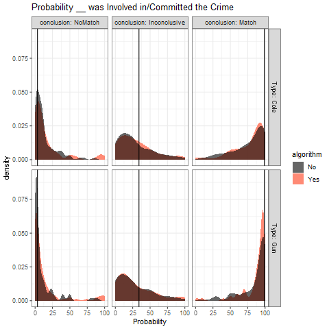
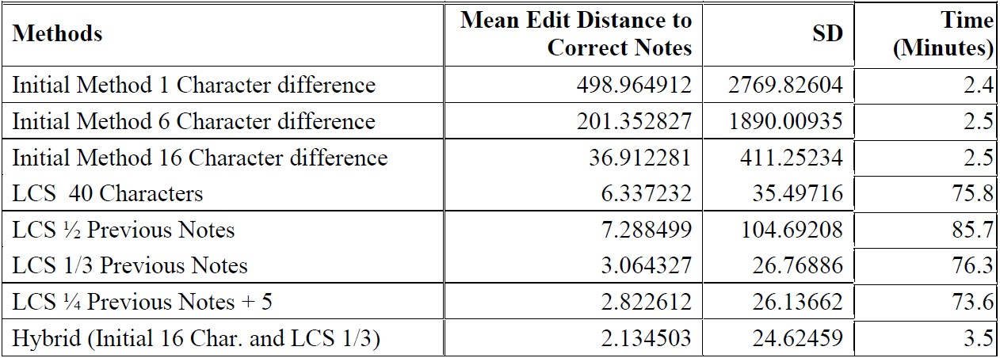
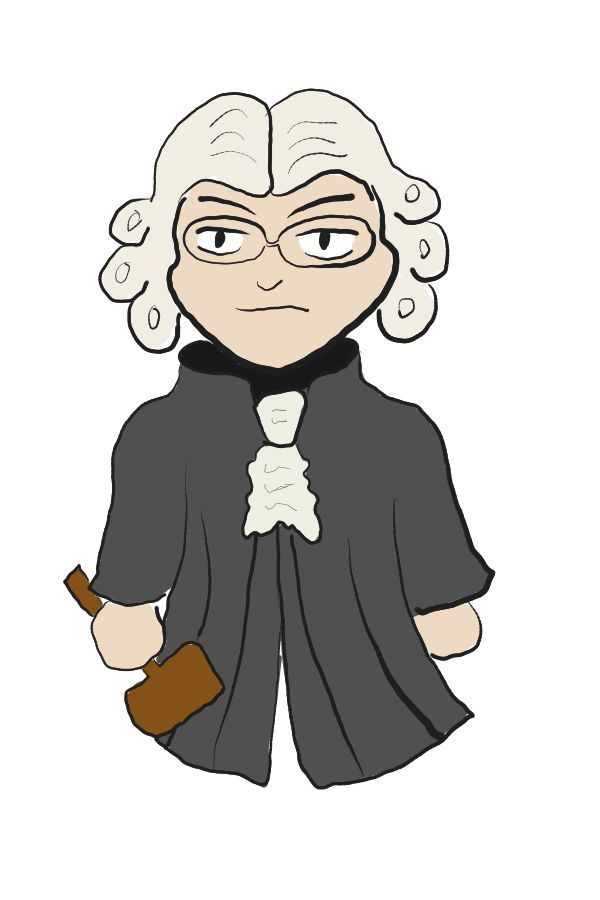

```{r setup, echo=FALSE, warning=FALSE, message=FALSE}
library(knitr)
library(ggplot2)
library(fontawesome)
library(DiagrammeR)
library(gridExtra)
library(grid)
library(jpeg)
```

class: primary-blue
## Research Questions

- How are potential jurors' perceptions of evidence affected by the use of algorithms and images?

    - How can we tell which portions of the testimony participants focus on?
    
    - What can we do when Likert response scales suffer from scale compression?
    
    - How can we create a more engaging testimony format that clarifies the actors?
    
---

class: center, middle, inverse-blue

# Background

---

class: primary-blue
### Why Algorithms in Forensic Science?

- Foundational Validity (PCAST definition)

  - Reproducible and consistent procedure for identifying and comparing features to determine identification between two samples
  
  - empirical measurements from multiple independent studies of false positive rate and sensitivity
 
---

class: primary-blue
### Why Algorithms in the Courtroom?
#### Concern about Interpretability
- FRStat testimony using probabilistic language:
  - "The probability of observing this amount of correspondence is approximately [XXX] times greater when the impressions are made by the same source rather than by different sources" (Defense Forensic Science Center)
  - Jurors struggle with distinguishing between a wide range of values (between 10 and 100,000)
    when estimating the likelihood that the defendant was involved in the crime (Garrett et. al. 2018) 
- A study in DNA (Koehler)
  - More likely to believe subject was the source of the DNA when presented with a probability rather than a frequency
  - Asked participants how many individuals would match DNA for a given match proportion in a population of 500,000. Correct answers:
     - 60.7% for frequency
     - 42.1% for probability
- Examiners may be easier to understand (Swofford & Champod 2022)
  - Supplement examiner testimony with a statistical comparison

---
class: center, middle, inverse-blue

# How are potential jurors' perceptions of evidence affected by the use of algorithms and images?

---

class: secondary-blue
## The Structure

- Based on Garrett et. al.'s "Mock jurors' evaluation of firearm examiner testimony" (2020)
    - Richard Cole is on trial for attempted robbery of a convenience store
    - Gun found in Cole's car is tested against bullet recovered from crime scene
    
- Three Variables: 
    - Demonstrative Evidence 
    - Algorithm 
        - Algorithm testimony includes both a Firearm Examiner and an Algorithm Expert
    - Conclusion

- Gathering Data
    - 569 participants from Prolific (using representative sample feature)
    
- Questions on the reliability/credibility of the evidence or the expert

---

class: center, secondary-blue
## The Demonstrative Evidence

<figure>

<figcaption>Gremi-ch, 2009</figcaption>
</figure>

.pull-left[
<figure>

<figcaption>baku13, 2005</figcaption>
</figure>
]

.pull-right[

]

---

class: secondary-blue
## The Algorithm

.pull-left[
- Described in Hare et. al.
- A 3D scan is taken of each bullet land, a stable cross section is extracted, and shoulders are removed
- A smoothing function is applied twice in order to extract the signature, which can be compared to land signatures from other bullets
- Traits (cross correlation, matching extrema, number of nonmatches, etc.) are used in a random forest to produce a match score for lands. Lands are aligned across bullets in order to compute an overall match score for the bullets
]

.pull-right[
<figure>

<figcaption><font size="1">  Hare et al.</font></figcaption>
</figure>

<figure>

<figcaption><font size="1">Hare et al.</font></figcaption>
</figure>


]

---

class: secondary-blue
## The Results

<center></center>

---

class: secondary-blue
## The Results

- Conviction choice
  - 10/196 (5%) for Non-match
  - 13/191 (7%) for Inconclusive
  - 112/182 (62%) for Match


---

class: secondary-blue
## The Results


<center>
</center>

---

class: secondary-blue

## Moving Forward

- Scale Compression
  - Ceiling effect: examiners are overall seen as reliable
  - Individuals may already believe that firearms evidence is reliable (Garrett & Mitchell, 2013)
  - Proposed Solution: Investigate other response methods
  
- Written Testimony
  - Not representative of a courtroom setting
  - Can be confusing
  - Proposed Partial Solution: Include characters to clarify actors
  
- Notepad analysis

---

class: center, middle, inverse-blue

# How can we tell which portions of the testimony participants focus on?

---

class: primary-blue
### Digital Notepad

.img[]

- Participants are provided with a digital notepad, and input is saved for each page of testimony
  - Data cleaning: removing the previous page's notes before analysis
  
  .img[]

---

class: primary-blue
### Hybrid Note Cleaning

- Easy Cases of Sequential Notes
   - First N Character Method

.img[]

- Difficult Notes (deletion, insertion, and duplication)
   - Longest Common Substring 

---

class: primary-blue
### Hybrid Method

- Difficult Cases
   - Edit distance larger than the initial cutoff value
   - Note length more than 4 standard deviations above the mean length for that page

.img[]

---

class: primary-blue
### How can we tell which portions of the testimony participants focus on?

- Highlight testimony based on frequency of occurrence in participants' notes
  - Collocations of length 5
     - Willfully: average frequency of 91.2
  - Frequency of Individual words
  - Divide by number of occurrences in the testimony
- Weighted Fuzzy Matches
  
  
.pull-left[.img[]]
.pull-right[.img[]
            ]

---

class: primary-blue
### Collocation Analysis


---

class: primary-blue
### What can we do when Likert response scales have scale compression?

- Micro-study comparing response formats
  - Strength of evidence (Likert - 9 point)
  - Guilt (Yes/No)
  - Convict (Yes/No)
  - Probability of guilt (Numeric)
  - What are the chances that defendant committed the crime? (Numeric or multiple choice)
  - How much would you be willing to bet that the defendant committed the crime? (Numeric)
  
- Inclusion of jury instructions and more cross examination on subjectivity

---

class: primary-blue
### How can we create a more engaging testimony format that clarifies the actors?

- Development of figures (by Richy Meleus) with text bubbles, and colors indicating which side they are testifying for

.pull-left[
.pull-left[
]
.pull-right[
]
]
.pull-right[
.pull-left[
]
.pull-right[
]
]

---

class: primary-blue
### How can we create a more engaging testimony format that clarifies the actors?

 `r fa("plus")`
 `r fa("equals")`


---

class: primary-blue

.img[]
<center></center>

---

class: primary-blue
## Research Questions

- How are potential jurors' perceptions of evidence affected by the use of algorithms and images?
    - 
    - What can we do when Likert response scales suffer from scale compression?
       - `r fa("comments-dollar")`
    - 

---

class: primary-blue,citation-slide
# Citations
- baku13. (2005, August). L7 105mm tank gun Cut model. Retrieved from https://commons.wikimedia.org/wiki/File:105mm_tank_gun_Rifling.jpg
- Baldwin, D. P., Bajic, S. J., Morris, M., & Zamzow, D. (2014). A Study of False-Positive and False-Negative Error Rates in Cartridge Case Comparisons: Fort Belvoir, VA: Defense Technical Information Center. Retrieved from http://www.dtic.mil/docs/citations/ADA611807
- Defense Forensic Science Center (DFSC). Information paper: modification of latent print technical reports to include statistical calculations, 2017; https://osf.io/pmkwf/
- Garrett, Brandon, Gregory Mitchell, and Nicholas Scurich. “Comparing Categorical and Probabilistic Fingerprint Evidence.” Journal of Forensic Sciences 63, no. 6 (November 2018): 1712–17. https://doi.org/10.1111/1556-4029.13797.
- Garrett, B., & Mitchell, G. and. (2013). How Jurors Evaluate Fingerprint
Evidence: The Relative Importance of Match Language, Method Information, and Error Acknowledgment: How Jurors Evaluate Fingerprint Evidence. Journal of Empirical Legal Studies, 10(3), 484–511. http://doi.org/10.1111/jels.12017 
- Garrett, B. L., Scurich, N., & Crozier, W. E. "Mock jurors’ evaluation of firearm examiner testimony." (2020). Law and Human Behavior, 44(5), 412–423. https://doi.org/10.1037/lhb0000423
- Gremi-ch. (2009). English: A 5.66x45mm (.223 rem.) Boat tailed FMJ spitzer bullet laying on a ruler with a scale in centimeter. Retrieved from https://commons.wikimedia.org/wiki/File:GP90-bullet.JPG?uselang=fr
- Hare, Eric, et al. “Automatic Matching of Bullet Land Impressions.” The Annals of Applied Statistics, vol. 11, no. 4, Dec. 2017, pp. 2332–56. Project Euclid, https://doi.org/10.1214/17-AOAS1080  
- Hofmann, H., Vanderplas, S., & Carriquiry, A. (2021). Treatment of Inconclusives in the AFTE Range of Conclusions. Law, Probability & Risk, 19(3-4). http://doi.org/https://doi.org/10.1093/lpr/mgab002
- Koehler, J. J. (2001). "When are people persuaded by DNA match statistics?" Law and Human Behavior, 25(5), 493–513. http://doi.org/d82kvn
- PCAST. (2016). Forensic Science in Criminal Courts: Ensuring Scientific Validity of Feature Comparison Methods. President’s Council of Advisors on Science and Technology. Retrieved from https://obamawhitehouse.archives.gov/sites/default/files/microsites/ostp/PCAST/pcast_forensic_science_report_final.pdf
- Swofford, H., & Champod, C. (2022). Probabilistic reporting and algorithms in forensic science: Stakeholder perspectives within the American criminal justice system. Forensic Science International: Synergy, 4, 100220. http://doi.org/gphvxj


This work was funded (or partially funded) by the Center for Statistics and Applications in Forensic Evidence (CSAFE) through Cooperative Agreements 70NANB15H176 and 70NANB20H019 between NIST and Iowa State University, which includes activities carried out at Carnegie Mellon University, Duke University, University of California Irvine, University of Virginia, West Virginia University, University of Pennsylvania, Swarthmore College and University of Nebraska, Lincoln.
