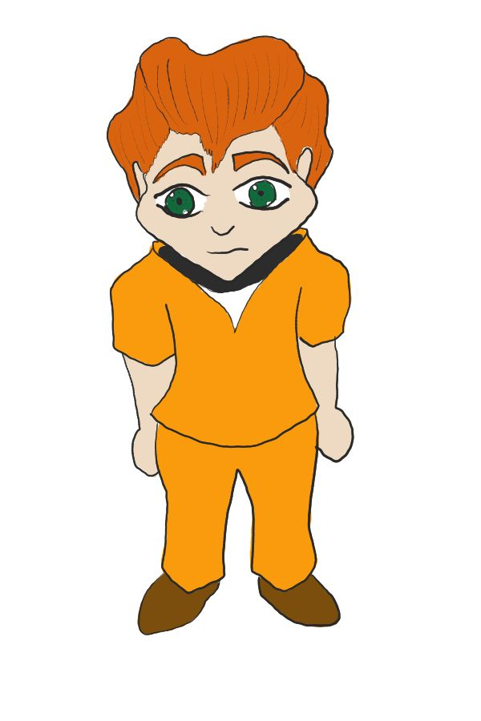
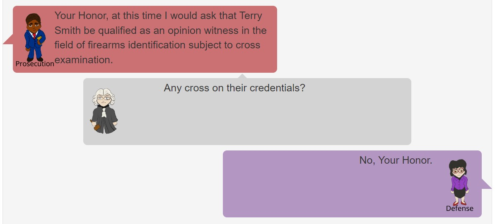

```{r setup, echo=FALSE, warning=FALSE, message=FALSE}
library(knitr)
library(ggplot2)
library(fontawesome)
library(DiagrammeR)
library(gridExtra)
library(grid)
library(jpeg)
library(tidyverse)
library(patchwork)
library(ggridges)
library(ggmosaic)
```

class: primary-blue
## Initial Study Structure

- How are potential jurors' perceptions of evidence affected by the use of algorithms and images?

- Based on Garrett et. al.'s "Mock jurors' evaluation of firearm examiner testimony" (2020)
    - Richard Cole is on trial for attempted robbery of a convenience store
    - Gun found in Cole's car is tested against bullet recovered from crime scene

- Testimony based on court transcripts
    
- Three Variables: 
    - Demonstrative Evidence 
    - Algorithm 
    - Conclusion

- Gathering Data
    - 569 participants from Prolific (using representative sample feature)

---

class: primary-blue
## Initial Study Questions

- Questions based on Garrett et. al.

- Probability

- Decision to Convict

- Strength of Evidence (9-point Likert Scale)

- How reliable/scientific was the evidence? (7-point Likert Scale)

- How credible did you find the examiner/algorithm expert? (7-point Likert Scale)

---

class: primary-blue
## Likert Scale Guidelines

- 7-9 categories generally recommended (Finstad, 2010; Joshi, Kale, Chandel, & Pal, 2015; Groves et. al. 2009; Preston & Colman, 2000)

- Use specific terms (Unrelaible -> Reliable instead of Disagree -> Agree) (DeCastellarnau, 2018)

- Label every scale point (Groves et. al. 2009)
  
---

class: secondary-blue
## The Results

```{r, echo=FALSE, message=FALSE, warning=FALSE, fig.width=12, fig.height=8}

merged_results_allresponses<-read_csv("~/PhD Research/UNL_Thesis/data/study1_merged_results_clean.csv")

merged_results_allresponses <-merged_results_allresponses %>% subset(clean_prints!=231)

merged_results <- merged_results_allresponses %>% filter(check1 =="9mm" & check2 == "Moderately reliable")

merged_results$conclusion <-
  factor(merged_results$conclusion,
         levels = c("NoMatch", "Inconclusive", "Match"))

conclusion_labs <- c("Identification", "Inconclusive", "Elimination")
names(conclusion_labs) <- c("Match", "Inconclusive", "NoMatch")

merged_results$overrel = factor(
  merged_results$overrel,
  levels = c(
    "Extremely unreliable",
    "Moderately unreliable",
    "Weakly unreliable",
    "Neither reliable nor unreliable",
    "Weakly reliable",
    "Moderately reliable",
    "Extremely reliable"
  )
)

levels(merged_results$overrel) <-
  gsub(" ", "\n", levels(merged_results$overrel))

rel_graph <- merged_results %>% 
  filter(!is.na(overrel)) %>%
  group_by(conclusion, algorithm, picture, overrel) %>%
  count() %>%
  group_by(conclusion, algorithm, picture) %>%
  mutate(prop = n/sum(n)) %>%
ggplot(aes(x = picture, fill = overrel)) +
  geom_col(
    mapping = aes(y =prop),
    position = position_stack(), color="black"
  ) +
  coord_flip() +
  facet_grid(algorithm~conclusion, labeller = labeller(algorithm = label_both, conclusion = conclusion_labs)) +
  ggtitle("How reliable do you think the firearm evidence in this case is?") +
  scale_fill_manual("", values = c("#d77227", "#fc8d59", "#fee090", "#ffffbf", "#e0f3f8","#91bfdb", "#4575b4")) +
  theme_bw()+
  theme(legend.position = "bottom", legend.direction = "horizontal") + 
  ylab("Proportion of responses") + 
    guides(fill = guide_legend(nrow = 1, reverse = TRUE))

merged_results$firetestcred = factor(
  merged_results$firetestcred,
  levels = c(
    "Extremely noncredible",
    "Moderately noncredible",
    "Weakly noncredible",
    "Neither credible nor noncredible",
    "Weakly credible",
    "Moderately credible",
    "Extremely credible"
  )
)

levels(merged_results$firetestcred) <-
  gsub(" ", "\n", levels(merged_results$firetestcred))

cred_graph <- merged_results %>% 
  filter(!is.na(firetestcred)) %>%
  group_by(conclusion, algorithm, picture, firetestcred) %>%
  count() %>%
  group_by(conclusion, algorithm, picture) %>%
  mutate(prop = n/sum(n)) %>%
ggplot(aes(x = picture, fill = firetestcred)) +
  geom_col(
    mapping = aes(y =prop),
    position = position_stack(), color="black"
  ) +
  coord_flip() +
  facet_grid(algorithm~conclusion, labeller = labeller(algorithm = label_both, conclusion = conclusion_labs)) +
  ggtitle("How credible did you find the testimony of Terry Smith (the firearm examiner)?") +
  scale_fill_manual("", values = c("#8c510a", "#d8b365", "#f6e8c3", "#f5f5f5", "#c7eae5","#5ab4ac", "#01665e")) +
  theme_bw()+
  theme(legend.position = "bottom", legend.direction = "horizontal") + 
  ylab("Proportion of responses") + 
    guides(fill = guide_legend(nrow = 1, reverse = TRUE))

rel_graph / cred_graph

```

---

class: primary-blue

## Response Scale Considerations

- Issues arise when there is a disconnect between the construct we wish to evaluate and the measurement tool (Groves et. al.)
  - Equivalent to using a 2nd grade math test to assess the math skill of 4th graders
- Categorical log scale for chance of guilt (Thompson, Kaasa, & Peterson, 2013)
  - 1 chance in (10/100/1,000) or guilt
  - Not significantly different from Bayesian estimate for evidence
- “Based on the available evidence I believe it is ___ times more likely that Mr. Kelly is guilty than not guilty.” (Thompson & Newman, 2015).
  - Provided lower, less consistent values than the categorical log scale
  
---

class: secondary-blue

## Moving Forward

- Scale Compression
  - Ceiling effect: firearms testimony is generally highly regarded
  - Individuals may already believe that firearms evidence is reliable (Garrett & Mitchell, 2013)
  - Proposed Solution: Investigate other response methods


---

class: center, middle, inverse-blue

# Follow-up Study

---

class: primary-blue
### What can we do when Likert response scales have scale compression?

- Study comparing response formats
  - Repeated Questions
    - Strength of evidence (Likert - 9 point)
    - Convict (Yes/No)
    - Probability of guilt (Hidden or Visible Slider)
  - New Questions
    - Guilt (Yes/No)
    - What are the chances that defendant committed the crime? (Numeric or multiple choice - Thompson & Newman (2015))
      - In numeric case, individuals were able to choose between expressing chance in terms of guilt or in terms of innocence
    - How much would you be willing to bet that the defendant committed the crime? (Numeric)
  
- Inclusion of jury instructions (United States Courts for the Ninth Circuit, 2019) and more cross examination on subjectivity

- Simplified to Identification and Elimination condition, without algorithm and images

---

class: primary-blue
### Testimony Changes

- Development of figures (by Richy Meleus) with text bubbles, and colors indicating which side they are testifying for

.pull-left[
.pull-left[
]
.pull-right[
]
]
.pull-right[
.pull-left[
]
.pull-right[
]
]

---

class: primary-blue

.img[]
<center></center>

---

class: primary-blue

```{r echo=FALSE, warning=FALSE, message=FALSE}

microstudy <- read_csv("~/PhD Research/UNL_Thesis/data/mircrostudy_response_redo_clean.csv")

microstudy_clean <- microstudy %>% dplyr::filter(check=="9mm", round(randomnumber,5) != 12.59938)

```

- Designed to test response formats for jury perception study
  - Measuring both consistency and interpretability of results

- 298 participants completed the survey and passed the attention check
  - 147 participants with the Identification condition
  - 151 participants with the Elimination condition

---

class: primary-blue

### Response Scales - Strength

```{r echo=FALSE, warning=FALSE, message=FALSE, fig.width=12, fig.height=8}

library(ggplot2)
library(scales)

microstudy_clean$evidence_strength = factor(
  microstudy_clean$evidence_strength,
  levels = c(
    "1 Not at all strong",
    "2",
    "3",
    "4",
    "5 Moderately strong",
    "6",
    "7",
    "8",
    "9 Extremely strong"
  )
)

ggplot(microstudy_clean) +
  geom_bar(aes(x=evidence_strength, fill=conclusion), position="dodge") +
  ggtitle("What is the Strength of Evidence against the Defendant?") +
  scale_fill_manual(values = c("grey80","seagreen"), name="Condition",
                    labels=c("Identification", "Elimination"))+
  ylab("Count")+
  xlab("Strength")+
  theme_bw()+
  scale_x_discrete(labels = wrap_format(10))


```

---

class: primary-blue

### Response Scales - Probability

```{r echo=FALSE, warning=FALSE, message=FALSE, fig.width=12, fig.height=8}

colors <-  c("Hidden"="red", "Visible"="grey")

conclusion_labs <- c("Identification", "Elimination")
names(conclusion_labs) <- c("Match", "NoMatch")

ggplot(microstudy_clean) +
  geom_density(alpha=0.75, aes(x=as.numeric(hidden_probability), fill="Hidden")) +
  geom_density(alpha=0.75, aes(x=as.numeric(visible_probability), fill="Visible")) +
  ggtitle("Probability Cole Commited the Crime") +
  scale_fill_manual(values = colors, name="Probability")+
  ylab("Density")+
  xlab("Probability")+
  facet_grid(.~conclusion, labeller = labeller(conclusion = conclusion_labs))+
  theme_bw()


```


---

class: primary-blue
### Response Scales - Betting

```{r echo=FALSE, warning=FALSE, message=FALSE, fig.width=12, fig.height=8}

ggplot(microstudy_clean) +
  geom_histogram(aes(x=betting, fill=guilt_opinion), 
                 binwidth=5, color="black",
           position = position_dodge(preserve = "single")) +
  ggtitle("How much would you bet that the Defendant is...") +
  scale_fill_manual(values = c("#D81B60","#004D40"), name="", labels=c("Innocent","Guilty"))+
  ylab("Count")+
  xlab("Bet Amount ($)")+
  xlim(c(0,50))+
  facet_grid(conclusion~., labeller = labeller(conclusion = conclusion_labs))+
  theme_bw()


```

---

class: primary-blue

### Response Scales - Fixed

```{r echo=FALSE, warning=FALSE, message=FALSE, fig.width=12, fig.height=8}

microstudy_clean$chances_fixed = factor(
  microstudy_clean$chances_fixed,
  levels = c(
    "Impossible that he is guilty",
    "About 1 chance in 10,000",
    "About 1 chance in 1,000",
    "About 1 chance in 100",
    "About 1 chance in 10",
    "1 chance in 2 (fifty-fifty chance)",
    "About 9 chances in 10",
    "About 99 chances in 100",
    "About 999 chances in 1,000",
    "About 9,999 chances in 10,000",
    "Certain to be guilty"
  )
)

ggplot(microstudy_clean) +
  geom_bar(aes(x=chances_fixed, fill=conclusion),  
           position = position_dodge(preserve = "single")) +
  ggtitle("What is the Chance that the Defendant is Guilty?") +
  scale_fill_manual(values = c("grey80","seagreen"), name="Condition",
                    labels = conclusion_labs)+
  ylab("Count")+
  xlab("Chance")+
  theme_bw()+
  scale_x_discrete(labels = wrap_format(10))


```

---

class: primary-blue

### Response Scales - Numeric Chance

Individuals were allowed to express numeric chance in terms of innocence or guilt.

```{r echo=FALSE, warning=FALSE, message=FALSE, fig.width=12, fig.height=7}

microstudy_clean <- microstudy_clean %>% 
  separate(numeric_chance, c("chance_of", "numerator", "denominator"), sep=",")

microstudy_clean$num_chance <- as.numeric(microstudy_clean$numerator)/as.numeric(microstudy_clean$denominator)

ggplot(microstudy_clean) +
  geom_density(alpha=0.5, aes(x=num_chance, fill=chance_of), position="dodge") +
  ggtitle("What is the chance that the defendant is...") +
  scale_fill_manual(values = c("#CC79A7" ,"#D55E00"), name="", labels=c("Guilty","Innocent"))+
 # ylab("Count")+
  xlab("Chance")+
  facet_grid(.~conclusion, labeller = labeller(conclusion = conclusion_labs))+
  #scale_x_continuous(trans='log10')+
  theme_bw()+
  xlim(c(0,1))

# ggplot(microstudy_clean) +
#   geom_density(alpha=0.5, aes(x=log(num_chance+0.0000000001), fill=chance_of), position="dodge") +
#   ggtitle("What is the chance that the defendant is...") +
#   scale_fill_manual(values = c("#CC79A7" ,"#D55E00"), name="", labels=c("Guilty","Innocent"))+
#  # ylab("Count")+
#   xlab("Chance")+
#   facet_grid(.~conclusion, labeller = labeller(conclusion = conclusion_labs))+
#   #scale_x_continuous(trans='log10')+
#   theme_bw()


```

---

class: secondary-blue

### Interpretability

- Scale Compression
  - Strength of Evidence
  - Betting

- Probability a Useful Metric
  - Sliding Scales instead of Likert Scales

- More Distributed Scales
  - Categorical Chance

- Next Step: Scale Comparison
  - Are response variables consistent?

---

class: primary-blue

### Scale Comparison Opinion of Guilt vs Conviction

```{r echo=FALSE, warning=FALSE, message=FALSE, fig.width=12, fig.height=8}


conviction_labs <- c("Convict", "Not Convict")
names(conviction_labs) <- c("Yes", "No")


ggplot(microstudy_clean) +
  geom_bar(aes(x=convict, fill=guilt_opinion), 
           position=position_dodge(preserve="single")) +
  ggtitle("") +
  scale_fill_manual(values = c("#D81B60","#004D40"), name="Opinion", labels=c("Innocent","Guilty"))+
  ylab("Count")+
  xlab("")+
  facet_grid(.~conclusion, labeller = labeller(conclusion = conclusion_labs))+
  theme_bw()+
  scale_x_discrete(labels = conviction_labs)

```

---

class: primary-blue, center, middle

### Scale Comparison

```{r echo=FALSE, warning=FALSE, message=FALSE, fig.width=15, fig.height=8}

set_values <- 
  data.frame(chances_fixed=c("Impossible that he is guilty",
                             "About 1 chance in 10,000",
                             "About 1 chance in 1,000",
                             "About 1 chance in 100",
                             "About 1 chance in 10",
                             "1 chance in 2 (fifty-fifty chance)",
                             "About 9 chances in 10",
                             "About 99 chances in 100",
                             "About 999 chances in 1,000",
                             "About 9,999 chances in 10,000",
                             "Certain to be guilty"),
             value=c(0,1/10000,1/1000,1/100,1/10,0.5,9/10,
                     99/100,999/1000,9999/10000,1),
             lower = c(0, 1/20000, (1/10000+1/1000)/2, (1/1000+1/100)/2,
                       (1/100+1/10)/2, (1/10+0.5)/2, (0.5+9/10)/2,
                       (9/10+99/100)/2, (99/100+999/1000)/2,
                       (999/1000+9999/10000)/2, (9999/10000+1)/2),
             upper = c(1/20000, (1/10000+1/1000)/2, (1/1000+1/100)/2,
                       (1/100+1/10)/2, (1/10+0.5)/2, (0.5+9/10)/2,
                       (9/10+99/100)/2, (99/100+999/1000)/2,
                       (999/1000+9999/10000)/2, (9999/10000+1)/2, 1))
clean_results_merged<- dplyr::left_join(microstudy_clean, set_values)

clean_results_merged <- clean_results_merged %>%
    mutate(adjusted_lower = 
             ifelse(chance_of == "innocent", 1 - upper, lower))%>%
    mutate(adjusted_upper = ifelse(chance_of == "innocent", 1 - lower, upper))


clean_results_merged$chances_fixed = factor(
  clean_results_merged$chances_fixed,
  levels = c(
    "Impossible that he is guilty",
    "About 1 chance in 10,000",
    "About 1 chance in 1,000",
    "About 1 chance in 100",
    "About 1 chance in 10",
    "1 chance in 2 (fifty-fifty chance)",
    "About 9 chances in 10",
    "About 99 chances in 100",
    "About 999 chances in 1,000",
    "About 9,999 chances in 10,000",
    "Certain to be guilty"
  )
)
guilt_overall <- ggplot(subset(clean_results_merged, chance_of=="guilty"), aes(x=chances_fixed))+ #,fill=conclusion
  geom_point(aes(y=value),color="red",size=5,alpha=0.5)+
  ggtitle("Chances of Guilt") +
  geom_jitter(aes(y=num_chance),
    size = 1
  ) +
  geom_boxplot(aes(y=num_chance),
               position = position_dodge(1),
               alpha = 0.5,
               outlier.shape = NA)+ 
  ylab("Open Response Chance")+
  xlab("Closed Response Chance")+
  scale_x_discrete(labels = wrap_format(10))+
  theme_bw()+
  ylim(c(0,1))


clean_results_merged$chance_wo_0 <- clean_results_merged$num_chance

clean_results_merged <- clean_results_merged %>%
    mutate(chance_wo_0 = ifelse(chance_wo_0 == 0, .Machine$double.eps, chance_wo_0))

guilt_low <- ggplot(subset(clean_results_merged, chance_of=="guilty" & 
              chances_fixed %in% c("Impossible that he is guilty", 
                                   "About 1 chance in 10,000", 
                                   "About 1 chance in 1,000",
                                   "About 1 chance in 100",
                                   "About 1 chance in 10")), aes(x=chance_wo_0, fill=chances_fixed, y=chances_fixed))+
  ggtitle("Chances of Guilt") +
  ylab("Count")+
  xlab("Open Response Chance")+
  geom_density_ridges(alpha=0.5)+
  scale_fill_manual(values=c("#D81B60","#1E88E5","#FFC107","#004D40", "#CCA785"))+
  theme_bw()+
  theme(panel.grid.major = element_blank(), panel.grid.minor = element_blank(), legend.position="none")+
  scale_x_log10(breaks=c(1/10000, 1/1000, 1/100, 1/10, 0.5),
                labels=label_number(drop0trailing=TRUE), 
                 limits = c(.Machine$double.eps, NA))+
  geom_vline(aes(xintercept=1/10000), color="#1E88E5")+
  geom_vline(aes(xintercept=1/1000), color="#FFC107")+
  geom_vline(aes(xintercept=1/100), color="#004D40")+
  geom_vline(aes(xintercept=.Machine$double.eps), color="#D81B60")+
  geom_vline(aes(xintercept=1/10), color="#CCA785")+
  geom_vline(aes(xintercept=0.5), color="black")+
  scale_y_discrete(labels = wrap_format(15))+
  theme(axis.text.x = element_text(angle = 90, vjust = 0.5, hjust=1))

clean_results_merged$chance_subtracted <- 1 - clean_results_merged$num_chance

clean_results_merged <- clean_results_merged %>%
    mutate(chance_subtracted = ifelse(chance_subtracted == 0, .Machine$double.eps, chance_subtracted))

guilt_high <- ggplot(subset(clean_results_merged, chance_of=="guilty" & 
              chances_fixed %in% c("Certain to be guilty", 
                                   "About 9,999 chances in 10,000", 
                                   "About 999 chances in 1,000",
                                   "About 99 chances in 100",
                                   "About 9 chances in 10")), aes(x=chance_subtracted, fill=chances_fixed, y=chances_fixed))+
  ggtitle("1 - Chance of Guilt") +
  ylab("Count")+
  xlab("1 - Open Response Chance of Guilt")+
  geom_density_ridges(alpha=0.5)+
  scale_fill_manual(values=c("#CC79A7","#D55E00","#009E73","#F0E442", "#A4A3B3"))+
  theme_bw()+
  theme(panel.grid.major = element_blank(), panel.grid.minor = element_blank(), legend.position="none")+
   scale_x_log10(breaks=c(1/10000, 1/1000, 1/100, 1/10, 0.5),
                 labels=label_number(drop0trailing=TRUE), 
                 limits = c(.Machine$double.eps, NA))+
  geom_vline(aes(xintercept=1/10000), color="#F0E442")+
  geom_vline(aes(xintercept=1/1000), color="#009E73")+
  geom_vline(aes(xintercept=1/100), color="#D55E00")+
  geom_vline(aes(xintercept=.Machine$double.eps), color="#A4A3B3")+
  geom_vline(aes(xintercept=1/10), color="#CC79A7")+
  geom_vline(aes(xintercept=0.5), color="black")+
  scale_y_discrete(labels = wrap_format(15))+
  theme(axis.text.x = element_text(angle = 90, vjust = 0.5, hjust=1))

guilt_overall+(guilt_low/guilt_high)

```

---

class: primary-blue, center, middle

### Scale Comparison

```{r echo=FALSE, warning=FALSE, message=FALSE, fig.width=15, fig.height=8}

innocent_overall <- ggplot(subset(clean_results_merged, chance_of=="innocent"), aes(x=chances_fixed))+ #,fill=conclusion
  geom_point(aes(y=1-value),color="red",size=5,alpha=0.5)+
  ggtitle("Chances of Innocence") +
  geom_jitter(aes(y=num_chance, color=guilt_opinion),
    size = 2
  ) +
  geom_boxplot(aes(y=num_chance),
               position = position_dodge(1),
               alpha = 0.5,
               outlier.shape = NA)+ 
  ylab("Numeric Chance of Innocence")+
  xlab("Chance of Guilt")+
  scale_x_discrete(labels = wrap_format(10))+
  scale_color_manual(values = c("#D81B60","#004D40"), name="Opinion", labels=c("Innocent","Guilty"))+
  theme_bw()+
  ylim(c(0,1))+theme(legend.position = "bottom")

innocent_high <- ggplot(subset(clean_results_merged, chance_of=="innocent" & 
              chances_fixed %in% c("Impossible that he is guilty", 
                                   "About 1 chance in 10,000", 
                                   "About 1 chance in 1,000",
                                   "About 1 chance in 100",
                                   "About 1 chance in 10")),
       aes(x=chance_subtracted, 
           fill=chances_fixed, y = chances_fixed))+
  geom_density_ridges(alpha=0.5)+
  ggtitle("1 - Chance of Innocence") +
  ylab("Count")+
  xlab("1 - Open Response Chance of Innocence")+
  scale_fill_manual(values=c("#D81B60","#1E88E5","#FFC107","#004D40", "#CCA785"))+
  theme_bw()+
    theme(panel.grid.major = element_blank(), panel.grid.minor = element_blank(), legend.position="none")+
   scale_x_log10(breaks=c(1/10000, 1/1000, 1/100, 1/10, 0.5),
                 labels=label_number(drop0trailing=TRUE), 
                 limits = c(.Machine$double.eps, NA))+
  geom_vline(aes(xintercept=1/10000), color="#1E88E5")+
  geom_vline(aes(xintercept=1/1000), color="#FFC107")+
  geom_vline(aes(xintercept=1/100), color="#004D40")+
    geom_vline(aes(xintercept=.Machine$double.eps), color="#D81B60")+
  geom_vline(aes(xintercept=1/10), color="#CCA785")+
  geom_vline(aes(xintercept=0.5), color="black")+
  scale_y_discrete(labels = wrap_format(15))+
  theme(axis.text.x = element_text(angle = 90, vjust = 0.5, hjust=1))

innocent_low <- ggplot(subset(clean_results_merged, chance_of=="innocent" &
              chances_fixed %in% c("Certain to be guilty",
                                   "About 9,999 chances in 10,000",
                                   "About 999 chances in 1,000",
                                   "About 99 chances in 100",
                                   "About 9 chances in 10")), aes(x=chance_wo_0, fill=chances_fixed, y=chances_fixed))+
   geom_density_ridges(alpha=0.5)+
  ggtitle("Chances of Innocence") +
  ylab("Count")+
  xlab("Open Response Chance of Innocence")+
  scale_fill_manual(values=c("#CC79A7","#D55E00","#009E73","#F0E442", "#A4A3B3"))+
  theme_bw()+
      theme(panel.grid.major = element_blank(), panel.grid.minor = element_blank(), legend.position="none")+
   scale_x_log10(breaks=c(1/10000, 1/1000, 1/100, 1/10, 0.5),
                 labels=label_number(drop0trailing=TRUE),
                 limits = c(.Machine$double.eps, NA))+
  geom_vline(aes(xintercept=1/10000), color="#F0E442")+
  geom_vline(aes(xintercept=1/1000), color="#009E73")+
  geom_vline(aes(xintercept=1/100), color="#D55E00")+
    geom_vline(aes(xintercept=.Machine$double.eps), color="#A4A3B3")+
  geom_vline(aes(xintercept=1/10), color="#CC79A7")+
  # geom_vline(aes(xintercept=0.255), color="black")+
  # geom_vline(aes(xintercept=0.0055), color="black")+
  # geom_vline(aes(xintercept=0.00055), color="black")+
  # geom_vline(aes(xintercept=0.000055), color="black")+
  geom_vline(aes(xintercept=0.5), color="black")+
  scale_y_discrete(labels = wrap_format(15))+
  theme(axis.text.x = element_text(angle = 90, vjust = 0.5, hjust=1))

innocent_overall+(innocent_low/innocent_high)

```

---

class: primary-blue, center, middle

### Scale Comparison

```{r echo=FALSE, warning=FALSE, message=FALSE, fig.width=12, fig.height=6}

mult_labs <- data.frame(short_mult = c(
    "Impossible",
    "1/10,000",
    "1/1,000",
    "1/100",
    "1/10",
    "1/2",
    "9/10",
    "99/100",
    "999/1,000",
    "9,999/10,000",
    "Certain"
  ), chances_fixed = c(
    "Impossible that he is guilty",
    "About 1 chance in 10,000",
    "About 1 chance in 1,000",
    "About 1 chance in 100",
    "About 1 chance in 10",
    "1 chance in 2 (fifty-fifty chance)",
    "About 9 chances in 10",
    "About 99 chances in 100",
    "About 999 chances in 1,000",
    "About 9,999 chances in 10,000",
    "Certain to be guilty"
  ))

clean_results_merged<-left_join(clean_results_merged, mult_labs)

clean_results_merged$short_mult = factor(
  clean_results_merged$short_mult,
  levels = c(
    "Impossible",
    "1/10,000",
    "1/1,000",
    "1/100",
    "1/10",
    "1/2",
    "9/10",
    "99/100",
    "999/1,000",
    "9,999/10,000",
    "Certain"
  )
)

clean_results_merged$correct_range <- 
  clean_results_merged$num_chance >= clean_results_merged$adjusted_lower &
  clean_results_merged$num_chance <= clean_results_merged$adjusted_upper

clean_results_merged$correct_range_word <- NA
clean_results_merged[clean_results_merged$correct_range==TRUE,]$correct_range_word <- "consistent"
clean_results_merged[clean_results_merged$correct_range==FALSE,]$correct_range_word <- "inconsistent"

correct_summary_df <- data.frame(table(clean_results_merged$correct_range, clean_results_merged$chance_of))
names(correct_summary_df)<- c("Consistent", "chance_of", "Count")

correct_prop_test <-
  prop.test(x=c(correct_summary_df$Count[2], correct_summary_df$Count[4]),
              n=c(correct_summary_df$Count[1]+correct_summary_df$Count[2],
                  correct_summary_df$Count[3]+correct_summary_df$Count[4]))

ggplot(clean_results_merged)+
  geom_mosaic(aes(x=product(correct_range_word, short_mult),
                  fill=correct_range_word), color="black")+
  theme_bw()+
  scale_fill_manual(values = c("seagreen1", "white"), name="Consistent Range:")+
  ggtitle("Selecting the Consistent Range vs. Choice to Express Chance")+
  xlab("Multiple Choice Chance of Guilt")+
  facet_grid(.~chance_of, labeller = "label_both", scales = "free_x")+
  theme(axis.text.y = element_blank(), axis.ticks.y=element_blank(),
        axis.title.y = element_blank(), 
        axis.text.x = element_text(angle = 90))

```

---

class: primary-blue

### Does Guilt = 1 - Chance of Innocence?

- Study of Initial Research Question


- Preliminary Results: 59.4% of participant values correspond

---

class: primary-blue

### Scale Comparison - What is "Beyond a Reasonable Doubt"?

```{r echo=FALSE, warning=FALSE, message=FALSE, fig.width=12, fig.height=6}

ggplot(microstudy_clean) +
  geom_bar(aes(x=chances_fixed, fill=convict), position=position_dodge(preserve = "single")) +
  ggtitle("What is the Chance that the Defendant is Guilty?") +
  scale_fill_manual(values = c("grey20", "plum1"), name="Convict?")+
  ylab("Count")+
  xlab("Chance")+
  theme_bw()+
  facet_grid(conclusion~., labeller = labeller(conclusion = conclusion_labs))+
  scale_x_discrete(labels = wrap_format(10))


```


---

class: primary-blue, center, middle

### Scale Comparison

```{r echo=FALSE, warning=FALSE, message=FALSE, fig.width=12, fig.height=6}

ggplot(microstudy_clean, aes(x=chances_fixed, fill=guilt_opinion))+ #,fill=conclusion
  ggtitle("Bet Amount by Perceived Chance of Guilt") +
  geom_jitter(aes(y=betting),
    size = 1
  ) +
  scale_fill_manual(values = c("#D81B60","#004D40"), name="Opinion", labels=c("Innocent","Guilty"))+
  geom_boxplot(aes(y=betting),
               position = position_dodge(preserve = "single"),
               alpha = 0.5,
               outlier.shape = NA)+ 
  ylab("Bet Amount")+
  xlab("Closed Response Chance")+
  scale_x_discrete(labels = wrap_format(10))+
  facet_grid(conclusion~., labeller = labeller(conclusion = conclusion_labs))+
  theme_bw()

```

---


class: primary-blue, center, middle

### Scale Comparison

```{r echo=FALSE, warning=FALSE, message=FALSE, fig.width=12, fig.height=8}

clean_results_merged$chances_fixed = factor(
  clean_results_merged$chances_fixed,
  levels = c(
    "Impossible that he is guilty",
    "About 1 chance in 10,000",
    "About 1 chance in 1,000",
    "About 1 chance in 100",
    "About 1 chance in 10",
    "1 chance in 2 (fifty-fifty chance)",
    "About 9 chances in 10",
    "About 99 chances in 100",
    "About 999 chances in 1,000",
    "About 9,999 chances in 10,000",
    "Certain to be guilty"
  )
)

clean_results_merged$prob_mult_consistency <- NA

clean_results_merged[clean_results_merged$chances_fixed=="Impossible that he is guilty" & clean_results_merged$visible_probability==0,]$prob_mult_consistency <- "consistent"

clean_results_merged[clean_results_merged$chances_fixed=="Impossible that he is guilty" & clean_results_merged$visible_probability!=0,]$prob_mult_consistency <- "inconsistent"

clean_results_merged[clean_results_merged$chances_fixed=="About 1 chance in 10,000" & clean_results_merged$visible_probability %in% c(0,1),]$prob_mult_consistency <- "consistent"

clean_results_merged[clean_results_merged$chances_fixed=="About 1 chance in 10,000" & !(clean_results_merged$visible_probability %in% c(0,1)),]$prob_mult_consistency <- "inconsistent"

clean_results_merged[clean_results_merged$chances_fixed=="About 1 chance in 1,000" & clean_results_merged$visible_probability %in% c(0,1),]$prob_mult_consistency <- "consistent"

clean_results_merged[clean_results_merged$chances_fixed=="About 1 chance in 1,000" & !(clean_results_merged$visible_probability %in% c(0,1)),]$prob_mult_consistency <- "inconsistent"

clean_results_merged[clean_results_merged$chances_fixed=="About 1 chance in 100" & clean_results_merged$visible_probability %in% seq(1,5),]$prob_mult_consistency <- "consistent"

clean_results_merged[clean_results_merged$chances_fixed=="About 1 chance in 100" & !(clean_results_merged$visible_probability %in% seq(1,5)),]$prob_mult_consistency <- "inconsistent"

clean_results_merged[clean_results_merged$chances_fixed=="About 1 chance in 10" & clean_results_merged$visible_probability %in% seq(6,30),]$prob_mult_consistency <- "consistent"

clean_results_merged[clean_results_merged$chances_fixed=="About 1 chance in 10" & !(clean_results_merged$visible_probability %in% seq(6,30)),]$prob_mult_consistency <- "inconsistent"

clean_results_merged[clean_results_merged$chances_fixed=="1 chance in 2 (fifty-fifty chance)" & clean_results_merged$visible_probability %in% seq(30,70),]$prob_mult_consistency <- "consistent"

clean_results_merged[clean_results_merged$chances_fixed=="1 chance in 2 (fifty-fifty chance)" & !(clean_results_merged$visible_probability %in% seq(30,70)),]$prob_mult_consistency <- "inconsistent"

clean_results_merged[clean_results_merged$chances_fixed=="About 9 chances in 10" & clean_results_merged$visible_probability %in% seq(70,94),]$prob_mult_consistency <- "consistent"

clean_results_merged[clean_results_merged$chances_fixed=="About 9 chances in 10" & !(clean_results_merged$visible_probability %in% seq(70,94)),]$prob_mult_consistency <- "inconsistent"

clean_results_merged[clean_results_merged$chances_fixed=="About 99 chances in 100" & clean_results_merged$visible_probability %in% seq(95,99),]$prob_mult_consistency <- "consistent"

clean_results_merged[clean_results_merged$chances_fixed=="About 99 chances in 100" & !(clean_results_merged$visible_probability %in% seq(95,99)),]$prob_mult_consistency <- "inconsistent"

clean_results_merged[clean_results_merged$chances_fixed=="About 999 chances in 1,000" & clean_results_merged$visible_probability %in% c(99,100),]$prob_mult_consistency <- "consistent"

clean_results_merged[clean_results_merged$chances_fixed=="About 999 chances in 1,000" & !(clean_results_merged$visible_probability %in% c(99,100)),]$prob_mult_consistency <- "inconsistent"

clean_results_merged[clean_results_merged$chances_fixed=="About 9,999 chances in 10,000" & clean_results_merged$visible_probability %in% c(99,100),]$prob_mult_consistency <- "consistent"

clean_results_merged[clean_results_merged$chances_fixed=="About 9,999 chances in 10,000" & !(clean_results_merged$visible_probability %in% c(99,100)),]$prob_mult_consistency <- "inconsistent"

clean_results_merged[clean_results_merged$chances_fixed=="Certain to be guilty" & clean_results_merged$visible_probability==100,]$prob_mult_consistency <- "consistent"

clean_results_merged[clean_results_merged$chances_fixed=="Certain to be guilty" & clean_results_merged$visible_probability!=100,]$prob_mult_consistency <- "inconsistent"


prob_hist <- ggplot(subset(clean_results_merged, !is.na(visible_probability)), aes(x=visible_probability, y=chances_fixed,
                     fill=prob_mult_consistency))+
    geom_density_ridges(scale=1, stat="binline", bins=100)+
  theme_bw()+
  scale_x_continuous(breaks=c(1,5.5,30,70,94.5,99),
                     labels=label_number(drop0trailing=TRUE))+
  xlab("Probability Defendant is Guilty")+
  scale_y_discrete(labels = wrap_format(15))+
  scale_fill_manual(values = c("seagreen1", "grey"), name="Range")+
  theme(legend.position="bottom")


prob_con <- ggplot(clean_results_merged)+
  geom_mosaic(aes(x=product(prob_mult_consistency, short_mult),
                  fill=prob_mult_consistency), color="black")+
  theme_bw()+
  xlab("Multiple Choice Chance of Guilt")+
  scale_fill_manual(values = c("seagreen1" ,"white"), name="Consistent Range:")+
  ggtitle("Selecting the Consistent Range vs. \nMultiple Choice Value")+
  theme(axis.text.y = element_blank(), axis.ticks.y=element_blank(),
        axis.title.y = element_blank(),
        axis.text.x = element_text(angle = 90), legend.position="bottom")

prob_hist+prob_con+ 
  plot_layout(widths = c(2, 1))

```

---


class: primary-blue, center, middle

### Scale Comparison

```{r echo=FALSE, warning=FALSE, message=FALSE, fig.width=12, fig.height=8}

library(ggpcp)

microstudy_pcp <- microstudy_clean %>% 
  select(evidence_strength, chances_fixed, conclusion, visible_probability)

# microstudy_pcp <- as.data.frame(table(microstudy_clean$evidence_strength,
#                                       microstudy_clean$chances_fixed,
#                                       microstudy_clean$conclusion))
# 
# microstudy_pcp <- microstudy_pcp %>%
#   purrr::map(.f = function(x) rep(x, microstudy_pcp$Freq)) %>%
#   as.data.frame() %>% select(-Freq)

# names(microstudy_pcp) <- c("evidence strength", "chances_fixed","conclusion")

microstudy_pcp<-left_join(microstudy_pcp, mult_labs)

conclusion_labs_df <- data.frame(conclusion = c("Match", "NoMatch"),
                                 condition = c("Identification", "Elimination"))

microstudy_pcp <- left_join(microstudy_pcp, conclusion_labs_df)

names(microstudy_pcp) <- c("Evidence Strength", "original_chance",
                           "original_conclusion", "Probability", 
                           "Fixed Chances", "Conclusion")

microstudy_pcp$`Fixed Chances` = factor(
  microstudy_pcp$`Fixed Chances`,
  levels = c(
    "Impossible",
    "1/10,000",
    "1/1,000",
    "1/100",
    "1/10",
    "1/2",
    "9/10",
    "99/100",
    "999/1,000",
    "9,999/10,000",
    "Certain"
  )
)

microstudy_pcp$`Evidence Strength` <- 
  gsub(" ", "\n", microstudy_pcp$`Evidence Strength`)

microstudy_pcp %>%
  ggplot(aes(vars=vars(c(6,1,5,4)))) +
  geom_pcp(aes(colour = Conclusion), boxwidth=0.6, alpha=0.9) +
  geom_pcp_box(boxwidth=0.6, fill="white", alpha=0.6) +
  scale_color_manual(values = c("seagreen", "grey80"), name="Conclusion",
                    labels=conclusion_labs) +
  guides(colour=guide_legend(override.aes = list(alpha=1))) +
  geom_pcp_text(boxwidth=0.6) +
  theme_bw() +
  ggtitle("Comparing Strength of Evidence to Multiple Choice Guilt Answer")

```

---

class: primary-blue
## Consistency

- Confusion in numerical chance

- Some Inconsistency between probability and multiple choice chance

- Compression in strength of evidence

- Some relationship between betting and multiple choice chance

- Follow Up Study
   - Multiple choice format
     -   "[blank] out of [blank]"
   - Sliding scales
---

class: primary-blue,citation-slide
### Citations
- baku13. (2005, August). L7 105mm tank gun Cut model. Retrieved from https://commons.wikimedia.org/wiki/File:105mm_tank_gun_Rifling.jpg
- DeCastellarnau, A. (2018). A classification of response scale
characteristics that affect data quality: A literature review. Quality &
Quantity, 52(4), 1523–1559. http://doi.org/10.1007/s11135-017-0533-4
- Garrett, B., & Mitchell, G. and. (2013). How Jurors Evaluate Fingerprint
Evidence: The Relative Importance of Match Language, Method Information, and Error Acknowledgment: How Jurors Evaluate Fingerprint Evidence. Journal of Empirical Legal Studies, 10(3), 484–511. http://doi.org/10.1111/jels.12017 
- Finstad, K. (2010). Response Interpolation and Scale Sensitivity: Evidence Against 5-Point Scales, 5(3), 8.
- Garrett, B. L., Scurich, N., & Crozier, W. E. "Mock jurors’ evaluation of firearm examiner testimony." (2020). Law and Human Behavior, 44(5), 412–423. https://doi.org/10.1037/lhb0000423
- Gremi-ch. (2009). English: A 5.66x45mm (.223 rem.) Boat tailed FMJ spitzer bullet laying on a ruler with a scale in centimeter. Retrieved from https://commons.wikimedia.org/wiki/File:GP90-bullet.JPG?uselang=fr
- Groves, R. M., Jr, F. J. F., Couper, M. P., Lepkowski, J. M., Singer, E., & Tourangeau, R. (2009). Survey Methodology. John Wiley & Sons.
- Hare, Eric, et al. “Automatic Matching of Bullet Land Impressions.” The Annals of Applied Statistics, vol. 11, no. 4, Dec. 2017, pp. 2332–56. Project Euclid, https://doi.org/10.1214/17-AOAS1080  
- Hofmann, H., Vanderplas, S., & Carriquiry, A. (2021). Treatment of Inconclusives in the AFTE Range of Conclusions. Law, Probability & Risk, 19(3-4). http://doi.org/https://doi.org/10.1093/lpr/mgab002
- Joshi, A., Kale, S., Chandel, S., & Pal, D. (2015). Likert Scale: Explored and Explained. British Journal of Applied Science & Technology, 7(4), 396–403. http://doi.org/10.9734/BJAST/2015/14975
- Preston, C. C., & Colman, A. M. (2000). Optimal number of response
categories in rating scales: Reliability, validity, discriminating power, and respondent preferences. Acta Psychologica, 104.
http://doi.org/10.1016/S0001-6918(99)00050-5
- Thompson, W. C., Kaasa, S. O., & Peterson, T. (2013). Do Jurors Give
Appropriate Weight to Forensic Identification Evidence? Journal of
Empirical Legal Studies, 10(2), 359–397.
- Thompson, W. C., & Newman, E. J. (2015). Lay understanding of forensic statistics: Evaluation of random match probabilities, likelihood ratios, and verbal equivalents. Law and Human Behavior, 39(4), 332–349. http://doi.org/10.1037/lhb0000134
- United States Courts for the Ninth Circuit. (2019). 3.14 Opinion Evidence, Expert Witness | Model Jury Instructions. Retrieved from https://www.ce9.uscourts.gov/jury-instructions/node/844


This work was funded (or partially funded) by the Center for Statistics and Applications in Forensic Evidence (CSAFE) through Cooperative Agreements 70NANB15H176 and 70NANB20H019 between NIST and Iowa State University, which includes activities carried out at Carnegie Mellon University, Duke University, University of California Irvine, University of Virginia, West Virginia University, University of Pennsylvania, Swarthmore College and University of Nebraska, Lincoln.

---

class: center, middle, inverse-blue

# Background

---

class: primary-blue
### Algorithms in Forensic Science

- Foundational Validity (PCAST definition)

  - Reproducible and consistent procedure for identifying and comparing features to determine identification between two samples
  
  - empirical measurements from multiple independent studies of false positive rate and sensitivity
 
---

class: primary-blue
### Algorithms in the Courtroom
#### Concern about Interpretability
- FRStat testimony using probabilistic language:
  - "The probability of observing this amount of correspondence is approximately [XXX] times greater when the impressions are made by the same source rather than by different sources" (Defense Forensic Science Center)
  - Jurors struggle with distinguishing between a wide range of values (between 10 and 100,000)
    when estimating the likelihood that the defendant was involved in the crime (Garrett et. al. 2018) 
- A study in DNA (Koehler)
  - More likely to believe subject was the source of the DNA when presented with a probability rather than a frequency
  - Asked participants how many individuals would match DNA for a given match proportion in a population of 500,000. Correct answers:
     - 60.7% for frequency
     - 42.1% for probability

---

class: primary-blue
### Demonstrative Evidence

- Non-probative images may affect the perceived "truthiness" or "falsiness" of a statement in the courtroom (Kellermann)

- Images can also affect memories (Cardwell et al.)
  - Individuals were more likely to remember "giving" food to an animal if accompanied by an image
  
- Cognitive neuroscience articles presented with an activated brain image rated higher in scientific reasoning than those with bar charts, a topographical brain graphic, or no graphic (McCabe & Castel)

- Schweitzer et al. found no effect of the inclusion of neuroimages on participant decisions with respect to the defendant's mental state.
