```{r setup, echo=FALSE, warning=FALSE, message=FALSE}
library(knitr)
library(ggplot2)
library(fontawesome)
library(DiagrammeR)
library(gridExtra)
library(grid)
library(jpeg)
```

class: primary-blue

## About Me

- Bachelor of Arts degrees in Statistics and Anthropology from the University of Chicago in 2019

- Master of Science degree in Statistics from the University of Nebraska-Lincoln

- Currently a PhD candidate at the University of Nebraska-Lincoln
  - Research Assistant for the Center of Statistics and Applications in Forensic Evidence

- Research Areas: Statistical Communication and Visualization

---

class: primary-blue, small-med-font
## Publications

[In Review] **Rogers, R.**, Vanderplas, S. ”Demonstrative Evidence and the Use of Algorithms in Jury Trials.” *Journal of Data Science*. July 2023.

[In Review] Kaur, R., **Rogers, R.**, Lawrence, N.C., Shi, Y., Chahal, P.S., Knezevic, S. Z., Jhala, A. J., "Effect of herbicide programs on control and seed production of multiple herbicide-resistant Palmer amaranth (Amaranthus palmeri) in corn resistant to 2,4-D choline/glufosinate/glyphosate." *Weed Technology*. September 2023.

[In Review] Tadich, L.F., **Rogers, R. E. S.**, Funston, R. N. “Effect of Short-Term Nutritional Increase 30 Days Prior to Artificial Insemination on Average Daily Gain and Reproductive Efficiency in March-Calving Beef Heifer Development Systems.” *Journal of Applied Animal Science*. April 2023.

2 Higgins, Kate. Brett Woods, Brett Haskell, Mariah Bullock, **Rachel Rogers**, Nedu Izuegbunam. “Utility of the Counseling Center Assessment of Psychological Symptoms Screen in a Collegiate Athlete Population.” *Journal of Athletic Training*. September 2023. 58 (9): 740-746.
https://doi.org/10.4085/1062-6050-0579.22.

1 Hille, Matthew M., Matthew L. Spangler, Michael L. Clawson, Kelly D. Heath, Hiep L. X. Vu, **Rachel E.S. Rogers**, and John Dustin Loy. “Five Year Randomized Controlled Trial to Assess the Efficacy and Antibody Responses to a Commercial and Autogenous Vaccine for the Prevention of Infectious Bovine Keratoconjunctivitis.” *Vaccines* 2022, 10, 916. https://doi.org/10.3390/vaccines10060916.
    
---

class: center, middle, inverse-blue

# How are potential jurors' perceptions of evidence affected by the use of algorithms and images?

---

class: center, middle, inverse-blue

# Background

---

class: primary-blue
### Algorithms in Forensic Science

- Foundational Validity (PCAST definition)

  - Reproducible and consistent procedure for identifying and comparing features to determine identification between two samples
  
  - empirical measurements from multiple independent studies of false positive rate and sensitivity
 
---

class: primary-blue
### Algorithms in the Courtroom
#### Concern about Interpretability
- FRStat testimony using probabilistic language:
  - "The probability of observing this amount of correspondence is approximately [XXX] times greater when the impressions are made by the same source rather than by different sources" (Defense Forensic Science Center)
  - Jurors struggle with distinguishing between a wide range of values (between 10 and 100,000)
    when estimating the likelihood that the defendant was involved in the crime (Garrett et. al. 2018) 
- A study in DNA (Koehler)
  - More likely to believe subject was the source of the DNA when presented with a probability rather than a frequency
  - Asked participants how many individuals would match DNA for a given match proportion in a population of 500,000. Correct answers:
     - 60.7% for frequency
     - 42.1% for probability

---

class: primary-blue
### Demonstrative Evidence

- Non-probative images may affect the perceived "truthiness" or "falsiness" of a statement in the courtroom (Kellermann)

- Images can also affect memories (Cardwell et al.)
  - Individuals were more likely to remember "giving" food to an animal if accompanied by an image
  
- Cognitive neuroscience articles presented with an activated brain image rated higher in scientific reasoning than those with bar charts, a topographical brain graphic, or no graphic (McCabe & Castel)

- Schweitzer et al. found no effect of the inclusion of neuroimages on participant decisions with respect to the defendant's mental state.


---

class: secondary-blue
## The Structure

- Based on Garrett et. al.'s "Mock jurors' evaluation of firearm examiner testimony" (2020)
    - Richard Cole is on trial for attempted robbery of a convenience store
    - Gun found in Cole's car is tested against bullet recovered from crime scene
    
- Three Variables: 
    - Demonstrative Evidence 
    - Algorithm 
        - Algorithm testimony includes both a Firearm Examiner and an Algorithm Expert
    - Conclusion

- Gathering Data
    - 569 participants from Prolific (using representative sample feature)
    
- Questions on the reliability/credibility of the evidence or the expert

---

class: center, secondary-blue
## The Demonstrative Evidence

<figure>

<figcaption>Gremi-ch, 2009</figcaption>
</figure>

.pull-left[
<figure>
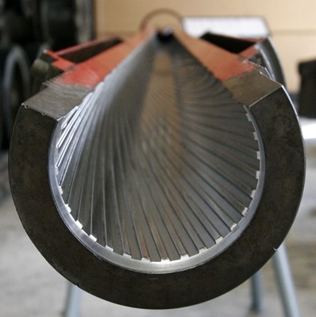
<figcaption>baku13, 2005</figcaption>
</figure>
]

.pull-right[
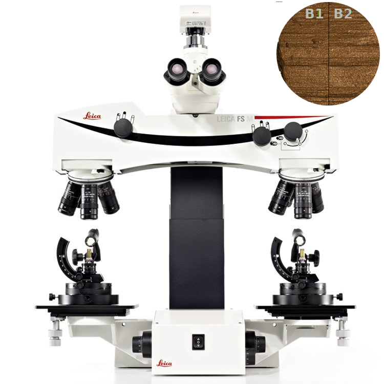
]

---

class: secondary-blue
## The Algorithm

.pull-left[
- Described in Hare et. al.
- A 3D scan is taken of each bullet land, a stable cross section is extracted, and shoulders are removed
- A smoothing function is applied twice in order to extract the signature, which can be compared to land signatures from other bullets
- Traits (cross correlation, matching extrema, number of nonmatches, etc.) are used in a random forest to produce a match score for lands. Lands are aligned across bullets in order to compute an overall match score for the bullets
]

.pull-right[
<figure>

<figcaption><font size="1">  Hare et al.</font></figcaption>
</figure>

<figure>

<figcaption><font size="1">Hare et al.</font></figcaption>
</figure>


]

---

class: secondary-blue
## The Results


<center>
<!-- 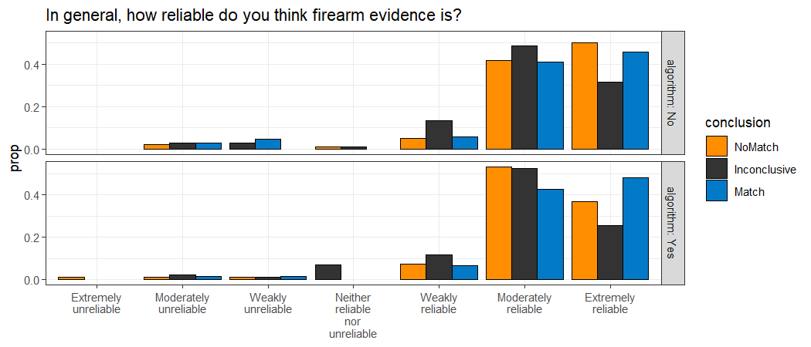 -->
</center>

---

class: secondary-blue

## Moving Forward

- Scale Compression
  - Ceiling effect: examiners are overall seen as reliable
  - Individuals may already believe that firearms evidence is reliable (Garrett & Mitchell, 2013)
  - Proposed Solution: Investigate other response methods
  
- Written Testimony
  - Not representative of a courtroom setting
  - Can be confusing
  - Proposed Partial Solution: Include characters to clarify actors
  
- Notepad analysis

---

class: center, middle, inverse-blue

# How can we tell which portions of the testimony participants focus on?

---

class: primary-blue
### Digital Notepad

.img[]

- Participants are provided with a digital notepad, and input is saved for each page of testimony
  - Data cleaning: removing the previous page's notes before analysis
  
  .img[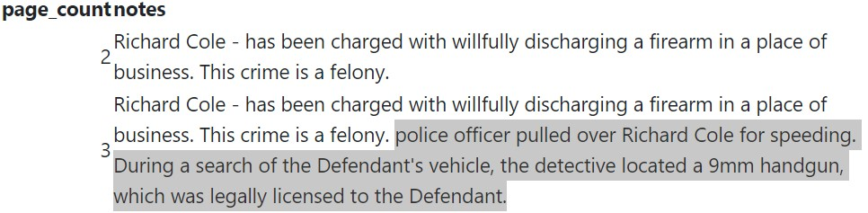]
  
---

class: primary-blue
### First n Characters

- Test edit distance on first n characters to previous notes
   - Edit distance: Number of changes necessary to go from one string to the other string
   - Hat -> Hot requires 1 substitution (edit distance of 1)
   - Over there -> there requires 5 deletions (edit distance of 5)
- Set a threshold for the maximum allowable difference between texts

.img[]

- What if:
   - Participants delete portions of their previous notes?
   - Participants add new notes in the middle of/before their old notes?
   - Participants duplicate their old notes?
   
---


class: primary-blue
### Longest Common Substring (LCS)

- Search for the longest common substring between the current set of notes and the previous set of notes
   - If the string is "long enough", remove from current page of notes
   - Repeat

```{r, echo=FALSE, message=FALSE, warning=FALSE, fig.align="center"}
grViz("digraph {
  graph [layout = dot, rankdir = TB]
  
  node [shape = rectangle]        
  rec1 [label = 'Page 1\n the cat enjoys napping in the afternoon']
  rec2 [label = 'Page 2\nWhen it is quiet, the cat enjoys napping']
  rec3 [label =  'LCS\n the cat enjoys napping']
  rec4 [label = 'Page 2 Clean\nWhen it is quiet']
  
  # edge definitions with the node IDs
  rec1 -> rec3
  rec2 -> rec3
  rec3 -> rec4
  }",
  height = 500, width=800)

```

---

class: primary-blue
### Longest Common Substring (LCS)

What if...
- Participants delete portions of their previous notes?
   
Page 1 | Page 2 | LCS | Edit Distance
--------|---------|---------|---------
The cat ran up the tree | The cat ran | The cat ran | 12

- Participants add new notes in the middle of old notes?
   
Page 1 | Page 2 | LCS | Edit Distance
--------|---------|---------|---------
The cat ran up the tree | <mark>The cat ran, chased by a</mark> dog, up the tree | (The cat ran)(up the tree) | 11

- Participants duplicate their old notes?
   
Page 1 | Page 2 | LCS | Edit Distance
--------|---------|---------|---------
The cat ran up the tree | <mark>The cat ran up the tree</mark> The cat ran up the tree | (The cat ran up the tree)(The cat ran up the tree) | 0

---

class: primary-blue
### Hybrid Note Cleaning

- Easy Cases of Sequential Notes
   - First N Character Method
     - Compare the beginning of the current notes with the entirety of the previous notes

.img[]

- Difficult Notes (deletion, insertion, and duplication)
   - Longest Common Substring 

---

class: primary-blue
### Hybrid Method

- Difficult Cases
   - Edit distance larger than the initial cutoff value
   - Note length more than 4 standard deviations above the mean length for that page
- Based on validation from 35 participants' notes (cleaned by hand)

.img[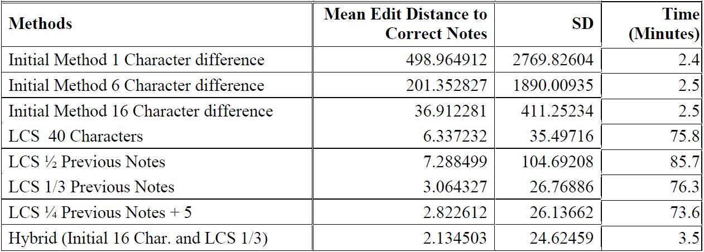]

---


class: primary-blue

```{r, echo=FALSE, message=FALSE, warning=FALSE, fig.align="center"}
#attr(adist("The cat ran up the tree.", "After the dog barked, Th", counts=TRUE,),"trafos")
grViz("digraph {
  graph [layout = dot, rankdir = TB]
  
  node [shape = rectangle]        
  rec1 [label = 'Calculate edit distance between first n characters in current notes and previous notes']
  rec2 [label = 'Edit Distance < 16']
  rec3 [label =  'Edit Distance > 15']
  rec4 [label = 'Remove first n characters']
  rec5 [label = 'Compute Longest Common Substring']
  rec6 [label = 'LCS > 1/3 Previous Note Length']
  rec7 [label = 'LCS <= 1/3 Previous Note Length']
  rec8 [label = 'Remove LCS']
  rec9 [label = 'End']
  rec10 [label = 'Calculate clean note length']
  rec11 [label = 'Clean note length > Mean(clean note length) + 4*SD(clean note length)']
  rec12 [label = 'Clean note length <= Mean(clean note length) + 4*SD(clean note length)']
  
  # edge definitions with the node IDs
  rec1 -> rec2 
  rec1 -> rec3
  rec2 -> rec4
  rec3 -> rec5
  rec5 -> rec6
  rec5 -> rec7
  rec6 -> rec8
  rec8 -> rec5
  rec4 -> rec10
  rec10 -> rec11
  rec10 -> rec12
  rec11 -> rec5
  rec12 -> rec9
  rec7 -> rec9
  }",
  height = 600, width=800)

```


---


class: primary-blue


```{r, echo=FALSE, message=FALSE, warning=FALSE, fig.align="center"}
#attr(adist("The cat ran up the tree.", "After the dog barked, Th", counts=TRUE,),"trafos")
grViz("digraph {
  graph [layout = dot, rankdir = TB]
  
  node [shape = rectangle, style = filled]    
  
  node [ fillcolor= white]
  rec3 [label =  'Edit Distance > 15']
  rec5 [label = 'Compute Longest Common Substring']
  rec6 [label = 'LCS > 1/3 Previous Note Length']
  rec7 [label = 'LCS <= 1/3 Previous Note Length']
  rec8 [label = 'Remove LCS']
  rec11 [label = 'Clean note length > Mean(clean note length) + 4*SD(clean note length)']
  
  node [fillcolor = pink]
  rec1 [label = 'Calculate edit distance between first n characters in current notes and previous notes\n 0']
  rec2 [label = 'Edit Distance < 16']
  rec4 [label = 'Remove first n characters']
  rec10 [label = 'Calculate clean note length']
  rec12 [label = 'Clean note length <= Mean(clean note length) + 4*SD(clean note length)']
  rec9 [label = 'End']
  
  # edge definitions with the node IDs
  rec1 -> rec2 
  rec1 -> rec3
  rec2 -> rec4
  rec3 -> rec5
  rec5 -> rec6
  rec5 -> rec7
  rec6 -> rec8
  rec8 -> rec5
  rec4 -> rec10
  rec10 -> rec11
  rec10 -> rec12
  rec11 -> rec5
  rec12 -> rec9
  rec7 -> rec9
  }",
  height = 450, width=800)

```


---

class: primary-blue, small-med-font

Page 1 | Page 2 | LCS | Edit Distance | Result 
--------|---------|---------|---------
The cat ran up the tree | The cat ran | The cat ran | 12 |  

```{r, echo=FALSE, message=FALSE, warning=FALSE, fig.align="center"}
#attr(adist("The cat ran up the tree.", "After the dog barked, Th", counts=TRUE,),"trafos")
grViz("digraph {
  graph [layout = dot, rankdir = TB]
  
  node [shape = rectangle, style = filled]    
  
  node [ fillcolor= white]        
  rec2 [label = 'Edit Distance < 6']
  rec4 [label = 'Remove first n characters']
  rec10 [label = 'Calculate clean note length']
  rec11 [label = 'Clean note length > Mean(clean note length) + 4*SD(clean note length)']
  rec12 [label = 'Clean note length <= Mean(clean note length) + 4*SD(clean note length)']
  
  node [ fillcolor= pink]
  rec1 [label = 'Calculate edit distance between first n characters in current notes and previous notes\n 12']
  rec3 [label =  'Edit Distance > 5']
  rec5 [label = 'Compute Longest Common Substring\nThe cat ran']
  rec6 [label = 'LCS > 1/3 Previous Note Length\n11 > 8']
  rec8 [label = 'Remove LCS\n']
  rec7 [label = 'LCS <= 1/3 Previous Note Length\n 0 < 8']
  rec9 [label = 'End']
  
  # edge definitions with the node IDs
  rec1 -> rec2 
  rec1 -> rec3
  rec2 -> rec4
  rec3 -> rec5
  rec5 -> rec6
  rec5 -> rec7
  rec6 -> rec8
  rec8 -> rec5
  rec4 -> rec10
  rec10 -> rec11
  rec10 -> rec12
  rec11 -> rec5
  rec12 -> rec9
  rec7 -> rec9
  }",
  height = 545, width=800)

```

---

class: primary-blue, small

Page 1 | Page 2 | LCS | Edit Distance | Result
--------|---------|---------|---------
The cat ran up the tree | <mark>The cat ran, chased by a</mark> dog, up the tree | (The cat ran)(up the tree) | 11 | ,chased by a dog,

```{r, echo=FALSE, message=FALSE, warning=FALSE, fig.align="center"}
#attr(adist("The cat ran up the tree.", "After the dog barked, Th", counts=TRUE,),"trafos")
grViz("digraph {
  graph [layout = dot, rankdir = TB]
  
  node [shape = rectangle, style = filled]    
  
  node [ fillcolor= white]        
  rec2 [label = 'Edit Distance < 6']
  rec4 [label = 'Remove first n characters']
  rec10 [label = 'Calculate clean note length']
  rec11 [label = 'Clean note length > Mean(clean note length) + 4*SD(clean note length)']
  rec12 [label = 'Clean note length <= Mean(clean note length) + 4*SD(clean note length)']
  
  node [ fillcolor= pink]
  rec1 [label = 'Calculate edit distance between first n characters in current notes and previous notes\n11']
  rec3 [label =  'Edit Distance > 5']
  rec5 [label = 'Compute Longest Common Substring\nThe cat ran\nUp the tree\nc']
  rec6 [label = 'LCS > 1/3 Previous Note Length\n11 > 8\n11 > 8']
  rec8 [label = 'Remove LCS\nchased by a dog, up the tree\nchased by a dog']
  rec7 [label = 'LCS <= 1/3 Previous Note Length\n1<8']
  rec9 [label = 'End\nchased by a dog']
  
  # edge definitions with the node IDs
  rec1 -> rec2 
  rec1 -> rec3
  rec2 -> rec4
  rec3 -> rec5
  rec5 -> rec6
  rec5 -> rec7
  rec6 -> rec8
  rec8 -> rec5
  rec4 -> rec10
  rec10 -> rec11
  rec10 -> rec12
  rec11 -> rec5
  rec12 -> rec9
  rec7 -> rec9
  }",
  height = 545, width=800)

```

---


class: primary-blue, small

Page 1 | Page 2 | LCS | Edit Distance | Mean | SD | Result
--------|---------|---------|---------
The cat ran up the tree | <mark>The cat ran up the tree</mark> The cat ran up the tree chased by a dog | (The cat ran up the tree) | 0 | 10 | 5 | chased by a dog

```{r, echo=FALSE, message=FALSE, warning=FALSE, fig.align="center"}
#attr(adist("The cat ran up the tree.", "After the dog barked, Th", counts=TRUE,),"trafos")
grViz("digraph {
  graph [layout = dot, rankdir = TB]
  
  node [shape = rectangle, style = filled]    
  
  node [ fillcolor= white]    
  rec3 [label =  'Edit Distance > 5']
  rec12 [label = 'Clean note length <= Mean(clean note length) + 4*SD(clean note length)']
  
  node [ fillcolor= pink]
  rec1 [label = 'Calculate edit distance between first n characters in current notes and previous notes\n 0']
  rec2 [label = 'Edit Distance < 6\n 0 < 6']
  rec4 [label = 'Remove first n characters\n The cat ran up the tree chased by a dog']
  rec10 [label = 'Calculate clean note length\n39']
  rec11 [label = 'Clean note length > Mean(clean note length) + 4*SD(clean note length)\n39>30']
  rec5 [label = 'Compute Longest Common Substring\nThe cat ran up the tree\nc']
  rec6 [label = 'LCS > 1/3 Previous Note Length\n 23 > 8']
  rec8 [label = 'Remove LCS\nchased by a dog']
  rec7 [label = 'LCS <= 1/3 Previous Note Length\n1 < 8']
  rec9 [label = 'End\nchased by a dog']
  
  # edge definitions with the node IDs
  rec1 -> rec2 
  rec1 -> rec3
  rec2 -> rec4
  rec3 -> rec5
  rec5 -> rec6
  rec5 -> rec7
  rec6 -> rec8
  rec8 -> rec5
  rec4 -> rec10
  rec10 -> rec11
  rec10 -> rec12
  rec11 -> rec5
  rec12 -> rec9
  rec7 -> rec9
  }",
  height = 500, width=800)

```

---

class: primary-blue
### How can we tell which portions of the testimony participants focus on?

- Highlight testimony based on frequency of occurrence in participants' notes
  - Collocations of length 5
     - Willfully: average frequency of 91.2
  - Frequency of Individual words
  - Divide by number of occurrences in the testimony
- Weighted Fuzzy Matches


  
.pull-left[.img[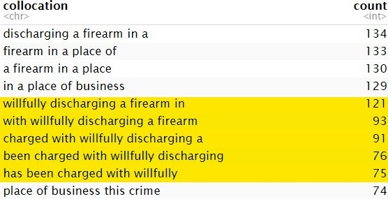]]
.pull-right[.img[]
            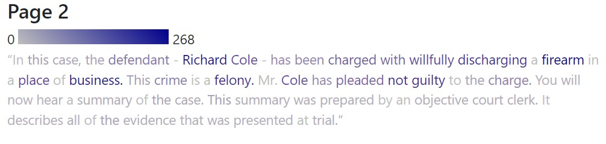]

---

class: primary-blue
### Collocation Analysis

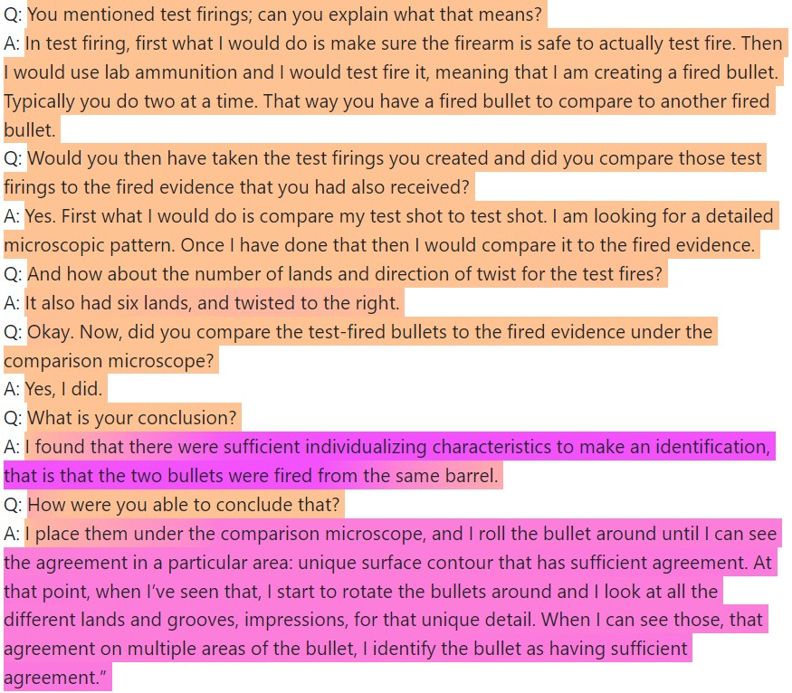

---

class: center, middle, inverse-blue

# Microstudy

---

class: primary-blue
### What can we do when Likert response scales have scale compression?

- Micro-study comparing response formats
  - Strength of evidence (Likert - 9 point)
  - Guilt (Yes/No)
  - Convict (Yes/No)
  - Probability of guilt (Numeric)
  - What are the chances that defendant committed the crime? (Numeric or multiple choice)
  - How much would you be willing to bet that the defendant committed the crime? (Numeric)
  
- Inclusion of jury instructions and more cross examination on subjectivity

- Simplified to Match and NonMatch condition, without algorithm and images

---

class: primary-blue
### How can we create a more engaging testimony format that clarifies the actors?

- Development of figures (by Richy Meleus) with text bubbles, and colors indicating which side they are testifying for

.pull-left[
.pull-left[
]
.pull-right[
]
]
.pull-right[
.pull-left[
]
.pull-right[
]
]

---

class: primary-blue
### How can we create a more engaging testimony format that clarifies the actors?

 `r fa("plus")`
 `r fa("equals")`
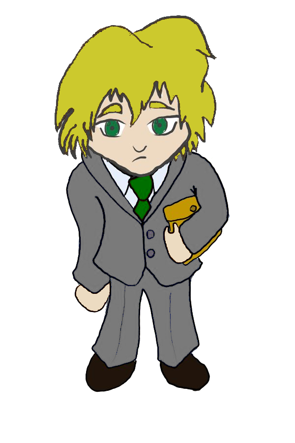

---

class: primary-blue

.img[]
<center>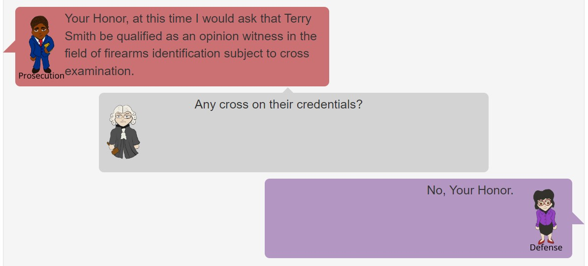</center>

---


class: primary-blue
## What Now?

- Re-developing the survey on jury perception
- Developing R package for highlighting text and data cleaning
  - highlightr and seqstrclean in development
- Developing survey tool
- Developing character randomizer
- Future Papers
  - Journal of Computational and Graphical Statistics
      - Notepad highlighting method and applications
  - Law of Probability and Risk
      - Study results and follow-up

---

class: primary-blue,citation-slide
### Citations
- baku13. (2005, August). L7 105mm tank gun Cut model. Retrieved from https://commons.wikimedia.org/wiki/File:105mm_tank_gun_Rifling.jpg
- Baldwin, D. P., Bajic, S. J., Morris, M., & Zamzow, D. (2014). A Study of False-Positive and False-Negative Error Rates in Cartridge Case Comparisons: Fort Belvoir, VA: Defense Technical Information Center. Retrieved from http://www.dtic.mil/docs/citations/ADA611807
<!-- - Cardwell, B. A., Henkel, L. A., Garry, M., Newman, E. J., & Foster, J. L. (2016). Nonprobative photos rapidly lead people to believe claims about their own (and other people’s) pasts. Memory & Cognition, 44(6), 883–896. http://doi.org/gn65b2 -->
- Defense Forensic Science Center (DFSC). Information paper: modification of latent print technical reports to include statistical calculations, 2017; https://osf.io/pmkwf/
- Garrett, Brandon, Gregory Mitchell, and Nicholas Scurich. “Comparing Categorical and Probabilistic Fingerprint Evidence.” Journal of Forensic Sciences 63, no. 6 (November 2018): 1712–17. https://doi.org/10.1111/1556-4029.13797.
- Garrett, B., & Mitchell, G. and. (2013). How Jurors Evaluate Fingerprint
Evidence: The Relative Importance of Match Language, Method Information, and Error Acknowledgment: How Jurors Evaluate Fingerprint Evidence. Journal of Empirical Legal Studies, 10(3), 484–511. http://doi.org/10.1111/jels.12017 
- Garrett, B. L., Scurich, N., & Crozier, W. E. "Mock jurors’ evaluation of firearm examiner testimony." (2020). Law and Human Behavior, 44(5), 412–423. https://doi.org/10.1037/lhb0000423
- Gremi-ch. (2009). English: A 5.66x45mm (.223 rem.) Boat tailed FMJ spitzer bullet laying on a ruler with a scale in centimeter. Retrieved from https://commons.wikimedia.org/wiki/File:GP90-bullet.JPG?uselang=fr
- Hare, Eric, et al. “Automatic Matching of Bullet Land Impressions.” The Annals of Applied Statistics, vol. 11, no. 4, Dec. 2017, pp. 2332–56. Project Euclid, https://doi.org/10.1214/17-AOAS1080  
- Hofmann, H., Vanderplas, S., & Carriquiry, A. (2021). Treatment of Inconclusives in the AFTE Range of Conclusions. Law, Probability & Risk, 19(3-4). http://doi.org/https://doi.org/10.1093/lpr/mgab002
<!-- - Kellermann, K. (2013). Trial advocacy: Truthiness, falsiness, and nothingness. -->
<!-- Jury Expert, 25, 38. -->
- Koehler, J. J. (2001). "When are people persuaded by DNA match statistics?" Law and Human Behavior, 25(5), 493–513. http://doi.org/d82kvn
<!-- - McCabe, D. P., & Castel, A. D. (2008). Seeing is believing: The effect of -->
<!-- brain images on judgments of scientific reasoning. Cognition, 107(1), -->
<!-- 343–352. http://doi.org/10.1016/j.cognition.2007.07.017 -->
- PCAST. (2016). Forensic Science in Criminal Courts: Ensuring Scientific Validity of Feature Comparison Methods. President’s Council of Advisors on Science and Technology. Retrieved from https://obamawhitehouse.archives.gov/sites/default/files/microsites/ostp/PCAST/pcast_forensic_science_report_final.pdf
<!-- - Schweitzer, N. J., Saks, M. J., Murphy, E. R., Roskies, A. L., Sinnott- -->
<!-- Armstrong, W., & Gaudet, L. M. (2011). Neuroimages as evidence in -->
<!-- a mens rea defense: No impact. Psychology, Public Policy, and Law, -->
<!-- 17(3), 357–393. http://doi.org/10.1037/a0023581 -->
- Swofford, H., & Champod, C. (2022). Probabilistic reporting and algorithms in forensic science: Stakeholder perspectives within the American criminal justice system. Forensic Science International: Synergy, 4, 100220. http://doi.org/gphvxj


This work was funded (or partially funded) by the Center for Statistics and Applications in Forensic Evidence (CSAFE) through Cooperative Agreements 70NANB15H176 and 70NANB20H019 between NIST and Iowa State University, which includes activities carried out at Carnegie Mellon University, Duke University, University of California Irvine, University of Virginia, West Virginia University, University of Pennsylvania, Swarthmore College and University of Nebraska, Lincoln.

---

class: center, middle, inverse-blue

## Microstudy Results

```{r echo=FALSE, warning=FALSE, message=FALSE}

library(readr)
survey2 <- read_csv("../JSM_2023/data/cleanish_results.csv")

survey2_clean <- survey2 %>% dplyr::filter(check=="9mm")

```

---

class: primary-blue
## Participants

- Issues in implementation
    - Some participants unable to access survey
    - Less cases for the Match condition compared to the NonMatch condition
    
- 272 participants completed the survey and passed the attention check
  - 115 participants with the Match condition
  - 157 participants with the NonMatch condition

---

class: primary-blue

## Scale Compression

```{r echo=FALSE, warning=FALSE, message=FALSE, fig.width=12, fig.height=8}

library(ggplot2)
library(scales)

survey2_clean$strength = factor(
  survey2_clean$strength,
  levels = c(
    "1 <br/> Not at all strong",
    "2",
    "3",
    "4",
    "5 <br/> Moderately strong",
    "6",
    "7",
    "8",
    "9 <br/> Extremely strong"
  )
)

ggplot(survey2_clean) +
  geom_bar(aes(x=strength, fill=conclusion.x), position="dodge") +
  ggtitle("What is the Strength of Evidence against the Defendant?") +
  scale_fill_manual(values = c("grey80","seagreen"), name="Condition")+
  ylab("Count")+
  xlab("Strength")+
  theme_bw()+
  scale_x_discrete(labels = wrap_format(10))


```


---

class: primary-blue
## Scale Compression

```{r echo=FALSE, warning=FALSE, message=FALSE, fig.width=12, fig.height=8}

survey2_clean$bet<- NA

survey2_clean[!is.na(survey2_clean$guilt_bet),]$bet<- 
  survey2_clean[!is.na(survey2_clean$guilt_bet),]$guilt_bet

survey2_clean[!is.na(survey2_clean$innocent_bet),]$bet<- survey2_clean[!is.na(survey2_clean$innocent_bet),]$innocent_bet

ggplot(survey2_clean) +
  geom_histogram(alpha=0.75, aes(x=bet, fill=opinion_guilt), position="dodge") +
  ggtitle("How much would you bet that the Defendant is...") +
  scale_fill_manual(values = c("black","orange"), name="", labels=c("Innocent","Guilty"))+
  ylab("Count")+
  xlab("Bet Amount")+
  xlim(c(0,50))+
  facet_grid(.~conclusion.x)+
  theme_bw()


```

---

class: primary-blue

# Scale Compression

```{r echo=FALSE, warning=FALSE, message=FALSE, fig.width=11, fig.height=6}

survey2_clean$fixed_like = factor(
  survey2_clean$fixed_like,
  levels = c(
    "Impossible that he is guilty",
    "About 1 chance in 10,000",
    "About 1 chance in 1,000",
    "About 1 chance in 100",
    "About 1 chance in 10",
    "1 chance in 2 (fifty-fifty chance)",
    "About 9 chances in 10",
    "About 99 chances in 100",
    "About 999 chances in 1,000",
    "About 9,999 chances in 10,000",
    "Certain to be guilty"
  )
)

ggplot(survey2_clean) +
  geom_bar(aes(x=fixed_like, fill=conclusion.x), position="dodge") +
  ggtitle("What are the Chances that the Defendant is Guilty?") +
  scale_fill_manual(values = c("grey80","seagreen"), name="Condition")+
  ylab("Count")+
  xlab("Chance")+
  theme_bw()+
  scale_x_discrete(labels = wrap_format(10))


```


---

class: primary-blue

# Scale Compression

If individuals thought the defendant was innocent, they were asked for the chance they thought the defendant was guilty, and vice versa.

```{r echo=FALSE, warning=FALSE, message=FALSE, fig.width=11, fig.height=6}

survey2_clean$likelihood<- NA

survey2_clean[!is.na(survey2_clean$innocent_free_num) &
                !is.na(survey2_clean$innocent_free_denom),]$likelihood<-
  survey2_clean[!is.na(survey2_clean$innocent_free_num) &
                  !is.na(survey2_clean$innocent_free_denom),]$innocent_free_num/
  survey2_clean[!is.na(survey2_clean$innocent_free_num) & 
                  !is.na(survey2_clean$innocent_free_denom),]$innocent_free_denom

survey2_clean[!is.na(survey2_clean$guilt_free_num) &
                !is.na(survey2_clean$guilt_free_denom),]$likelihood<-
  survey2_clean[!is.na(survey2_clean$guilt_free_num) &
                  !is.na(survey2_clean$guilt_free_denom),]$guilt_free_num/
  survey2_clean[!is.na(survey2_clean$guilt_free_num) & 
                  !is.na(survey2_clean$guilt_free_denom),]$guilt_free_denom

ggplot(survey2_clean) +
  geom_density(alpha=0.75, aes(x=likelihood, fill=opinion_guilt), position="dodge") +
  ggtitle("What is the chance that the defendant is...") +
  scale_fill_manual(values = c("orange","black"), name="", labels=c("Guilty","Innocent"))+
 # ylab("Count")+
  xlab("Chance")+
  facet_grid(.~conclusion.x)+
  #scale_x_continuous(trans='log10')+
  theme_bw()


```

---

class: primary-blue

# Opinion of Guilt vs Conviction

```{r echo=FALSE, warning=FALSE, message=FALSE, fig.width=11, fig.height=6}


ggplot(survey2_clean) +
  geom_bar(aes(x=guilty, fill=opinion_guilt), position="dodge") +
  ggtitle("") +
  scale_fill_manual(values = c("black","orange"), name="Opinion", labels=c("Innocent","Guilty"))+
  ylab("Count")+
  xlab("Convict?")+
  facet_grid(.~conclusion.x)+
  theme_bw()

```

---

class: primary-blue

# Conviction Vs. Chance

```{r echo=FALSE, warning=FALSE, message=FALSE, fig.width=11, fig.height=6}

ggplot(survey2_clean) +
  geom_bar(aes(x=fixed_like, fill=guilty), position=position_dodge(preserve = "single")) +
  ggtitle("What is the Chance that the Defendant is Guilty?") +
  scale_fill_manual(values = c("grey20", "plum1"), name="Convict?")+
  ylab("Count")+
  xlab("Chance")+
  theme_bw()+
  facet_grid(conclusion.x~.)+
  scale_x_discrete(labels = wrap_format(10))


```

---

class: primary-blue
## Research Questions

- How are potential jurors' perceptions of evidence affected by the use of algorithms and images?
    - 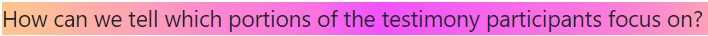
    - What can we do when Likert response scales suffer from scale compression?
       - `r fa("comments-dollar")`
    - 

---

class: primary-blue

## Scale Comparison

```{r echo=FALSE, warning=FALSE, message=FALSE}

ggplot(survey2_clean, aes(x = conclusion.x, y = prob_hide, fill = guilty)) +
  geom_point(
    position = position_jitterdodge(
      jitter.width = 0.2,
      jitter.height = 0.4,
      dodge.width = 1
    ),
    size = 0.5
  ) +
  geom_boxplot(position = position_dodge(1),
               alpha = 0.5,
               outlier.shape = NA) +
  ggtitle("Probability Cole Commited the Crime") +
  scale_fill_manual(values = c("grey20", "plum1"), name="Convict?")+
  ylab("Probability")+
  xlab("Conclusion")+
  theme_bw()

```


---

class: primary-blue, center, middle

## Scale Comparison

```{r echo=FALSE, warning=FALSE, message=FALSE, fig.width=12, fig.height=8}


set_values <- data.frame(fixed_like=c(    "Impossible that he is guilty",
                                          "About 1 chance in 10,000",
                                          "About 1 chance in 1,000",
                                          "About 1 chance in 100",
                                          "About 1 chance in 10",
                                          "1 chance in 2 (fifty-fifty chance)",
                                          "About 9 chances in 10",
                                          "About 99 chances in 100",
                                          "About 999 chances in 1,000",
                                          "About 9,999 chances in 10,000",
                                          "Certain to be guilty"),
                         value=c(0,1/10000,1/1000,1/100,1/10,0.5,9/10,99/100,999/1000,9999/10000,1))
clean_results_merged<- dplyr::left_join(survey2_clean, set_values)
clean_results_merged$fixed_like = factor(
  survey2_clean$fixed_like,
  levels = c(
    "Impossible that he is guilty",
    "About 1 chance in 10,000",
    "About 1 chance in 1,000",
    "About 1 chance in 100",
    "About 1 chance in 10",
    "1 chance in 2 (fifty-fifty chance)",
    "About 9 chances in 10",
    "About 99 chances in 100",
    "About 999 chances in 1,000",
    "About 9,999 chances in 10,000",
    "Certain to be guilty"
  )
)
ggplot(clean_results_merged, aes(x=fixed_like))+ #,fill=conclusion
  geom_point(aes(y=value),color="red",size=5,alpha=0.5)+
  ggtitle("Chances for those who thought Cole was innocent") +
  geom_jitter(aes(y=(guilt_free_num/guilt_free_denom)),
    # position = position_jitterdodge(
    #   jitter.width = 0.2,
    #   #jitter.height = 0.4,
    #   dodge.width = 1
    # ),
    size = 1
  ) +
  geom_boxplot(aes(y=(guilt_free_num/guilt_free_denom)),
               position = position_dodge(1),
               alpha = 0.5,
               outlier.shape = NA)+ 
  ylab("Open Response Chance")+
  xlab("Closed Response Chance")+
  scale_x_discrete(labels = wrap_format(10))

```

---

class: primary-blue

# Scale Comparison

```{r echo=FALSE, warning=FALSE, message=FALSE, eval=FALSE}

library(patchwork)
guilt<-ggplot(clean_results_merged, aes(x = conclusion.x, y = guilt_bet, fill = guilty)) +
  geom_point(
    position = position_jitterdodge(
      jitter.width = 0.2,
      jitter.height = 0.4,
      dodge.width = 1
    ),
    size = 0.5
  ) +
  geom_boxplot(position = position_dodge(1),
               alpha = 0.5,
               outlier.shape = NA) +
  ggtitle("Probability Cole Commited the Crime") +
  scale_fill_manual(values = c("grey20", "plum1"), name="Convict?")+
  theme_bw()

innocent<-ggplot(clean_results_merged, aes(x = conclusion.x, y = innocent_bet, fill = guilty)) +
  geom_point(
    position = position_jitterdodge(
      jitter.width = 0.2,
      jitter.height = 0.4,
      dodge.width = 1
    ),
    size = 0.5
  ) +
  geom_boxplot(position = position_dodge(1),
               alpha = 0.5,
               outlier.shape = NA) +
  ggtitle("Probability Cole Commited the Crime") +
  scale_fill_manual(values = c("grey20", "plum1"), name="Convict?")+
  theme_bw()

guilt + innocent

```

```{r echo=FALSE, warning=FALSE, message=FALSE}

ggplot(clean_results_merged, aes(x = conclusion.x, y = bet, fill = opinion_guilt)) +
  geom_point(
    position = position_jitterdodge(
      jitter.width = 0.2,
      jitter.height = 0.4,
      dodge.width = 1
    ),
    size = 0.5
  ) +
  geom_boxplot(position = position_dodge(1),
               alpha = 0.5,
               outlier.shape = NA) +
  ggtitle("If Researchers Provided You with $50, How Much Would you Bet..") +
  scale_fill_manual(values = c("grey20", "plum1"), name="How much would\nyou bet that Cole is...",
                    labels=c("Innocent", "Guilty"))+
  ylab("Amount (Dollars)")+
  xlab("Conclusion")+
  theme_bw()


```


---

class: primary-blue, center, middle

# Scale Comparison

```{r echo=FALSE, warning=FALSE, message=FALSE, fig.width=11, fig.height=6}


ggplot(clean_results_merged, aes(x=fixed_like, fill=opinion_guilt))+ #,fill=conclusion
  ggtitle("Chances for those who thought Cole was innocent") +
  geom_jitter(aes(y=bet),
    # position = position_jitterdodge(
    #   jitter.width = 0.2,
    #   #jitter.height = 0.4,
    #   dodge.width = 1
    # ),
    size = 1
  ) +
  geom_boxplot(aes(y=bet),
               position = position_dodge(1),
               alpha = 0.5,
               outlier.shape = NA)+ 
  ylab("Open Response Chance")+
  xlab("Closed Response Chance")+
  scale_x_discrete(labels = wrap_format(10))

```

---

class: secondary-blue
## The Results

<center></center>

---

class: secondary-blue
## The Results

- Conviction choice
  - 10/196 (5%) for Non-match
  - 13/191 (7%) for Inconclusive
  - 112/182 (62%) for Match


---

class: primary-blue

## Scale Compression

```{r echo=FALSE, warning=FALSE, message=FALSE, fig.width=12, fig.height=8}

colors <-  c("Hidden"="red", "Visible"="grey")

ggplot(survey2_clean) +
  geom_density(alpha=0.75, aes(x=prob_hide, fill="Hidden")) +
  geom_density(alpha=0.75, aes(x=prob_vis, fill="Visible")) +
  ggtitle("Probability Cole Commited the Crime") +
  scale_fill_manual(values = colors, name="Probability")+
  ylab("Density")+
  xlab("Probability")+
  facet_grid(.~conclusion.x)+
  theme_bw()


```

---

class: primary-blue, center, middle

## Scale Comparison

```{r echo=FALSE, warning=FALSE, message=FALSE, fig.width=12, fig.height=8}

ggplot(clean_results_merged, aes(x=fixed_like))+ #,fill=conclusion
  geom_point(aes(y=value),color="red",size=5,alpha=0.5)+
  ggtitle("Chance for those who thought Cole was guilty") +
  geom_jitter(aes(y=(1-innocent_free_num/innocent_free_denom)),
             # position = position_jitterdodge(
             #   jitter.width = 0.2,
             #   #jitter.height = 0.4,
             #   dodge.width = 1
             # ),
             size = 1
  ) +
  geom_boxplot(aes(y=(1-innocent_free_num/innocent_free_denom)),
               position = position_dodge(1),
               alpha = 0.5,
               outlier.shape = NA)+ 
  ylab("Open Response Chance")+
  xlab("Closed Response Chance")+
  scale_x_discrete(labels = wrap_format(10))

```

---


class: primary-blue, split-three

.pull-left[
<figure>

<figcaption>baku13, 2005</figcaption>
</figure>
<figure>

<figcaption>Gremi-ch, 2009</figcaption>
</figure>
<figure>

<figcaption>Hare et al.</figcaption>
</figure>

]

.pull-right[

<figure>
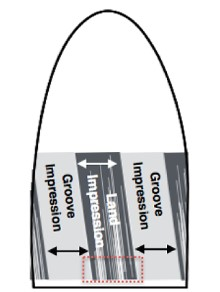
<figcaption>Hare et al.</figcaption>
</figure>

]

---

class: primary-blue
### Weights

- Fuzzy Matching
  - $x_i$ is the frequency for a fuzzy collocation $i$
  - $d_i$ is the fuzzy match distance
  - $c_i$ is the number of closest matches for the fuzzy collocation
     - ex. "Jur"
- Non-Fuzzy Matching ( $z$ )
- What if the testimony contains the same collocation multiple times? ( $k$ )
  - ex. "the bullet matching algorithm is"
- What if the testimony occurs in multiple scenarios? ( $s$ )
  
$$
(z+\sum_{i=1}^n\frac{x_i}{(d_i+0.25)c_i})\frac{1}{ks}
$$

.pull-left[.img[]]
.pull-right[.img[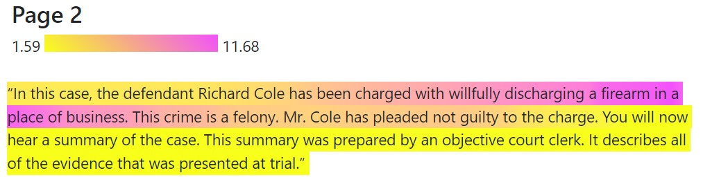]]


 
